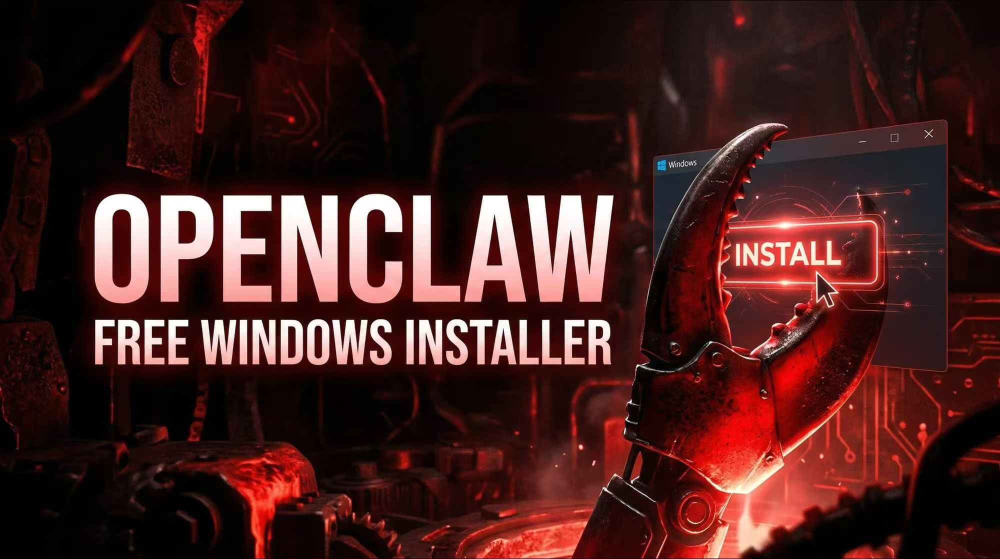
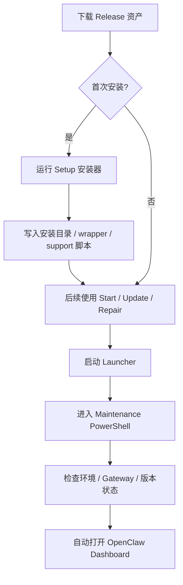
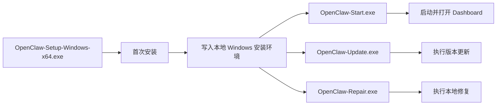

# OpenClaw Windows 一键安装包装层

<p align="center">
  
</p>

<p align="center">
  面向 Windows 的 OpenClaw 工程化包装层：安装器、一键启动、一键更新、一键修复、Dashboard 自动打开。
</p>

<p align="center">
  <a href="https://github.com/RZX00/openclaw-windows-installer/releases/latest"></a>
  <a href="./LICENSE"></a>
  <a href="https://github.com/openclaw/openclaw"></a>
</p>

## One-click Start Model

`OpenClaw-Start.exe` is now defined as a **local-host startup path**:

- ensure a persistent Gateway on the gateway host
- verify RPC health
- verify dashboard readiness
- open the dashboard through native `openclaw dashboard`
- classify `Gateway token` and `Provider auth` separately

Default mode is `local-stable`. The wrapper no longer treats LAN HTTP, remote proxying, and local loopback as the same one-click path.

Remote access guidance:

- preferred: `Tailscale Serve HTTPS`
- preferred: `SSH tunnel`
- breakglass only: plain LAN HTTP with explicit `gateway.controlUi.allowedOrigins`

`OpenClaw-Update.exe` and `OpenClaw-Repair.exe` reuse the same post-validation path for capability cache refresh, token checks, RPC health verification, dashboard verification, and provider-auth classification.

## Reach Pack

`OpenClaw-Reach-Pack.exe` is an **add-on package** for an existing Windows OpenClaw install.

- install `OpenClaw-Setup-Windows-x64.exe` first
- then run `OpenClaw-Reach-Pack.exe`
- the Reach pack now fails fast when the main install is missing, instead of silently unpacking for a long time and only failing later
- the Reach self-extractor now shows a visible progress window during payload extraction and unpacking

## 项目定位

这个仓库不是 OpenClaw 官方主仓，而是一个专门为 **Windows 直装体验** 做的包装层项目。

它解决的不是“OpenClaw 核心能力怎么写”，而是下面这些 Windows 落地问题：

- 怎么把命令行安装变成图形安装器
- 怎么把启动 / 更新 / 修复做成普通用户能直接双击的 EXE
- 怎么自动发现安装目录，而不是只依赖固定路径
- 怎么在启动成功后自动打开正确的 Dashboard
- 怎么尽量跟上游 CLI 保持兼容，而不是越包越偏

## 下载哪个文件

> 最新版本请直接看 [Releases](https://github.com/RZX00/openclaw-windows-installer/releases/latest)

| 文件 | 适用场景 | 说明 |
| --- | --- | --- |
| `OpenClaw-Setup-Windows-x64.exe` | 第一次安装 | 标准 Windows 安装器，首次使用优先下载这个 |
| `OpenClaw-Start.exe` | 已安装后直接启动 | 拉起维护窗口，校验环境并打开 Dashboard |
| `OpenClaw-Update.exe` | 已安装后更新 | 对当前本机安装执行更新 |
| `OpenClaw-Repair.exe` | 已安装后修复 | 对异常或损坏环境执行修复 |

## 一图看懂工作流



## 这个包装层具体做什么

```text
Windows Wrapper
+--------------------------------------------------------------+
| Graphical Installer                                          |
| One-click Start / Update / Repair EXEs                       |
| PowerShell Maintenance Pipeline                              |
| Smart Install Path Discovery                                 |
| Dashboard Auto-open                                          |
| Icons / Packaging / Release Assets                           |
| Compatibility Adaptation for Upstream OpenClaw Changes       |
+--------------------------------------------------------------+
```

核心工作包括：

- **安装器包装**：把安装、提权、日志、进度和外部窗口协同整合成完整的 Windows 安装体验
- **维护入口工程化**：把启动、更新、修复统一收敛到同一套 launcher + maintenance 链路
- **Dashboard 自动打开**：优先复用上游 CLI 合同，避免自己硬编码旧 URL
- **安装目录智能发现**：当默认目录不命中时，自动尝试发现现有安装根
- **Windows 兼容适配**：围绕 Node、Gateway 持久化、更新判断、健康检查做兼容
- **Release 资产整理**：把用户真正需要下载的 EXE 直接放到 GitHub Release

## Release 资产关系



## 仓库结构

| 路径 | 作用 |
| --- | --- |
| `client/` | Windows 包装层源码、图标、构建脚本、维护脚本 |
| `client/package/` | 用于兼容构建的 OpenClaw 上游快照 |
| `assets/readme/` | README 展示资源（SVG 等） |
| `scripts/build-release-assets.ps1` | Release 构建脚本 |
| `.github/workflows/windows-release.yml` | GitHub Release 自动发布工作流 |
| `build-windows-oneclick-installer.ps1` | 根目录兼容入口，转发到 `client/` |

## 本地构建

### 构建安装器

```powershell
powershell -ExecutionPolicy Bypass -File .\client\build-windows-oneclick-installer.ps1 -Channel latest -Locale zh-CN
```

默认产物目录：

```text
client\dist\windows-oneclick\
```

通常会生成：

- Windows 安装器 EXE
- 一键启动 EXE
- 一键更新 EXE
- 一键修复 EXE

### 构建 Release 资产

```powershell
powershell -ExecutionPolicy Bypass -File .\scripts\build-release-assets.ps1 -ReleaseTag v0.1.2
```

默认输出：

```text
release\
├─ OpenClaw-Setup-Windows-x64.exe
├─ OpenClaw-Start.exe
├─ OpenClaw-Update.exe
└─ OpenClaw-Repair.exe
```

## 发布方式

推送 `v*` 标签后，GitHub Actions 会自动：

- 构建安装器
- 构建一键启动 / 更新 / 修复包
- 创建或更新对应的 GitHub Release
- 上传 4 个可直接下载的 EXE

示例：

```powershell
git checkout main
git pull --ff-only
git tag v0.1.2
git push origin main
git push origin v0.1.2
```

## 与上游 OpenClaw 的关系

- **上游项目**：`OpenClaw`
- **上游仓库**：<https://github.com/openclaw/openclaw>
- **上游许可**：`MIT`
- **当前仓库定位**：Windows 包装层 / 安装层 / 维护层，不是 OpenClaw 核心源码主仓

本仓库保留了一个用于兼容构建的 OpenClaw vendored snapshot，位于 `client/package`。  
目的不是替代上游，而是让 Windows 包装层在适配特定上游版本时有稳定、可复现的构建基线。

## 开源与许可

- 本仓库包装层代码采用 `MIT` 协议发布，见 `LICENSE`
- 基于 OpenClaw 修改、适配或再包装的归属说明见 `NOTICE`
- OpenClaw 上游许可文件保留在 `client/package/LICENSE`

```text
Open Source Boundary
+--------------------------------------------------------------+
| We open-source our Windows wrapper layer                     |
| We keep upstream attribution and license notices             |
| We do not represent this repository as the official upstream |
+--------------------------------------------------------------+
```

## 不包含什么

这个公开版本不包含以下方向：

- 商业授权中心服务端
- DRM / 授权码门禁逻辑
- 与当前 Windows 直装版无关的私有运营逻辑

## 致谢

感谢 OpenClaw 上游项目及其贡献者提供的核心能力与开源基础。

- 上游仓库：<https://github.com/openclaw/openclaw>
- 官方文档：<https://docs.openclaw.ai>

---

如果你在这个仓库里遇到问题，请优先把它理解为 **Windows 包装层问题**。  
如果问题发生在 OpenClaw 核心能力本身，请先到上游仓库确认。
