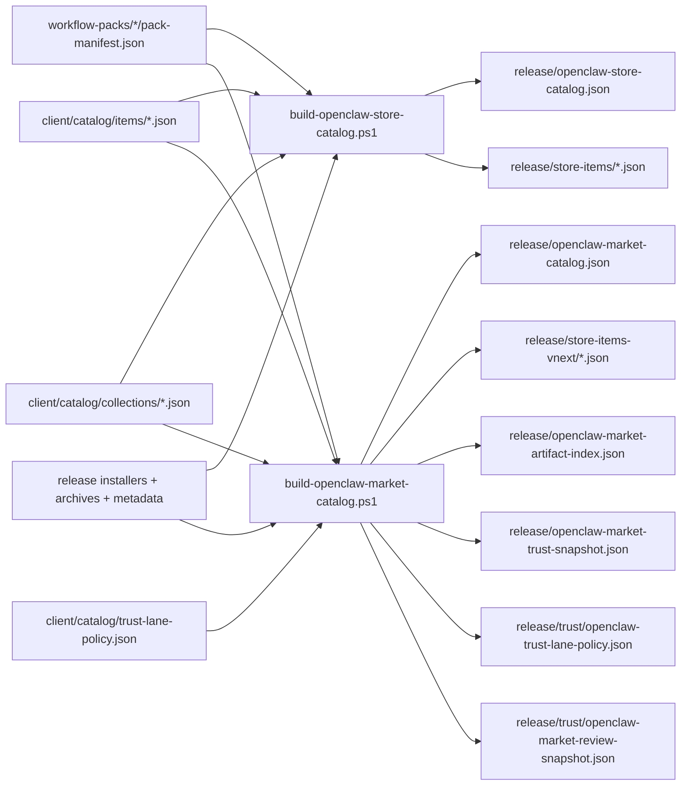
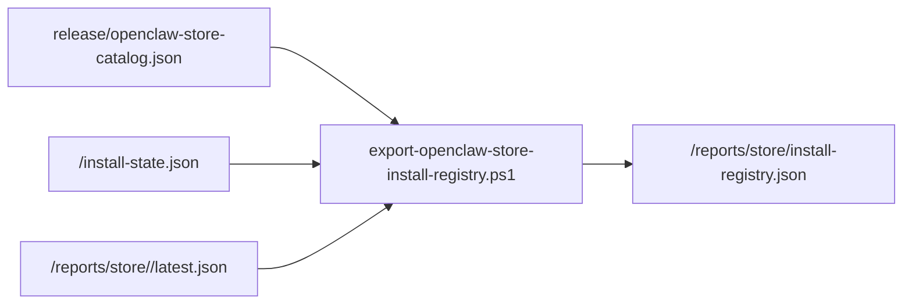

# OpenClaw Store Catalog Assets

This directory stores the curated catalog inputs used by
`client/build-openclaw-store-catalog.ps1` and
`client/build-openclaw-market-catalog.ps1`.

```text
client/catalog/
+-- catalog.schema.json
+-- market-catalog.schema.json
+-- artifact-index.schema.json
+-- trust-snapshot.schema.json
+-- review-snapshot.schema.json
+-- trust-lane-policy.json
+-- items/
|   +-- <item-id>.json
+-- collections/
    +-- <collection-id>.json
```

## Asset Roles

- `catalog.schema.json`
  - freezes the legacy machine-readable catalog payload consumed by the current desktop shell
- `market-catalog.schema.json`
  - freezes the vNext market catalog payload for the fulfillment engine and future desktop shell
- `artifact-index.schema.json`
  - freezes the vNext artifact addressing payload keyed by artifact id + sha256
- `trust-snapshot.schema.json`
  - freezes the vNext publish-time trust summary for each item
- `review-snapshot.schema.json`
  - freezes the vNext publish-time review and exposure projection for each item
- `trust-lane-policy.json`
  - declares the release-side trust lane policy that drives exposure and review defaults
- `items/*.json`
  - per-item override metadata layered on top of workflow-pack manifests
- `collections/*.json`
  - curated store-home groupings for the official desktop demo

## Build Flow



## Collection Behavior

Collection files are filtered against the item ids actually present in the
current build.

This lets the same catalog builder handle a single-pack demo release and future
multi-pack releases without duplicating collection logic.

## Release Outputs

The release pipeline now produces both legacy and vNext store-facing artifacts:

```text
installers
archives
build metadata
source locks
legacy store item metadata
legacy store catalog metadata
vNext market item metadata
vNext market catalog metadata
market artifact index
market trust snapshot
market review snapshot
trust lane policy snapshot
```

## Local Install Registry

The store layer now also has a local install-registry projection contract:

```text
catalog + install-state + latest store report
  -> export-openclaw-store-install-registry.ps1
  -> install-registry.json
```



Registry purpose:

- freezes one store-facing local contract for `installed`, `readiness`, and `available actions`
- lets desktop UI read one merged registry instead of joining 3 data sources itself
- preserves a lane distinction between curated catalog items and imported local-only packs

Contract files:

- `client/catalog/catalog.schema.json`
  - legacy release catalog contract
- `client/catalog/market-catalog.schema.json`
  - vNext market catalog contract
- `client/catalog/artifact-index.schema.json`
  - vNext artifact addressing contract
- `client/catalog/trust-snapshot.schema.json`
  - vNext trust publish contract
- `client/catalog/review-snapshot.schema.json`
  - vNext review and exposure publish contract
- `client/catalog/install-registry.schema.json`
  - local install-registry contract
