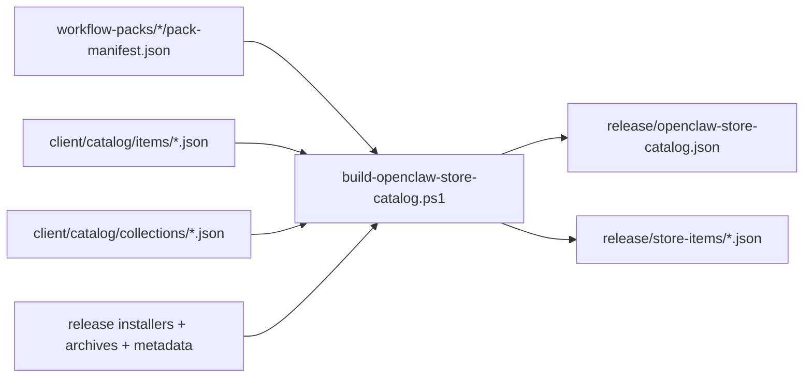

# OpenClaw Store Catalog Assets

This directory stores the curated catalog inputs used by
`client/build-openclaw-store-catalog.ps1`.

```text
client/catalog/
+-- catalog.schema.json
+-- items/
|   +-- <item-id>.json
+-- collections/
    +-- <collection-id>.json
```

## Asset Roles

- `catalog.schema.json`
  - freezes the machine-readable catalog payload consumed by desktop
- `items/*.json`
  - per-item override metadata layered on top of workflow-pack manifests
- `collections/*.json`
  - curated store-home groupings for the official desktop demo

## Build Flow



## Collection Behavior

Collection files are filtered against the item ids actually present in the
current build.

This lets the same catalog builder handle a single-pack demo release and future
multi-pack releases without duplicating collection logic.

## Release Outputs

The release pipeline should now be understood as producing these store-facing
artifacts together:

```text
installers
archives
build metadata
source locks
store item metadata
store catalog metadata
```
