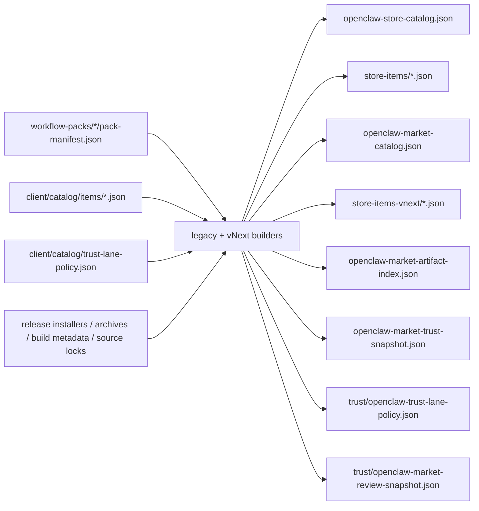

# OpenClaw Catalog Publish Contract

Date: 2026-03-23
Status: Frozen for Stage 1 with Stage 5 trust extensions
Scope: official publish pipeline in `openclaw-setup-cn`

## Purpose

This contract defines the publish outputs emitted by the Stage 1 catalog and
artifact pipeline.

The system now publishes both legacy store-facing assets and vNext market-facing
assets in parallel.

## Output Set

```ascii
Legacy outputs
├─ release/openclaw-store-catalog.json
└─ release/store-items/*.json

vNext outputs
├─ release/openclaw-market-catalog.json
├─ release/store-items-vnext/*.json
├─ release/openclaw-market-artifact-index.json
├─ release/openclaw-market-trust-snapshot.json
└─ release/trust/*
   ├─ openclaw-trust-lane-policy.json
   └─ openclaw-market-review-snapshot.json
```

## Publish Rule

```text
Legacy catalog outputs remain backward-compatible while vNext outputs grow the
market_item, artifact, and trust surface needed by the desktop fulfillment
engine.
```

## Data Flow



## Compatibility Rule

- legacy desktop consumers continue to read `openclaw-store-catalog.json`
- vNext desktop / fulfillment consumers must prefer the vNext output set
- both output families must be generated from the same pinned manifest,
  artifact, and audit inputs in the same release run

## Artifact Addressing Rule

Every vNext publish artifact must be addressable by:

```text
artifactId + sha256 + relativePath
```

## Trust Rule

The trust snapshot is the canonical publish-time summary for:

- trust lane
- release channel
- audit status
- audit summary
- source pinning status
- release-blocking state

Additional Stage 5 trust outputs are canonical for:

- trust lane exposure policy
- publish and review projection
- signed / verified release metadata
- feature-flagged community readiness
