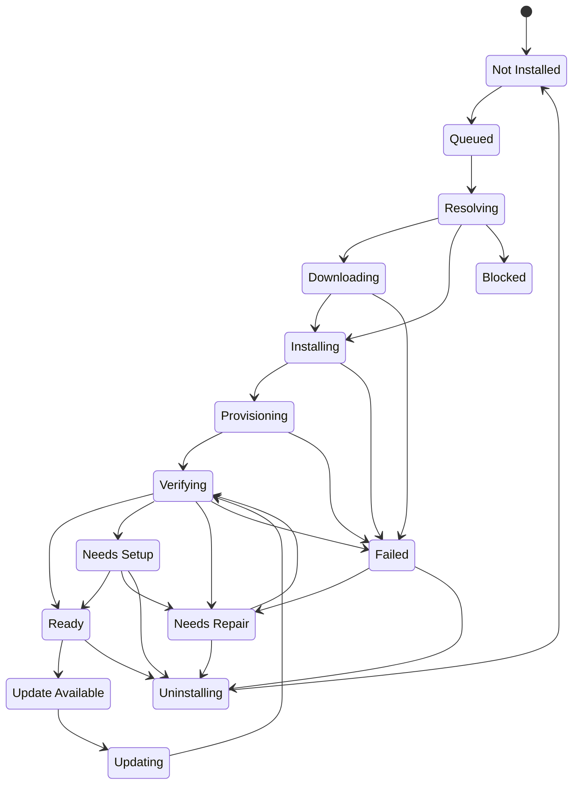

# OpenClaw Store Install State Machine

Date: 2026-03-20
Status: Frozen for V1
Scope: OpenClaw official desktop store

## Purpose

This document freezes the canonical install and readiness states used across:

- catalog item presentation
- install progress reporting
- repair flows
- persisted inventory state

The desktop shell must not invent parallel UI-only states.

## Core Product Rule

```text
Installed != Ready
```

An item may be fully copied to disk and still not be usable.

## Canonical States

```text
Not Installed
Queued
Resolving
Downloading
Installing
Provisioning
Verifying
Ready
Needs Setup
Needs Repair
Blocked
Failed
Update Available
Updating
Uninstalling
```

## Machine Id Mapping

```text
not-installed    -> Not Installed
queued           -> Queued
resolving        -> Resolving
downloading      -> Downloading
installing       -> Installing
provisioning     -> Provisioning
verifying        -> Verifying
ready            -> Ready
needs-setup      -> Needs Setup
needs-repair     -> Needs Repair
blocked          -> Blocked
failed           -> Failed
update-available -> Update Available
updating         -> Updating
uninstalling     -> Uninstalling
```

## Transition Model



## State Semantics

```text
Not Installed
  -> no usable installed item is present on the machine

Queued
  -> install was requested and is waiting for execution

Resolving
  -> metadata, policies, source lock, and artifacts are being resolved

Downloading
  -> required artifacts are being acquired

Installing
  -> payload is being written into the target environment

Provisioning
  -> post-install file/config/template setup is running

Verifying
  -> health checks and readiness checks are running

Ready
  -> verification passed and no blocking manual steps remain

Needs Setup
  -> install succeeded, but manual prerequisites still exist

Needs Repair
  -> expected payload, runtime, provisioning, or verification drift detected

Blocked
  -> install cannot proceed because policy, trust, compatibility, or missing prerequisite blocks execution

Failed
  -> current action failed and did not reach a valid usable state

Update Available
  -> installed item is usable, but a newer catalog version exists

Updating
  -> update flow is in progress

Uninstalling
  -> installed payload and state are being removed
```

## Readiness Derivation

Only these three states are considered post-install readiness outcomes:

```text
Ready
Needs Setup
Needs Repair
```

Rules:

```text
Ready
  -> verification passed
  -> no blocking manual prerequisites remain

Needs Setup
  -> install action succeeded
  -> verification for installed payload passed enough to trust the item is present
  -> one or more manual prerequisites still remain

Needs Repair
  -> expected payload, runtime, provisioning, or verification state drifted
  -> or install landed in a recoverable broken state
```

## Persistence Rule

Persisted inventory and reports must store canonical machine ids,
not ad hoc localized labels.
