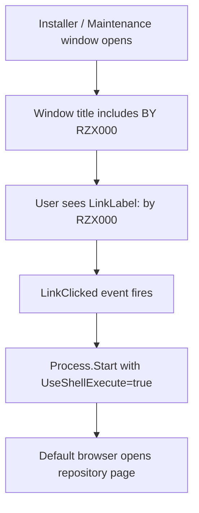

# Clickable Signature Branding Implementation Plan

> **For Claude:** REQUIRED SUB-SKILL: Use superpowers:executing-plans to implement this plan task-by-task.

**Goal:** Replace the old signature with `by RZX000` and make it open the repository page from the installer and maintenance windows.

**Architecture:** Keep package identity in the window title, but move the clickable behavior into explicit `LinkLabel` controls inside each WinForms window because native title text is not clickable. Reuse the existing WinForms external-link pattern already present in the license helper UI to keep behavior consistent and low-risk.

**Tech Stack:** C#, .NET Framework WinForms, PowerShell release build scripts, Git

---

## Design Notes

Recommended approach: preserve the title suffix for the start/update/repair package windows and add a clickable repository link in the visible UI body.

Why this approach:
- It matches the user's current branding request.
- It avoids pretending the Windows title bar can be clicked.
- It keeps the change localized to the two confirmed Windows entrypoints.

Alternative approaches considered:
- Aggressive: inject a custom-drawn title bar and replace the native frame. Rejected because it adds avoidable complexity and regression risk.
- Minimal: change only plain text labels. Rejected because it would not satisfy the clickable requirement.

## UI Flow

```text
+------------------------------+
| Native window title          |
| OpenClaw ... BY RZX000       |
+------------------------------+
| Header / status area         |
|                by RZX000 ->  |  click
|                              |-------> https://github.com/RZX00/openclaw-windows-installer
| Main workflow controls       |
| Logs / buttons               |
+------------------------------+
```



### Task 1: Prepare shared branding decisions

**Files:**
- Modify: `client/windows-oneclick-bootstrap.cs`
- Modify: `client/windows-openclaw-launcher.cs`

**Step 1: Define branding constants**

Add a shared per-file constant for the repository URL and replace the old signature text with `by RZX000`.

**Step 2: Define safe external-link behavior**

Use `Process.Start(new ProcessStartInfo(url) { UseShellExecute = true })` inside guarded helper methods so link clicks do not crash the UI.

**Step 3: Review platform constraint**

Confirm the implementation does not attempt to make the native title bar clickable.

**Step 4: Commit**

```bash
git add client/windows-oneclick-bootstrap.cs client/windows-openclaw-launcher.cs docs/plans/2026-03-15-clickable-signature-branding.md
git commit -m "feat: add clickable RZX000 branding"
```

### Task 2: Update installer UI branding

**Files:**
- Modify: `client/windows-oneclick-bootstrap.cs`

**Step 1: Replace the plain header signature label**

Convert the existing footer/header signature from `Label` to `LinkLabel`.

**Step 2: Wire the click handler**

Open the repository page in the default browser.

**Step 3: Keep layout stable**

Preserve current top/right alignment and typography so the installer header does not reflow.

**Step 4: Commit**

```bash
git add client/windows-oneclick-bootstrap.cs
git commit -m "feat: add clickable branding to installer"
```

### Task 3: Update launcher branding

**Files:**
- Modify: `client/windows-openclaw-launcher.cs`

**Step 1: Replace title suffix**

Change the window title suffix from `BY 那纸` to `BY RZX000`.

**Step 2: Add visible clickable branding**

Insert a `LinkLabel` into the maintenance window header so users can click through to the repository from the UI body.

**Step 3: Match all modes**

Ensure start, update, and repair all inherit the same title and link behavior because they share this window.

**Step 4: Commit**

```bash
git add client/windows-openclaw-launcher.cs
git commit -m "feat: add clickable branding to launcher"
```

### Task 4: Validate and review

**Files:**
- Test: `client/windows-oneclick-bootstrap.cs`
- Test: `client/windows-openclaw-launcher.cs`

**Step 1: Parse check**

Run a targeted compile-oriented validation if available, or build the release assets.

**Step 2: Review diff**

Inspect the final diff to confirm only branding-related code changed.

**Step 3: Release readiness**

If the user wants distribution artifacts, rebuild release assets and tag the next release.

**Step 4: Commit**

```bash
git add docs/plans/2026-03-15-clickable-signature-branding.md client/windows-oneclick-bootstrap.cs client/windows-openclaw-launcher.cs
git commit -m "feat: add clickable RZX000 branding"
```
