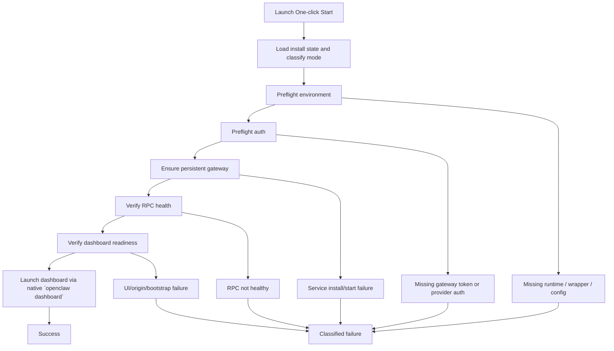

# One-Click Start Stability Design

> **For Claude:** REQUIRED SUB-SKILL: Use superpowers:executing-plans to implement this plan task-by-task.

**Goal:** Redesign the Windows one-click start flow so it remains reliable on OpenClaw 2026.3.13+ and stops failing on token auth, dashboard opening, origin policy, and startup timeout edge cases.

**Architecture:** Stop treating "start gateway", "gateway health", and "open dashboard" as the same readiness signal. Make one-click start a deterministic state machine with explicit mode classification, auth preflight, gateway persistence checks, dashboard readiness verification, and native `openclaw dashboard` handoff.

**Tech Stack:** PowerShell, WinForms launcher, OpenClaw CLI/Gateway, Windows Scheduled Tasks / Startup fallback

---

## Research Snapshot

Date context:
- Current repo snapshot tracks upstream OpenClaw `2026.3.13`.
- Official latest GitHub release visible during research is `v2026.3.13-1` on **2026-03-14**.

Upstream changes relevant to this bug cluster:
- `2026.3.13` tightened Windows gateway install/status/auth behavior.
- Control UI auth/origin behavior is stricter than older builds.
- The dashboard flow now prefers native CLI bootstrap behavior over wrapper-side URL guessing.

## Validated Root Causes

### Hypothesis 1: capability probing amplifies startup latency and creates false "timeout" behavior

Validated.

Evidence:
- `Resolve-Capabilities` runs many sequential `--help` probes through the wrapper.
- Each probe uses a **20 second** timeout.
- On slow or half-broken installs, one-click start can burn a large amount of time before the real startup path even begins.

```text
Current startup cost amplifier

Start
  -> probe daemon status help
  -> probe status --deep help
  -> probe status --all help
  -> probe health help
  -> probe gateway status help
  -> probe gateway install/start/stop/restart help
  -> probe doctor help
  -> probe dashboard help
  -> only then do real work
```

### Hypothesis 2: current readiness checks validate CLI health, not dashboard readiness

Validated.

Evidence:
- `Test-Healthy` only checks CLI commands like `health --json`, `gateway status --json`, and `status --deep`.
- No step verifies:
  - HTTP UI asset availability
  - dashboard bootstrap readiness
  - auth/bootstrap success for the browser path

Result:
- Gateway may be "healthy" for CLI/RPC but still not ready for browser attach, causing "start succeeded, dashboard unusable".

### Hypothesis 3: the launcher bypasses the native dashboard bootstrap flow

Validated.

Evidence:
- Current flow calls `openclaw dashboard --no-open`, extracts a URL, then manually `Start-Process` opens it.
- If that resolution fails, the fallback is hardcoded to `http://127.0.0.1:18789/`.

Why this is now fragile:
- Upstream `openclaw dashboard` is not just "print URL"; it handles current auth behavior, token/bootstrap hints, and browser-open semantics.
- The hardcoded fallback ignores:
  - custom port
  - `gateway.controlUi.basePath`
  - remote/tunnel URL
  - bootstrap nuances introduced by newer auth behavior

### Hypothesis 4: "pure routed" remote HTTP access is fundamentally unstable under the current Control UI security model

Validated.

Evidence from upstream docs:
- Non-loopback browser access requires explicit `gateway.controlUi.allowedOrigins`.
- Plain HTTP remote access has secure-context/device-identity limitations.
- `allowInsecureAuth` is a compatibility toggle, not a general-purpose remote fix.
- Upstream consistently recommends:
  - localhost
  - Tailscale Serve HTTPS
  - SSH tunnel

Result:
- Trying to make one generic "pure route" start path work for local, LAN, proxy, tailnet, and insecure HTTP is the wrong product shape.

### Hypothesis 5: one-click start does not preflight the two token domains that users now confuse

Validated.

Token domain A:
- Gateway auth token
- Used by Control UI / dashboard WebSocket auth

Token domain B:
- Model/provider auth
- Example: Anthropic `setup-token`, API key, Codex OAuth

Evidence:
- Current one-click start mainly checks license and gateway health.
- It does not classify:
  - missing gateway token
  - dashboard auth missing
  - missing provider auth profile
  - expired setup-token / provider auth state

Result:
- Users interpret every post-update auth failure as "extra token required", even when the missing piece is not the same token.

## Design Decision

Recommended product definition:

```text
"One-click Start" should mean:
bring up a local, persistent, healthy Gateway on the gateway host
and open the dashboard correctly on that same host

It should NOT silently serve as:
LAN exposure wizard
reverse proxy wizard
tailnet HTTP bypass
provider-auth repair tool
```

That means remote access must become an explicit mode, not accidental fallout from local startup logic.

## Recommended Architecture

### Mode split

```text
Mode A: Local Stable Start        (default, recommended)
Mode B: Remote Stable Access      (recommended remote path)
Mode C: LAN Breakglass Access     (explicit opt-in only)
```

Definitions:
- `Local Stable Start`
  - target: gateway host machine
  - bind: loopback preferred
  - dashboard open: native `openclaw dashboard`
- `Remote Stable Access`
  - target: remote browser access
  - transport: Tailscale Serve HTTPS or SSH tunnel
  - avoid plain HTTP route dependence
- `LAN Breakglass Access`
  - target: trusted private network only
  - requires explicit risk acceptance
  - not the default one-click start path

### Startup state machine



## Concrete Implementation Plan

### Phase 1: stop the main regressions

1. Replace manual dashboard launch with native CLI launch.
   - First choice: call `openclaw dashboard`.
   - Fallback only when the command is unavailable.

2. Remove or cache capability probing.
   - Cache results per installed version in install state.
   - Do not re-run 10+ `--help` probes on every start.

3. Split readiness into two checks.
   - `Gateway healthy`
   - `Dashboard ready`

4. Add startup error classification.
   - timeout
   - origin policy
   - dashboard auth token missing
   - provider auth missing
   - port conflict
   - service persistence failure

### Phase 2: formalize remote access instead of guessing

1. Add a remote access profile/state field in install state.
2. Support only two stable remote paths:
   - Tailscale Serve HTTPS
   - SSH tunnel
3. Stop pretending plain HTTP routed mode is a first-class path.
4. If user forces LAN mode:
   - require explicit token
   - manage `allowedOrigins`
   - mark it as breakglass

### Phase 3: auth preflight

1. Check gateway token presence before dashboard launch.
2. Check provider auth status before claiming "chat ready".
3. Distinguish:
   - "Gateway dashboard can open but model auth is missing"
   - "Gateway itself cannot authenticate the dashboard"

## Best Implementation of "One-Click Start"

Recommended final behavior:

```text
One-click Start
  -> verify/install persistent local gateway
  -> verify RPC health
  -> verify dashboard command works
  -> run native `openclaw dashboard`
  -> if dashboard auth missing, generate or retrieve gateway token
  -> if provider auth missing, open targeted onboarding/auth repair
```

Not recommended as default:
- direct LAN HTTP browser open
- tailnet HTTP open without HTTPS
- wrapper-side guessed dashboard URL as the primary path

## Recommended Product Choices

### Stable option (recommended)

- Keep "One-click Start" local-only and deterministic.
- Add a separate "Remote Access" entry for Tailscale Serve / SSH tunnel.
- Treat LAN HTTP as explicit breakglass.

Why:
- matches upstream security model
- far lower support cost
- aligns with 2026.3.13+ auth/origin behavior

### Aggressive option

- Build a "smart router" one-click start that auto-detects local vs remote vs proxy vs tailnet.
- Auto-patches origins, insecure auth toggles, and transport strategy.

Why not recommended:
- too many branches
- higher regression surface
- fights upstream security assumptions

## Test Matrix

```text
Local loopback
  - token present
  - token missing
  - custom port
  - custom basePath

Persistent service
  - scheduled task works
  - scheduled task hangs
  - startup-folder fallback

Dashboard
  - openclaw dashboard succeeds
  - dashboard command unsupported
  - UI asset path changed

Remote
  - Tailscale Serve HTTPS
  - SSH tunnel
  - LAN breakglass

Auth
  - gateway token valid
  - gateway token missing
  - Anthropic setup-token missing/expired
  - API key present via service-visible env
```

## Final Recommendation

Ship the stable option:
- redefine one-click start as local-host startup only
- move remote browser access to a dedicated remote mode
- stop hand-assembling dashboard URLs as the primary strategy
- preflight both gateway token and provider auth before claiming success
