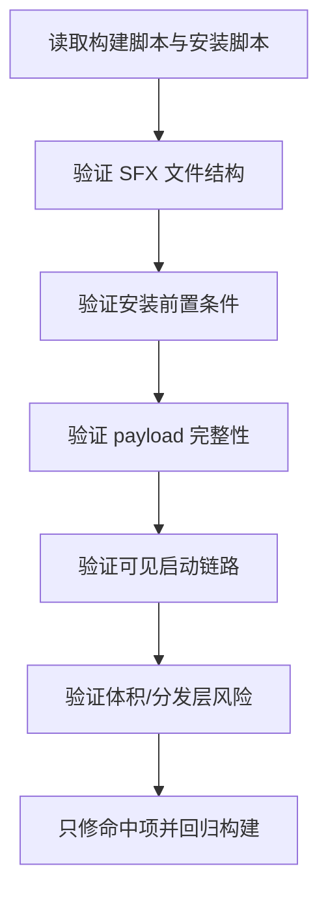

# Reach Pack 故障排查计划

日期：2026-03-15

## 目标

定位 `OpenClaw-Reach-Pack.exe` “不工作”的真实原因，并只修命中的问题。

## 当前假设

```text
Reach Pack Failure
|
+-- H1: SFX 自解压入口有缺陷
|   `-- 需要验证 payload/footer/extract 流程是否完整
|
+-- H2: Reach 安装器前置条件不满足
|   `-- 需要验证是否强依赖已安装的 OpenClaw 主包
|
+-- H3: Reach 运行时内容缺失或路径错误
|   `-- 需要验证 git/gh/node/python/skill 是否全部被正确打进 payload
|
+-- H4: 启动方式导致用户侧看起来像“没打开”
|   `-- 需要验证 winexe + cmd 子进程是否真的能弹出可见窗口
|
+-- H5: 包体积/携带文件触发执行层风险
    `-- 需要验证 500MB+ 单文件 SFX 与 gh/git/node/python 组合是否带来执行或分发问题
```

## 验证顺序



## 验收标准

- 能明确指出 Reach 包失败是在“构建、启动、安装、验证、分发”哪一层。
- 若修复代码，必须有本地可重复验证。
- 若问题不在代码而在使用前置条件或分发限制，必须把结论写清楚并补足产品/日志提示。
