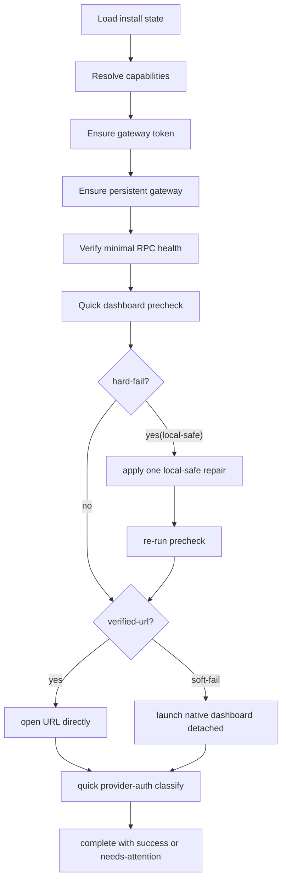

# 一键启动 Dashboard 打开与超时修复实施文档

## 目标

把 `OpenClaw-Start.exe` 调整为“平衡模式”启动器：

```text
Start
  -> 保留必要硬门槛
     - gateway token
     - persistent gateway
     - RPC health
     - local-only dashboard path
  -> dashboard 预检只做快检
  -> 软失败不拦截
  -> 优先直开 verified URL
  -> 否则 detached 启动 native dashboard
  -> provider auth 只做快速分类
```

## 已验证的 5 个根因

```text
1. dashboard 预检被当成硬门槛
   -> `Finalize-OperationalReadiness` 在打开 dashboard 之前直接失败

2. `dashboard --no-open` 分类过于激进
   -> timeout / URL 缺失 / URL 无效 都被直接判死

3. native dashboard 打开仍走同步捕获链路
   -> `Invoke-OpenClaw` 会等待退出，导致“我手动能开，包装器不行”

4. launcher 用固定总时长误杀
   -> 360s 到点直接 kill，没有区分“仍在持续输出”

5. provider auth 检查过慢且阻塞成功路径
   -> `models status` 过长 timeout + `--check` 让 Start 变慢且不稳定
```

## 设计决策

```text
默认模式: local-stable
dashboard 打开策略:
  verified-url         -> 直接 Start-Process URL
  soft-fail            -> detached 启动 `openclaw dashboard`
  hard-fail(local)     -> 单次本机安全修复后重试
  hard-fail(nonlocal)  -> NeedsAttention

超时策略:
  Start idle timeout   -> 180s
  Start hard cap       -> 900s
  Update / Repair      -> 保持原有总时长模型
```

## 状态机



## 实施批次

```text
Batch 1
  - 重写 Verify-DashboardReady 的 soft/hard 分类
  - 引入单次 local-safe auto-repair
  - 改写 Open-DashboardEntry 为 URL-first / native-detached fallback
  - provider auth 改为 fast classify

Batch 2
  - launcher 改为 activity-based timeout
  - 输出明确的 idle / hard-cap reason
  - 保持 Start 过程有活动时不被误杀
```

## 验收口径

```text
通过:
  - 手动 `openclaw dashboard` 能开时，Start 也能开
  - `dashboard --no-open` 超时不再直接失败
  - dashboard 打开不再同步等待退出
  - provider auth unknown 不阻塞 Success
  - Start 只有无活动超时才退出

失败:
  - 非 loopback URL 仍被当成本机一键启动成功
  - `origin not allowed` 被自动扩大修复到 LAN / remote
  - provider auth 慢导致 Start 再次误超时
```
