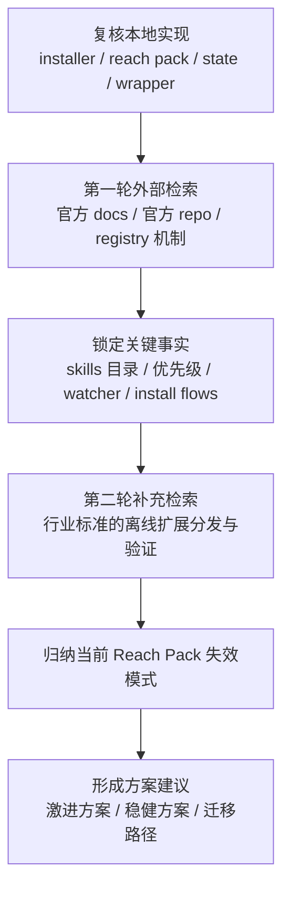

# OpenClaw 工作流/Skills 一键安装深度调研计划

## 目标

围绕当前 Windows 安装包，研究如何把“工作流 / skills / 配套运行时 / 能力注册”从“安装后再手工补齐”改造成“安装即完成、可验证、可恢复”的一键交付链路。

## 问题拆解

```text
用户表面问题
+----------------------------------------------------------------------------------+
| 基础安装已经顺滑，但工作流配置仍然麻烦                                           |
| Reach Pack 不稳定，完成后不一定真正可用                                          |
| skills 没有稳定安装到正确目录                                                    |
| 能力缺失，运行后看起来像“装了但没生效”                                           |
| 其他第三方 skills 也很难统一安装                                                 |
+----------------------------------------------------------------------------------+
                                      |
                                      v
待验证的核心问题
+----------------------------------------------------------------------------------+
| 1. 上游 OpenClaw 实际的 skills 发现路径、优先级、刷新机制是什么                  |
| 2. 当前 Reach Pack 是否装到了“被加载但不被优先采用”的位置                        |
| 3. 当前安装是否缺少索引刷新 / 新会话切换 / 能力探测 / 环境注入                   |
| 4. 运行时依赖是否只是复制了文件，但没有完成 capability gating 所需条件           |
| 5. 是否应该继续走“附加包”，还是改成“主安装包内置工作流发行版”                    |
+----------------------------------------------------------------------------------+
```

## 调研路径



## 交付物

```text
1. 上游机制事实表
2. 当前实现与上游机制的偏差表
3. Reach Pack 失效根因假设列表
4. 一键工作流安装架构建议
5. 激进方案 vs 稳健方案
6. 对当前仓库的下一步改造建议
```

## 当前已知本地事实

```text
- 主安装链路中心:
  - client/install-windows-core.ps1
  - client/windows-openclaw-maintenance.ps1
  - ProgramData/OpenClaw/install-state.json

- Reach Pack 是附加包，不在主安装闭环内:
  - client/build-windows-reach-pack.ps1
  - client/install-windows-reach-pack.ps1

- Reach Pack 当前做法:
  - 安装离线 Git / Node / Python / gh / xreach / mcporter
  - 往 ProgramData/OpenClaw/reach 写 payload
  - 往 ProgramData/OpenClaw/bin 写 wrappers
  - 往 %USERPROFILE%/.openclaw/skills/agent-reach/SKILL.md 写单个 skill
```

## 输出原则

```text
- 以官方机制为准，不靠猜测
- 优先给出可落地到当前仓库的架构建议
- 不追求“能跑一次”，追求“可重复安装、可检测、可恢复”
- 报告里必须区分：
  - 事实
  - 基于事实的推断
  - 建议
```
