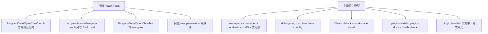

# OpenClaw 工作流 / Skills 一键安装深度调研报告

## 结论先行

```text
你们现在的 Reach Pack 之所以“看起来装完了，但技能没真正生效”，
不是单点 bug，而是分发模型本身和上游 OpenClaw 的原生装载模型错位了：

1. 上游原生技能分发主路径是：
   - workspace skills
   - managed/local skills
   - plugins
   - plugin bundles

2. 当前 Reach Pack 走的是旁路复制：
   - 机器级 ProgramData 运行时
   - 用户级 ~/.openclaw/skills 单个 SKILL.md
   - 没接入上游的 workspace / plugin / bundle / lock / enable / doctor 验证闭环

3. 结果就是：
   - 文件可能存在
   - wrapper 可能能跑
   - 但 OpenClaw 当前会话、当前 workspace、当前 gating 条件、当前能力缓存
     不一定认它

4. 想做到真正“一键工作流安装”，不能继续把每个 skill 当成一堆文件硬塞进去。
   需要改成“官方原语优先”的分发体系：
   - skill-only -> 按上游规则安装到 workspace 或 managed/local
   - multi-file / multi-plugin / 需要设置或 MCP 的工作流 -> 打成 plugin bundle
   - 第三方复杂 skill -> 建内部 curated pack，而不是让用户现场下载
```

## 上游机制事实

### 1. Skills 的官方发现路径与优先级

```text
OpenClaw 官方 skills 加载顺序：

<workspace>/skills
  > ~/.openclaw/skills
  > bundled skills
  > skills.load.extraDirs
```

- 这意味着你们现在写入 `~/.openclaw/skills` 只是“共享技能层”，不是最高优先级。
- 如果用户当前 agent/workspace 已经有同名 skill，或者工作流真正依赖 workspace 级上下文，managed/local 层不一定是最合适的目标。

### 2. ClawHub 的官方安装模型不是“全局机器级复制”

```text
ClawHub 默认安装到：
  ./skills

如果当前目录不是工作区，则回退到：
  已配置的 OpenClaw workspace

OpenClaw 把它当作：
  <workspace>/skills

生效时机：
  next session
```

- 这说明上游官方默认把 skill 视为“工作区资产”而不是“机器全局运行时”。
- 同时 ClawHub 维护 `.clawhub/lock.json`，有来源与版本记录。

### 3. Skills 不是“文件存在就会加载”

OpenClaw 对 skill 有 load-time gating：

- `metadata.openclaw.os`
- `metadata.openclaw.requires.bins`
- `metadata.openclaw.requires.env`
- `metadata.openclaw.requires.config`

也就是说：

```text
SKILL.md 在磁盘上存在
!=
skill 在当前主机上 eligible
!=
skill 在当前会话里会出现在系统提示里
```

### 4. 官方已经提供“可验证”的技能检查 CLI

```bash
openclaw skills list
openclaw skills list --eligible
openclaw skills info <name>
openclaw skills check
```

- 这套命令可以直接验证“技能是否被发现、是否满足依赖、是否可用”。
- 你们当前 Reach Pack 的验证没有接入这一层。

### 5. 上游已经提供比 raw skill 更适合打包分发的原语

#### Plugins

插件可以：

- 注册命令
- 注册工具
- 注册后台服务
- 注册 RPC / HTTP 路由
- 自带 `skills` 目录

而且支持本地安装：

```bash
openclaw plugins install <path-or-spec>
```

支持输入：

- 本地目录
- `.zip`
- `.tgz`
- `.tar.gz`
- `.tar`
- npm 包

#### Plugin Bundles

Plugin Bundles 官方目标就是：

```text
把多个插件 + skills + MCP config + defaults
组合成一个可分发、可一次安装的单元
```

这和你们的“工作流区一键安装”目标高度一致。

### 6. 官方到 2026-03 仍明确推荐 Windows 走 WSL2

官方 onboarding / README 都写明：

```text
Windows (via WSL2; strongly recommended)
```

这意味着：

- 原生 Windows 并不是上游最稳定、最优先保障的生态位
- 很多社区 skills 的默认依赖链更接近 macOS / Linux / Homebrew / POSIX
- 你们如果坚持原生 Windows，就必须维护自己的兼容矩阵与发行策略

### 7. Agent Reach 上游自身也有明确目录契约

Agent Reach 官方安装文档要求：

- skill 安装到 `~/.openclaw/skills/agent-reach`
- 运行与配置目录使用 `~/.agent-reach`

而当前 Reach Pack 是：

- runtime 装到 `ProgramData\OpenClaw\reach`
- skill 只复制到 `~/.openclaw/skills/agent-reach/SKILL.md`

这是目录契约层面的偏差，不是简单的“路径不同但等价”。

## 当前实现与上游机制的偏差



### 偏差 1：目标目录不统一

当前 Reach Pack 同时操作：

- `ProgramData\OpenClaw\reach`
- `ProgramData\OpenClaw\bin`
- `%USERPROFILE%\.openclaw\skills\agent-reach`

这导致：

- 运行时是机器级
- skill 是用户级
- workspace 完全没参与

多 agent / 多 workspace / 多用户时最容易出错。

### 偏差 2：只复制了 SKILL.md，没有采用“完整 skill bundle”模型

当前构建脚本从 Agent Reach 的 Python payload 中只抽出：

- `agent_reach/skill/SKILL.md`

而不是按通用 skill bundle 思维去保留完整 skill 目录结构。

这对 Agent Reach 也许还能勉强工作，但对很多其他 skills 不成立，因为很多 skills 还依赖：

- scripts
- templates
- references
- extra config

### 偏差 3：验证层太浅

当前 Reach Pack 安装后只验证：

- Git
- Python
- gh
- Node
- Agent Reach CLI
- xreach
- mcporter

但没有验证：

- OpenClaw 是否发现该 skill
- skill 是否 eligible
- 当前 session 是否能看到它
- 是否缺 config / env / os gating
- 是否需要 gateway restart / next session

### 偏差 4：没有接入上游 plugin / bundle / lock / doctor 体系

这导致当前附加包缺少：

- 版本来源记录
- 原生 enable / disable / update 管理
- 原生 integrity / doctor / info 能力
- 与未来上游扩展机制的兼容性

### 偏差 5：没有把“Windows 平台兼容性”作为一级维度管理

很多 skills 官方就有：

- `os`
- `requires.bins`

如果不做 win32 兼容矩阵管理，安装成功率注定不稳定。

## Reach Pack 失败的 5 个最可能根因

### 假设 1：Skill 写到了可发现目录，但不是正确的“工作流语义目录”

如果目标是某个 agent/workspace 专用工作流，写入 `~/.openclaw/skills` 并不等于它会按预期出现在对应 workspace 的会话中。

### 假设 2：Skill 文件存在，但 gating 没通过

最典型的是：

- `metadata.openclaw.os` 不含 `win32`
- 缺 bin
- 缺 env
- 缺 config

这种情况下用户会看到“像是装了，但能力缺失”。

### 假设 3：Reach Pack 的运行时目录偏离了 Agent Reach 上游约定

上游 Agent Reach 默认约定的是 `~/.agent-reach`，你们改成了 `ProgramData\OpenClaw\reach`。

如果上游脚本、文档、工具链、相对路径假设没有全部适配，运行时就会表现成部分可用、部分失效。

### 假设 4：安装完成后没有触发 OpenClaw 原生级刷新 / 检查

上游明确提到：

- ClawHub 安装后通常在 next session 生效
- watcher 是在 next agent turn 刷新 snapshot

而 Reach Pack 当前没有做：

- `openclaw skills check`
- `openclaw skills info agent-reach`
- 必要的 gateway restart / session refresh

### 假设 5：当前分发模型天生不适合“很多其他 skills”

因为很多 skills 根本不是“复制一个 SKILL.md”就能装好的。

对于多文件 skill、带脚本 skill、带 MCP / config / plugin 的工作流，这套模型天然扩展不出去。

## 行业对标结论

### VS Code 的模式

官方支持：

- 从 Marketplace 安装
- 从 `.vsix` 本地离线安装

本质是：

```text
扩展以“版本化单文件包”交付
+ 安装目标固定
+ 生命周期由宿主统一管理
+ 有原生列表 / 启用 / 禁用 / 更新体系
```

### JetBrains 的模式

官方支持：

- Install Plugin from Disk
- Private / Custom Plugin Repository

本质同样是：

```text
不要让用户自己拼文件夹
而是让宿主消费“标准扩展包”或“标准私有仓库”
```

### 对你们的直接启示

```text
真正稳定的一键安装
不是把 skill 文件复制得更彻底
而是把“工作流”升格成宿主可识别、可验证、可更新的标准分发单元
```

## 方案选项

### 方案 A：激进方案

```text
内部定义「Workflow Bundle」发行体系
并统一基于 OpenClaw plugin / plugin bundle 原语分发
```

做法：

1. 你们维护自己的 curated workflow registry
2. 每个 workflow pack 预先锁定版本、依赖、兼容平台
3. 能用 plugin 的一律打成 plugin
4. 多插件 + 多 skill + MCP + 默认配置一起打成 plugin bundle
5. 对不兼容 Windows 的第三方 skill：
   - 要么 fork 成 win32 兼容版
   - 要么明确标记“仅 WSL2 / 不支持原生 Windows”

优点：

- 交付体验最好
- 安装最可控
- 可做真正离线
- 能统一版本、回滚、验签、健康检查

缺点：

- 需要长期维护内部发行体系
- 第三方 skill 接入成本高

### 方案 B：稳健方案

```text
保留当前 Windows 一键安装器
但把工作流安装切到“官方分发原语优先”
```

建议落地为三层：

1. **shared skill pack**
   - 只处理“纯 skill、轻依赖、你们已验证支持 win32”的内容
   - 安装到 `~/.openclaw/skills/<name>/...`
   - 必须复制完整 skill 目录，不再只复制 SKILL.md

2. **plugin pack**
   - 对需要命令、工具、后台服务、MCP、配置 schema 的工作流
   - 统一打成本地 `.tgz/.zip`，由 `openclaw plugins install <local-archive>` 安装

3. **post-install verifier**
   - 安装后统一执行：
     - `openclaw skills check`
     - `openclaw skills info <name>`
     - `openclaw plugins list`
     - `openclaw plugins info <id>`
     - `openclaw plugins doctor`

优点：

- 最贴近上游
- 维护成本比方案 A 小
- 能快速替换当前 Reach Pack

缺点：

- 仍然需要你们维护一份“支持原生 Windows 的工作流白名单”
- 对社区任意 skill 仍不能承诺百分百安装成功

## 推荐路线

### 我建议的默认路线

```text
短中期采用：方案 B
长期演进目标：方案 A
```

原因：

1. 你们当前已经有成熟的 Windows 安装器外壳，没必要推倒重来
2. 用户当前最痛的是“我们自己的工作流区装不上”，不是“立刻兼容所有社区 skill”
3. 先把“自有 workflow zone”改成官方兼容的标准包，再决定是否建设内部 registry

## 对当前仓库的直接改造建议

### 第一阶段：停掉 Reach Pack 的旁路思路

不要再把新增工作流继续堆进 `Reach Pack` 的“复制 runtime + 复制 SKILL.md”模型里。

### 第二阶段：建立工作流分类

```text
Workflow Catalog
+----------------------------------------------------------------------------------+
| A. skill-only                         -> shared skill pack                        |
| B. skill + binary runtime             -> curated shared pack + full preflight     |
| C. tool/service/MCP/config heavy      -> plugin / plugin bundle                   |
| D. not win32-compatible               -> 禁止原生安装 / 提示 WSL2                 |
+----------------------------------------------------------------------------------+
```

### 第三阶段：安装协议改造

主安装器或附加包安装时，统一执行：

1. 解析 pack manifest
2. 校验 sha256 / version / target platform
3. 按 pack 类型选择安装通道
4. 写入 config / enable state
5. 运行 OpenClaw 原生验证命令
6. 保存安装结果与失败原因

### 第四阶段：健康检查改造

把当前 Reach Pack 的验证从“工具能否打印版本号”升级为：

```text
Phase 1: artifact verify
Phase 2: file placement verify
Phase 3: openclaw skills/plugin discovery verify
Phase 4: eligibility verify
Phase 5: smoke test verify
```

## 对 Agent Reach 的特殊建议

Agent Reach 是当前最典型的“局部能跑、整体不稳”的案例。

建议优先二选一：

### 路线 1：完全遵循上游目录契约

- skill 仍放 `~/.openclaw/skills/agent-reach`
- runtime / config / tools 迁回上游预期的 `~/.agent-reach`

### 路线 2：显式 fork 并产品化

- 给 Agent Reach 增加正式支持的可配置 home root
- 不再靠隐式 wrapper 假装兼容
- 用你们自己的 Windows 发行版固定行为

如果不做这一步，后续继续补 patch，故障会反复出现。

## 本地代码证据

- Reach Pack 把用户 skill 固定写到 `~/.openclaw/skills/agent-reach`：
  - [install-windows-reach-pack.ps1](/E:/app/openclaw-setup-cn/client/install-windows-reach-pack.ps1#L279)
- Reach Pack 只复制 `SKILL.md`：
  - [install-windows-reach-pack.ps1](/E:/app/openclaw-setup-cn/client/install-windows-reach-pack.ps1#L315)
  - [build-windows-reach-pack.ps1](/E:/app/openclaw-setup-cn/client/build-windows-reach-pack.ps1#L589)
- Reach Pack 的验证只到 wrapper / version 层：
  - [install-windows-reach-pack.ps1](/E:/app/openclaw-setup-cn/client/install-windows-reach-pack.ps1#L340)

## 参考来源

### OpenClaw 官方

1. Skills
   - https://docs.openclaw.ai/tools/skills
2. ClawHub
   - https://docs.openclaw.ai/tools/clawhub
3. Plugins
   - https://docs.openclaw.ai/tools/plugin
4. Plugin manifest
   - https://docs.openclaw.ai/plugins/manifest
5. Plugin bundles
   - https://docs.openclaw.ai/plugins/bundles
6. CLI skills
   - https://docs.openclaw.ai/cli/skills
7. CLI plugins
   - https://docs.openclaw.ai/cli/plugins
8. Onboarding wizard / Windows via WSL2
   - https://docs.openclaw.ai/start/wizard
9. OpenClaw GitHub README
   - https://github.com/openclaw/openclaw

### Agent Reach 官方

10. Agent Reach install guide
    - https://raw.githubusercontent.com/Panniantong/agent-reach/main/docs/install.md
11. Agent Reach pyproject
    - https://raw.githubusercontent.com/Panniantong/agent-reach/main/pyproject.toml
12. Agent Reach SKILL.md
    - https://raw.githubusercontent.com/Panniantong/agent-reach/main/agent_reach/skill/SKILL.md

### 行业参考

13. VS Code extension marketplace / VSIX install
    - https://code.visualstudio.com/docs/configure/extensions/extension-marketplace
14. IntelliJ plugin install from disk / plugin management
    - https://www.jetbrains.com/help/idea/managing-plugins.html
15. IntelliJ custom plugin repository
    - https://www.jetbrains.com/help/idea/custom-plugin-repository.html
