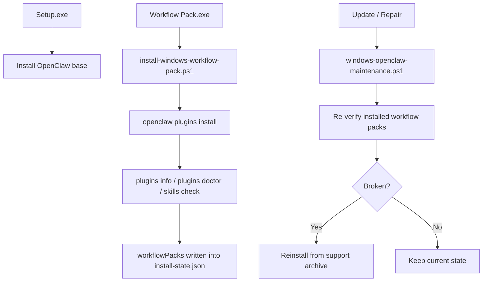

# Workflow Zone One-Click Final Review

## Goal

Move `workflow-zone` from the old Reach Pack semantics into a standalone OpenClaw-native workflow add-on package, and complete:

- base installer / workflow add-on decoupling
- native plugin + skills installation and verification for the workflow add-on
- Update / Repair re-check and self-heal for previously installed workflow add-ons
- release assets, compatibility scripts, and docs switched to the workflow pack model

## Phase Commits

```text
Phase 1
  4c80be1  feat: add workflow pack scaffold and builder

Phase 2
  7e187c4  feat: add workflow pack installer and native verification

Phase 3
  6afcd98  feat: self-heal workflow packs during update and repair

Phase 4
  8803544  feat: publish workflow pack add-on artifacts
```

## Delivered Shape

```text
Base
  OpenClaw-Setup-Windows-x64.exe

Workflow Add-On
  OpenClaw-Workflow-Pack-Workflow-Zone.exe
  OpenClaw-Workflow-Pack-Workflow-Zone.zip

Maintenance
  OpenClaw-Start.exe
  OpenClaw-Update.exe
  OpenClaw-Repair.exe

Compatibility Alias
  build-windows-reach-pack.ps1
  install-windows-reach-pack.ps1
    -> forward into workflow pack builder / installer
```



## Validation Matrix

```text
[PASS] client/build-windows-workflow-pack.ps1
  - dry-run passed
  - real zip build passed

[PASS] client/install-windows-workflow-pack.ps1
  - dry-run against existing ProgramData install passed
  - dry-run with synthetic runtime payload passed

[PASS] client/windows-openclaw-maintenance.ps1
  - syntax parse passed
  - support-root fallback discovery validated via isolated harness
  - self-heal success path validated via isolated harness
  - archive-missing failure path validated via isolated harness
  - Finalize-OperationalReadiness success/failure integration validated via isolated harness

[PASS] client/build-windows-workflow-pack-installer.ps1
  - syntax parse passed
  - dry-run passed

[PASS] client/build-windows-reach-pack.ps1
  - compatibility alias dry-run passed

[PASS] client/install-windows-reach-pack.ps1
  - syntax parse passed
  - compatibility forwarding reviewed

[PASS] scripts/build-release-assets.ps1
  - syntax parse passed
  - release asset naming switched to workflow pack model

[PASS] .github/workflows/windows-release.yml
  - workflow artifact and GitHub Release asset names switched to workflow pack model
```

## Final Review Findings

```text
No blocking implementation defects remained after the final review pass.

Important non-blocking observation:
- A full end-to-end release build was attempted.
- It produced OpenClaw-Setup-Windows-x64.exe before the command exceeded the 30 minute tool timeout.
- The long-running step was workflow runtime preparation during npm global dependency installation inside the workflow pack installer build.
- Temporary processes and artifacts from that attempt were cleaned up after inspection.
```

## Residual Risk

```text
1. Full release build duration is still high because the workflow add-on installer embeds offline runtime dependencies.
2. The code paths are verified by dry-run and isolated harness coverage, but a complete end-to-end release build should still be rerun in CI or on a dedicated build machine and timed.
3. README / RELEASING were updated at the product-language level, but the legacy Chinese sections still contain historical content outside the newly added workflow-pack notes.
```
