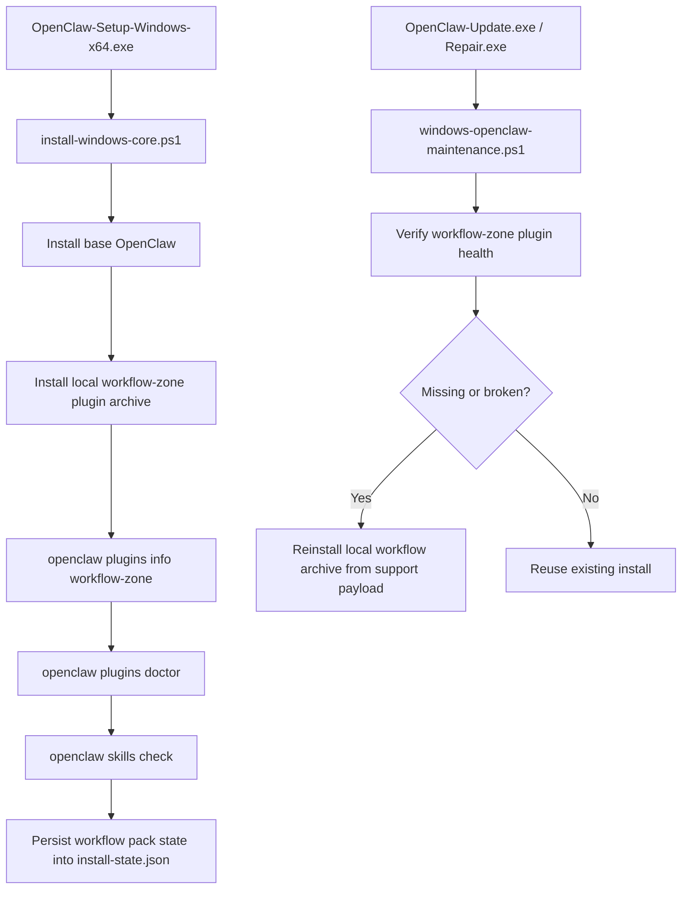

# Workflow Zone One-Click Installation Implementation Plan

> **For Claude:** REQUIRED SUB-SKILL: Use superpowers:executing-plans to implement this plan task-by-task.

**Goal:** 把“我们自己的工作流区”改造成随主安装器一起交付、安装后即被 OpenClaw 原生识别和验证的一键安装能力，不再依赖 Reach Pack 的旁路复制模型。

**Architecture:** 采用稳健方案，把工作流区重构为一个本地可安装的 `skill-pack plugin`，由 Windows 主安装器内嵌分发并在基础 OpenClaw 安装完成后，通过 `openclaw plugins install <local-archive>` 完成原生安装；随后统一执行 `plugins` / `skills` 级验证，并把结果写入 `install-state.json`。保留 `Update/Repair` 对该工作流包的重装与验活能力，彻底废弃“只复制 SKILL.md + wrapper 探测”的 Reach Pack 主路径。

**Tech Stack:** PowerShell, C#, OpenClaw CLI, local plugin archive (`.zip` or `.tgz`), GitHub Actions release pipeline

---

## Scope

```text
本次只解决：
- 我们自己的 workflow zone
- Windows 原生一键安装
- 安装 / 更新 / 修复后的稳定验活

本次不解决：
- 任意第三方社区 skill 的通用安装兼容
- 广义 ClawHub 替代品
- 全量 Reach Pack 生态兼容
```

## Recommended Product Shape

```text
Recommended:
Main Setup.exe
  -> install OpenClaw base
  -> install workflow-zone plugin pack
  -> run native verification

Fallback:
Update.exe / Repair.exe
  -> verify plugin pack presence
  -> reinstall local workflow pack if missing/broken
```



## Current State Summary

```text
Current Reach Pack:
- build-windows-reach-pack.ps1 builds a custom self-extracting EXE
- install-windows-reach-pack.ps1 copies runtime into ProgramData/OpenClaw/reach
- writes only ~/.openclaw/skills/agent-reach/SKILL.md
- writes wrappers into ProgramData/OpenClaw/bin
- validates only CLI/version level

Target State:
- workflow zone shipped as local plugin archive
- plugin manifest owns skills directories
- OpenClaw native plugin loader owns discovery
- skills check / plugins doctor become source of truth
```

## Target Files

```text
Expected new/modified files

Build / packaging
- Modify: client/build-windows-oneclick-installer.ps1
- Modify: scripts/build-release-assets.ps1
- Modify: .github/workflows/windows-release.yml
- Create: client/build-windows-workflow-zone-pack.ps1
- Create: client/workflow-zone-plugin/openclaw.plugin.json
- Create: client/workflow-zone-plugin/package.json
- Create: client/workflow-zone-plugin/index.ts
- Create: client/workflow-zone-plugin/skills/... (our curated workflow zone)

Install / verify
- Modify: client/install-windows-core.ps1
- Modify: client/windows-openclaw-maintenance.ps1

Docs
- Modify: README.md
- Modify: RELEASING.md

Legacy cleanup / compatibility
- Modify: client/build-windows-reach-pack.ps1 (deprecate or narrow)
- Modify: client/install-windows-reach-pack.ps1 (deprecate or narrow)
```

## Design Rules

```text
1. Workflow zone must be delivered as one OpenClaw-native install unit.
2. Installation success means:
   - plugin installed
   - plugin enabled or otherwise active
   - expected skills discoverable
   - expected skills eligible
3. No new custom skill-discovery rules.
4. No more “copy single SKILL.md” for curated workflow assets.
5. All verification must use OpenClaw native commands before declaring success.
6. Update and Repair must be able to self-heal workflow-zone installation.
```

### Task 1: Define Workflow Zone Plugin Layout

**Files:**
- Create: `E:\app\openclaw-setup-cn\client\workflow-zone-plugin\openclaw.plugin.json`
- Create: `E:\app\openclaw-setup-cn\client\workflow-zone-plugin\package.json`
- Create: `E:\app\openclaw-setup-cn\client\workflow-zone-plugin\index.ts`
- Create: `E:\app\openclaw-setup-cn\client\workflow-zone-plugin\skills\...`
- Reference: `E:\app\openclaw-setup-cn\client\package\extensions\open-prose\openclaw.plugin.json`
- Reference: `E:\app\openclaw-setup-cn\client\package\extensions\open-prose\package.json`

**Step 1: Inventory the curated workflow zone content**

List every internal workflow you actually want to ship in v1:
- `agent-reach`
- any other self-owned skills
- supporting files each one needs beyond `SKILL.md`

**Step 2: Map each shipped workflow to a full skill directory**

For each workflow:
- create a full directory under `skills/<skill-name>/`
- include `SKILL.md`
- include helper files/scripts/templates if the skill requires them
- remove any assumption that only `SKILL.md` is sufficient

**Step 3: Create a minimal skill-pack plugin manifest**

Use a manifest shape like:

```json
{
  "id": "workflow-zone",
  "name": "Workflow Zone",
  "description": "Curated workflow zone for the Windows installer package.",
  "skills": ["./skills"],
  "configSchema": {
    "type": "object",
    "additionalProperties": false,
    "properties": {}
  }
}
```

**Step 4: Create minimal package metadata**

Use a package shape like:

```json
{
  "name": "@openclaw/workflow-zone",
  "version": "0.1.0",
  "private": true,
  "description": "Curated workflow-zone skill pack plugin for Windows installer.",
  "type": "module",
  "openclaw": {
    "extensions": ["./index.ts"]
  }
}
```

**Step 5: Add a minimal plugin entrypoint**

Start with a minimal `index.ts`:

```ts
const plugin = {
  id: "workflow-zone",
  name: "Workflow Zone",
  description: "Curated workflow-zone skill pack plugin.",
  configSchema: {
    type: "object",
    additionalProperties: false,
    properties: {},
  },
  register() {},
};

export default plugin;
```

**Step 6: Commit**

```bash
git add client/workflow-zone-plugin
git commit -m "feat: add workflow zone plugin pack scaffold"
```

### Task 2: Build a Local Plugin Archive for the Installer

**Files:**
- Create: `E:\app\openclaw-setup-cn\client\build-windows-workflow-zone-pack.ps1`
- Modify: `E:\app\openclaw-setup-cn\scripts\build-release-assets.ps1`
- Test with: local build output under `release\`

**Step 1: Create a builder script for the local plugin archive**

The script should:
- stage `client/workflow-zone-plugin`
- validate required files exist
- produce one deterministic local archive
- recommended output: `OpenClaw-Workflow-Zone.zip`

**Step 2: Keep the archive format installer-friendly**

Target install command:

```bash
openclaw plugins install <local-archive>
```

Recommended archive contents:

```text
workflow-zone/
  openclaw.plugin.json
  package.json
  index.ts
  skills/
```

**Step 3: Integrate builder into release asset generation**

Update `scripts/build-release-assets.ps1` to build:
- Setup
- Workflow Zone archive
- Start / Update / Repair

Do not keep `Reach Pack` as a primary release artifact unless explicitly retained for backward compatibility.

**Step 4: Verify archive structure**

Run:

```powershell
powershell -ExecutionPolicy Bypass -File .\client\build-windows-workflow-zone-pack.ps1 -OutputDir .\release
```

Expected:
- `release\OpenClaw-Workflow-Zone.zip` exists
- archive contains `openclaw.plugin.json` and `skills\`

**Step 5: Commit**

```bash
git add client/build-windows-workflow-zone-pack.ps1 scripts/build-release-assets.ps1
git commit -m "feat: build local workflow zone plugin archive"
```

### Task 3: Embed the Workflow Archive into the Main Setup Payload

**Files:**
- Modify: `E:\app\openclaw-setup-cn\client\build-windows-oneclick-installer.ps1`

**Step 1: Add the workflow archive to stage assembly**

Extend the stage payload so it copies:
- base bundle
- bundle manifest
- workflow archive

into the main `Setup.exe` payload.

**Step 2: Pick a stable in-payload filename**

Recommended:

```text
OpenClaw-Workflow-Zone.zip
```

This should be copied into the stage root next to:
- `install-windows-core.ps1`
- `windows-openclaw-maintenance.ps1`
- bundle zip
- manifest json

**Step 3: Preserve intermediate build visibility**

When `-KeepIntermediate` is set, verify the intermediate stage contains the workflow archive.

**Step 4: Dry-run validation**

Run:

```powershell
powershell -ExecutionPolicy Bypass -File .\client\build-windows-oneclick-installer.ps1 -DryRun
```

Expected:
- no missing-file errors for workflow archive path

**Step 5: Commit**

```bash
git add client/build-windows-oneclick-installer.ps1
git commit -m "feat: embed workflow zone archive into setup payload"
```

### Task 4: Install Workflow Zone Natively During Base Install

**Files:**
- Modify: `E:\app\openclaw-setup-cn\client\install-windows-core.ps1`

**Step 1: Add workflow archive discovery**

Add helper(s) to resolve:
- workflow archive from `InvokerRoot`
- support copy destination under `ProgramData\OpenClaw\support`

Recommended support location:

```text
ProgramData\OpenClaw\support\OpenClaw-Workflow-Zone.zip
```

**Step 2: Persist archive into support assets**

During installation, copy the embedded workflow archive into support storage so Update/Repair can reuse it later.

**Step 3: Install the plugin using OpenClaw itself**

After base wrapper install succeeds, run:

```bash
openclaw plugins install "<support-archive-path>"
```

Use the installed wrapper path / command target rather than calling a random global binary.

**Step 4: Verify plugin installation immediately**

Run:

```bash
openclaw plugins info workflow-zone
openclaw plugins doctor
openclaw skills check
```

Treat failure of these checks as installation failure for the workflow zone.

**Step 5: Persist workflow-zone install state**

Add fields to `install-state.json` such as:

```json5
workflowZone: {
  archivePath: "ProgramData\\OpenClaw\\support\\OpenClaw-Workflow-Zone.zip",
  pluginId: "workflow-zone",
  installed: true,
  verifiedAt: "2026-03-18T12:34:56Z",
  verification: {
    pluginsInfoOk: true,
    pluginsDoctorOk: true,
    skillsCheckOk: true
  }
}
```

**Step 6: Make failure actionable**

If plugin installation fails:
- show which command failed
- show which support archive path was used
- persist failure reason into install-state
- do not claim full success

**Step 7: Commit**

```bash
git add client/install-windows-core.ps1
git commit -m "feat: install and verify workflow zone during base install"
```

### Task 5: Reuse the Same Verification in Update and Repair

**Files:**
- Modify: `E:\app\openclaw-setup-cn\client\windows-openclaw-maintenance.ps1`

**Step 1: Add workflow-zone state resolution**

Read from `install-state.json`:
- archive path
- plugin id
- last verification

If state is missing, fall back to the support directory convention.

**Step 2: Add workflow-zone health verifier**

Create a helper that runs:

```bash
openclaw plugins info workflow-zone
openclaw plugins doctor
openclaw skills check
```

and parses pass/fail for the current install.

**Step 3: Add self-heal path**

If verifier fails and archive exists:
- run `openclaw plugins install "<support-archive-path>"`
- rerun verifier

**Step 4: Integrate into Update and Repair endgame**

Run workflow-zone verification:
- after Update completes
- during Repair post-validation

This must plug into the same user-visible result path as Gateway/dashboard checks.

**Step 5: Update state persistence**

Persist latest workflow verification summary back into `install-state.json`.

**Step 6: Commit**

```bash
git add client/windows-openclaw-maintenance.ps1
git commit -m "feat: self-heal workflow zone during update and repair"
```

### Task 6: Deprecate Reach Pack as the Main Delivery Path

**Files:**
- Modify: `E:\app\openclaw-setup-cn\client\build-windows-reach-pack.ps1`
- Modify: `E:\app\openclaw-setup-cn\client\install-windows-reach-pack.ps1`
- Modify: `E:\app\openclaw-setup-cn\README.md`
- Modify: `E:\app\openclaw-setup-cn\RELEASING.md`
- Modify: `E:\app\openclaw-setup-cn\.github\workflows\windows-release.yml`

**Step 1: Remove Reach Pack from primary release guidance**

Update docs so the recommended first-install path is:
- download `OpenClaw-Setup-Windows-x64.exe`
- workflow zone comes with it

**Step 2: Decide legacy behavior**

Recommended legacy behavior:
- keep Reach Pack script temporarily
- change it to print deprecation guidance
- do not advertise it in README or release table

**Step 3: Update release workflow**

Publish:
- Setup
- Start
- Update
- Repair

Optionally publish:
- `OpenClaw-Workflow-Zone.zip` as debug/support artifact only

**Step 4: Commit**

```bash
git add README.md RELEASING.md .github/workflows/windows-release.yml client/build-windows-reach-pack.ps1 client/install-windows-reach-pack.ps1
git commit -m "chore: deprecate reach pack in favor of embedded workflow zone"
```

### Task 7: Add Smoke Validation Commands

**Files:**
- Modify: `E:\app\openclaw-setup-cn\README.md`
- Optional docs note in: `E:\app\openclaw-setup-cn\docs\plans\2026-03-18-workflow-oneclick-research-report.md`

**Step 1: Define post-install smoke commands**

```powershell
C:\ProgramData\OpenClaw\bin\openclaw.cmd plugins info workflow-zone
C:\ProgramData\OpenClaw\bin\openclaw.cmd plugins doctor
C:\ProgramData\OpenClaw\bin\openclaw.cmd skills check
C:\ProgramData\OpenClaw\bin\openclaw.cmd skills list --eligible
```

**Step 2: Define expected operator outcome**

Expected:
- workflow-zone plugin is installed
- no plugin load failure
- expected internal skills show as ready / eligible

**Step 3: Commit**

```bash
git add README.md
git commit -m "docs: add workflow zone smoke validation commands"
```

## Review Checklist

```text
Architecture review
- Does the workflow zone now use OpenClaw-native installation primitives?
- Is there any remaining path that only copies a SKILL.md?
- Is ProgramData only used as support/archive storage, not as custom skill root?

Behavior review
- Does Setup install the workflow pack automatically?
- Does Update re-verify it?
- Does Repair self-heal it?

Verification review
- Is success based on plugins/skills native checks, not wrapper version checks?
- Are failure reasons persisted and visible?

Docs review
- Is Reach Pack no longer the recommended workflow distribution path?
- Does release guidance match the real artifacts?
```

## Recommended Default Assumption

```text
Default implementation assumption:
- embed workflow-zone archive into main Setup.exe
- install it automatically
- stop shipping Reach Pack as a user-facing required step
```

## Blocking Product Decision

```text
唯一需要用户拍板的高层决策：

A. 推荐：工作流区默认内嵌进主安装器
   - 真正的一键安装
   - 用户路径最短
   - 最符合本次目标

B. 备选：仍保留单独的工作流附加包
   - 适合想把主安装器体积压小
   - 但会弱化“一键安装”的产品定义
```
