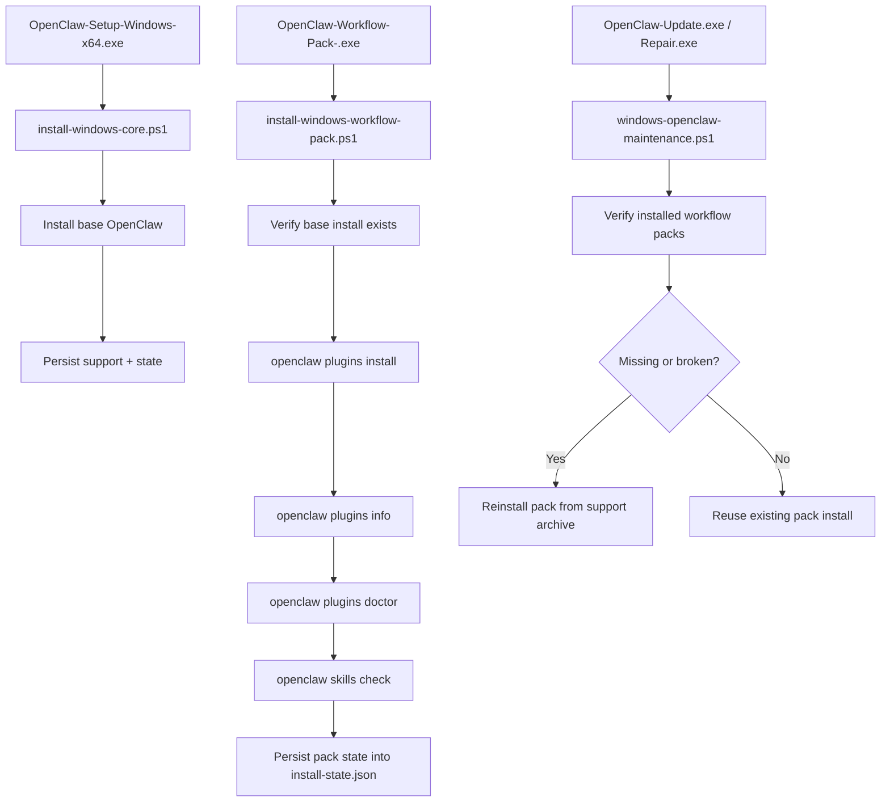

# Workflow Zone One-Click Installation Implementation Plan

> **For Claude:** REQUIRED SUB-SKILL: Use superpowers:executing-plans to implement this plan task-by-task.

**Goal:** 把“我们自己的工作流区”改造成独立的可选 workflow add-on 包体系，让不同用户按套餐安装；每个附加包都必须被 OpenClaw 原生识别、安装、验证与修复，不再依赖 Reach Pack 的旁路复制模型。

**Architecture:** 采用稳健方案，把每个工作流套餐重构为一个本地可安装的 `skill-pack plugin` 附加包。基础 `Setup.exe` 只安装 OpenClaw base；独立的 workflow add-on 包通过自己的安装器或安装脚本调用 `openclaw plugins install <local-archive>` 完成原生安装；随后统一执行 `plugins` / `skills` 级验证，并把结果写入 `install-state.json`。`Update/Repair` 只负责验证和自愈已经装过的 workflow add-on，不再把“附加工作流安装”塞进主安装闭环。

**Tech Stack:** PowerShell, C#, OpenClaw CLI, local plugin archive (`.zip` or `.tgz`), GitHub Actions release pipeline

---

## Scope

```text
本次只解决：
- 我们自己的 workflow zone
- Windows 原生一键安装
- 安装 / 更新 / 修复后的稳定验活

本次不解决：
- 任意第三方社区 skill 的通用安装兼容
- 广义 ClawHub 替代品
- 全量 Reach Pack 生态兼容
```

## Locked Product Shape

```text
Base Package:
OpenClaw-Setup-Windows-x64.exe
  -> install OpenClaw base
  -> do not install optional workflow packs

Workflow Add-On Packages:
- OpenClaw-Workflow-Pack-<pack>.exe
- or local OpenClaw-Workflow-Pack-<pack>.zip + thin installer wrapper

Package install:
  -> verify base OpenClaw exists
  -> install one workflow plugin pack
  -> run native verification

Lifecycle:
Update.exe / Repair.exe
  -> verify installed workflow packs
  -> reinstall local workflow archive if missing/broken
```



## Current State Summary

```text
Current Reach Pack:
- build-windows-reach-pack.ps1 builds a custom self-extracting EXE
- install-windows-reach-pack.ps1 copies runtime into ProgramData/OpenClaw/reach
- writes only ~/.openclaw/skills/agent-reach/SKILL.md
- writes wrappers into ProgramData/OpenClaw/bin
- validates only CLI/version level

Target State:
- each workflow add-on shipped as local plugin archive
- plugin manifest owns skills directories
- OpenClaw native plugin loader owns discovery
- skills check / plugins doctor become source of truth
```

## Target Files

```text
Expected new/modified files

Build / packaging
- Modify: scripts/build-release-assets.ps1
- Modify: .github/workflows/windows-release.yml
- Create: client/build-windows-workflow-pack.ps1
- Create: client/install-windows-workflow-pack.ps1
- Create: client/workflow-packs/<pack-id>/openclaw.plugin.json
- Create: client/workflow-packs/<pack-id>/package.json
- Create: client/workflow-packs/<pack-id>/index.ts
- Create: client/workflow-packs/<pack-id>/skills/... (our curated workflow zone pack)
- Create: client/workflow-packs/<pack-id>/pack-manifest.json
- Optionally create: client/windows-workflow-pack-bootstrap.cs

Install / verify
- Modify: client/install-windows-core.ps1
- Modify: client/windows-openclaw-maintenance.ps1

Docs
- Modify: README.md
- Modify: RELEASING.md

Legacy cleanup / compatibility
- Modify: client/build-windows-reach-pack.ps1 (replace or retire in favor of generic workflow-pack builder)
- Modify: client/install-windows-reach-pack.ps1 (replace or retire in favor of generic workflow-pack installer)
```

## Design Rules

```text
1. Every workflow add-on pack must be delivered as one OpenClaw-native install unit.
2. Installation success means:
   - plugin installed
   - plugin enabled or otherwise active
   - expected skills discoverable
   - expected skills eligible
3. No new custom skill-discovery rules.
4. No more “copy single SKILL.md” for curated workflow assets.
5. All verification must use OpenClaw native commands before declaring success.
6. Update and Repair must be able to self-heal any workflow pack that was previously installed.
7. Base installer and workflow add-on installer must stay decoupled.
8. Pack metadata must support shipping multiple named套餐 without forking the installer code.
```

### Task 1: Define the Workflow Pack Contract

**Files:**
- Create: `E:\app\openclaw-setup-cn\client\workflow-packs\<pack-id>\openclaw.plugin.json`
- Create: `E:\app\openclaw-setup-cn\client\workflow-packs\<pack-id>\package.json`
- Create: `E:\app\openclaw-setup-cn\client\workflow-packs\<pack-id>\index.ts`
- Create: `E:\app\openclaw-setup-cn\client\workflow-packs\<pack-id>\skills\...`
- Create: `E:\app\openclaw-setup-cn\client\workflow-packs\<pack-id>\pack-manifest.json`
- Reference: `E:\app\openclaw-setup-cn\client\package\extensions\open-prose\openclaw.plugin.json`
- Reference: `E:\app\openclaw-setup-cn\client\package\extensions\open-prose\package.json`

**Step 1: Define the first pack and the generic pack model**

Assume a generic model:
- one code path supports many named packs
- first landing pack is `workflow-zone`

List every internal workflow you actually want in the first pack:
- `agent-reach`
- any other self-owned skills
- supporting files each one needs beyond `SKILL.md`

**Step 2: Add pack metadata**

Create `pack-manifest.json` with fields like:

```json
{
  "packId": "workflow-zone",
  "displayName": "Workflow Zone",
  "pluginId": "workflow-zone",
  "outputName": "OpenClaw-Workflow-Pack-Workflow-Zone.exe",
  "archiveName": "OpenClaw-Workflow-Pack-Workflow-Zone.zip",
  "description": "Curated workflow zone add-on package for Windows.",
  "schemaVersion": 1
}
```

**Step 3: Map each shipped workflow to a full skill directory**

For each workflow:
- create a full directory under `skills/<skill-name>/`
- include `SKILL.md`
- include helper files/scripts/templates if the skill requires them
- remove any assumption that only `SKILL.md` is sufficient

**Step 4: Create a minimal skill-pack plugin manifest**

Use a manifest shape like:

```json
{
  "id": "workflow-zone",
  "name": "Workflow Zone",
  "description": "Curated workflow zone for the Windows installer package.",
  "skills": ["./skills"],
  "configSchema": {
    "type": "object",
    "additionalProperties": false,
    "properties": {}
  }
}
```

**Step 5: Create minimal package metadata**

Use a package shape like:

```json
{
  "name": "@openclaw/workflow-zone",
  "version": "0.1.0",
  "private": true,
  "description": "Curated workflow-zone skill pack plugin for Windows installer.",
  "type": "module",
  "openclaw": {
    "extensions": ["./index.ts"]
  }
}
```

**Step 6: Add a minimal plugin entrypoint**

Start with a minimal `index.ts`:

```ts
const plugin = {
  id: "workflow-zone",
  name: "Workflow Zone",
  description: "Curated workflow-zone skill pack plugin.",
  configSchema: {
    type: "object",
    additionalProperties: false,
    properties: {},
  },
  register() {},
};

export default plugin;
```

**Step 7: Commit**

```bash
git add client/workflow-packs
git commit -m "feat: add workflow pack contract and first pack scaffold"
```

### Task 2: Build a Generic Workflow Pack Archive and Add-On EXE

**Files:**
- Create: `E:\app\openclaw-setup-cn\client\build-windows-workflow-pack.ps1`
- Create: `E:\app\openclaw-setup-cn\client\install-windows-workflow-pack.ps1`
- Modify: `E:\app\openclaw-setup-cn\scripts\build-release-assets.ps1`
- Test with: local build output under `release\`

**Step 1: Create a generic builder script**

The script should:
- accept `-PackId`
- stage `client/workflow-packs/<pack-id>`
- validate required files exist
- produce one deterministic local archive
- optionally produce a thin self-extracting EXE wrapper for end-user double-click install
- recommended archive output: `OpenClaw-Workflow-Pack-<PackName>.zip`

**Step 2: Keep the archive format installer-friendly**

Target install command:

```bash
openclaw plugins install <local-archive>
```

Recommended archive contents:

```text
<pack-id>/
  openclaw.plugin.json
  package.json
  index.ts
  skills/
  pack-manifest.json
```

**Step 3: Add a generic pack installer script**

The installer script should:
- verify base OpenClaw install exists
- find local plugin archive from payload
- copy archive into `ProgramData\OpenClaw\support\workflow-packs\<pack-id>\`
- run `openclaw plugins install <archive>`
- run native verification
- persist pack state

**Step 4: Integrate builder into release asset generation**

Update `scripts/build-release-assets.ps1` to build:
- Setup
- one or more workflow pack artifacts
- Start / Update / Repair

Do not keep Reach Pack as the semantic model. If desired, repurpose its build slot into generic workflow-pack add-on generation.

**Step 5: Verify archive structure**

Run:

```powershell
powershell -ExecutionPolicy Bypass -File .\client\build-windows-workflow-pack.ps1 -PackId workflow-zone -OutputDir .\release
```

Expected:
- `release\OpenClaw-Workflow-Pack-Workflow-Zone.zip` exists
- archive contains `openclaw.plugin.json` and `skills\`

**Step 6: Commit**

```bash
git add client/build-windows-workflow-pack.ps1 client/install-windows-workflow-pack.ps1 scripts/build-release-assets.ps1
git commit -m "feat: build generic workflow add-on pack artifacts"
```

### Task 3: Package Each Workflow Add-On as a Separate Installer

**Files:**
- Modify: `E:\app\openclaw-setup-cn\client\build-windows-reach-pack.ps1`
- Or repurpose into: `E:\app\openclaw-setup-cn\client\build-windows-workflow-pack.ps1`
- Optionally create: `E:\app\openclaw-setup-cn\client\windows-workflow-pack-bootstrap.cs`

**Step 1: Reuse the self-extracting EXE approach for add-on packs**

Follow the current Reach Pack packaging model:
- self-extracting EXE wrapper
- payload contains plugin archive + pack installer script
- visible progress
- fail fast if base install is missing

**Step 2: Pick a stable in-payload structure**

Recommended:

```text
payload/
  OpenClaw-Workflow-Pack-Workflow-Zone.zip
  install-windows-workflow-pack.ps1
  pack-manifest.json
```

**Step 3: Preserve intermediate build visibility**

When `-KeepIntermediate` is set, verify the intermediate stage contains the workflow archive.

**Step 4: Dry-run validation**

Run:

```powershell
powershell -ExecutionPolicy Bypass -File .\client\build-windows-workflow-pack.ps1 -PackId workflow-zone -DryRun
```

Expected:
- no missing-file errors for workflow archive path

**Step 5: Commit**

```bash
git add client/build-windows-reach-pack.ps1 client/build-windows-workflow-pack.ps1
git commit -m "feat: package workflow add-ons as separate self-extracting installers"
```

### Task 4: Install Workflow Packs Natively Through the Add-On Installer

**Files:**
- Modify: `E:\app\openclaw-setup-cn\client\install-windows-workflow-pack.ps1`
- Modify: `E:\app\openclaw-setup-cn\client\install-windows-core.ps1`

**Step 1: Keep base installer responsible only for support conventions**

In `install-windows-core.ps1`, add:
- stable support root conventions for workflow packs
- `install-state.json` structure to remember installed packs

Recommended support location:

```text
ProgramData\OpenClaw\support\workflow-packs\<pack-id>\OpenClaw-Workflow-Pack-<PackName>.zip
```

**Step 2: Add workflow archive discovery in the add-on installer**

The add-on installer should resolve:
- plugin archive from its payload
- support copy destination under `ProgramData\OpenClaw\support\workflow-packs\<pack-id>\`

**Step 3: Persist archive into support assets**

During add-on installation, copy the embedded workflow archive into support storage so Update/Repair can reuse it later.

**Step 4: Install the plugin using OpenClaw itself**

After base wrapper existence is verified, run:

```bash
openclaw plugins install "<support-archive-path>"
```

Use the installed wrapper path / command target rather than calling a random global binary.

**Step 5: Verify plugin installation immediately**

Run:

```bash
openclaw plugins info workflow-zone
openclaw plugins doctor
openclaw skills check
```

Treat failure of these checks as installation failure for the workflow pack.

**Step 6: Persist workflow-pack install state**

Add fields to `install-state.json` such as:

```json5
workflowPacks: {
  "workflow-zone": {
    archivePath: "ProgramData\\OpenClaw\\support\\workflow-packs\\workflow-zone\\OpenClaw-Workflow-Pack-Workflow-Zone.zip",
    pluginId: "workflow-zone",
    installed: true,
    installedAt: "2026-03-18T12:34:56Z",
    verifiedAt: "2026-03-18T12:35:30Z",
    verification: {
      pluginsInfoOk: true,
      pluginsDoctorOk: true,
      skillsCheckOk: true
    }
  }
}
```

**Step 7: Make failure actionable**

If plugin installation fails:
- show which command failed
- show which support archive path was used
- persist failure reason into install-state
- do not claim add-on success

**Step 8: Commit**

```bash
git add client/install-windows-workflow-pack.ps1 client/install-windows-core.ps1
git commit -m "feat: install and verify workflow packs through add-on installer"
```

### Task 5: Reuse the Same Verification in Update and Repair

**Files:**
- Modify: `E:\app\openclaw-setup-cn\client\windows-openclaw-maintenance.ps1`

**Step 1: Add workflow-pack state resolution**

Read from `install-state.json`:
- archive path
- plugin ids
- last verification

If state is missing, fall back to the support directory convention.

**Step 2: Add workflow-pack health verifier**

Create a helper that runs:

```bash
openclaw plugins info <pack-plugin-id>
openclaw plugins doctor
openclaw skills check
```

and parses pass/fail for the current install.

**Step 3: Add self-heal path**

If verifier fails and archive exists:
- run `openclaw plugins install "<support-archive-path>"`
- rerun verifier

**Step 4: Integrate into Update and Repair endgame**

Run workflow-pack verification:
- after Update completes
- during Repair post-validation

This must plug into the same user-visible result path as Gateway/dashboard checks.

**Step 5: Update state persistence**

Persist latest workflow verification summary back into `install-state.json`.

**Step 6: Commit**

```bash
git add client/windows-openclaw-maintenance.ps1
git commit -m "feat: self-heal workflow packs during update and repair"
```

### Task 6: Replace Reach Pack Semantics with Generic Workflow Add-On Packages

**Files:**
- Modify: `E:\app\openclaw-setup-cn\client\build-windows-reach-pack.ps1`
- Modify: `E:\app\openclaw-setup-cn\client\install-windows-reach-pack.ps1`
- Modify: `E:\app\openclaw-setup-cn\README.md`
- Modify: `E:\app\openclaw-setup-cn\RELEASING.md`
- Modify: `E:\app\openclaw-setup-cn\.github\workflows\windows-release.yml`

**Step 1: Remove Reach Pack from product language**

Update docs so the recommended first-install path is:
- download `OpenClaw-Setup-Windows-x64.exe`
- if needed, separately download the matching workflow pack add-on

**Step 2: Repurpose legacy scripts**

Recommended legacy behavior:
- either rename Reach Pack into generic Workflow Pack builder/installer
- or keep it as a compatibility alias that builds the first workflow pack
- do not preserve the old “copy runtime + SKILL.md” behavior

**Step 3: Update release workflow**

Publish:
- Setup
- Start
- Update
- Repair
- selected workflow add-on EXEs

Optionally publish:
- workflow pack `.zip` archives as debug/support artifacts only

**Step 4: Commit**

```bash
git add README.md RELEASING.md .github/workflows/windows-release.yml client/build-windows-reach-pack.ps1 client/install-windows-reach-pack.ps1
git commit -m "chore: replace reach pack semantics with workflow add-on packages"
```

### Task 7: Add Smoke Validation Commands

**Files:**
- Modify: `E:\app\openclaw-setup-cn\README.md`
- Optional docs note in: `E:\app\openclaw-setup-cn\docs\plans\2026-03-18-workflow-oneclick-research-report.md`

**Step 1: Define post-install smoke commands**

```powershell
C:\ProgramData\OpenClaw\bin\openclaw.cmd plugins info workflow-zone
C:\ProgramData\OpenClaw\bin\openclaw.cmd plugins doctor
C:\ProgramData\OpenClaw\bin\openclaw.cmd skills check
C:\ProgramData\OpenClaw\bin\openclaw.cmd skills list --eligible
```

**Step 2: Define expected operator outcome**

Expected:
- workflow-zone plugin is installed
- no plugin load failure
- expected internal skills show as ready / eligible

**Step 3: Commit**

```bash
git add README.md
git commit -m "docs: add workflow zone smoke validation commands"
```

## Review Checklist

```text
Architecture review
- Does every workflow add-on now use OpenClaw-native installation primitives?
- Is there any remaining path that only copies a SKILL.md?
- Is ProgramData only used as support/archive storage, not as custom skill root?

Behavior review
- Does Setup stay base-only?
- Does each workflow add-on install itself correctly?
- Does Update re-verify installed packs?
- Does Repair self-heal installed packs?

Verification review
- Is success based on plugins/skills native checks, not wrapper version checks?
- Are failure reasons persisted and visible?

Docs review
- Is Reach Pack no longer described as a special-case runtime copier?
- Does release guidance match the real artifacts?
```

## Recommended Default Assumption

```text
Default implementation assumption:
- ship a generic workflow-pack framework
- first pack is workflow-zone
- base Setup remains base-only
- selected users install one or more separate workflow add-on packages
```

## Product Decision Result

```text
已确认：
- 采用 B 路线
- 主安装器只负责基础 OpenClaw
- 工作流能力以独立 workflow add-on 包交付
- 后续实现按“多套餐 / 多 pack”扩展，而不是写死单一 workflow-zone 内嵌安装
```
