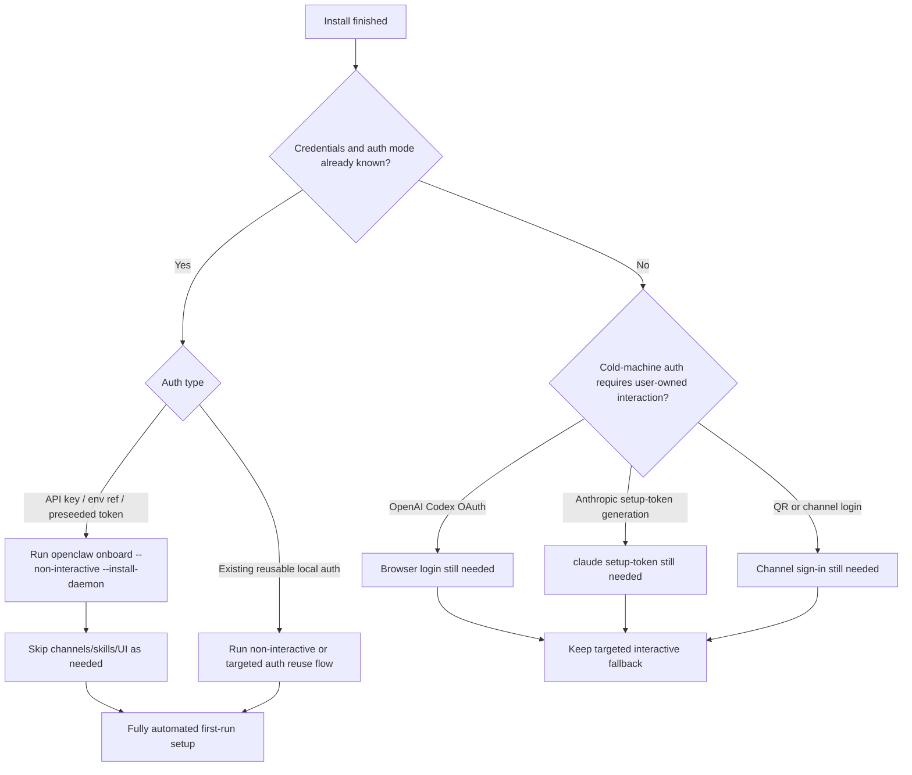

# 2026-03-19 Auto Onboarding Feasibility

## Goal

Check whether the official OpenClaw onboarding/config flow can be automated so
the Windows installer can skip the current manual "openclaw onboard --install-daemon"
terminal step after install and move to a fully automated setup.

## Current local behavior

The current installer always opens the interactive onboarding terminal after a
successful install:

- `client/install-windows-core.ps1`
- `Open-ConfigurationPage()`
- hardcoded command: `openclaw onboard --install-daemon`

The maintenance script also falls back to interactive auth repair for missing
provider auth:

- `client/windows-openclaw-maintenance.ps1`
- `Open-ProviderAuthRepair()`
- fallback commands:
  - `openclaw onboard --install-daemon --auth-choice setup-token`
  - `openclaw onboard --install-daemon --auth-choice openai-codex`
  - `openclaw onboard --install-daemon`

## Five hypotheses

| # | Hypothesis | Result | Evidence |
|---|------------|--------|----------|
| 1 | Official OpenClaw only supports interactive onboarding. | False | Official docs include `openclaw onboard --non-interactive`. |
| 2 | Local gateway + daemon install can be completed non-interactively. | True | Official automation docs show `--install-daemon`, `--gateway-port`, `--gateway-bind`, and provider auth flags. |
| 3 | Gateway token setup still requires manual UI interaction. | False | Official docs support `--gateway-token` and `--gateway-token-ref-env`. |
| 4 | All auth providers can be made fully automatic. | False | API-key and pre-seeded token paths can be automated; browser OAuth and setup-token generation still require user-owned auth material or an existing credential to reuse. |
| 5 | Our installer already uses the supported non-interactive path. | False | Current script still launches interactive `onboard --install-daemon` and does not pass any non-interactive flags. |

## Official-doc findings

### 1. Non-interactive onboarding is officially supported

Official CLI automation docs provide this baseline:

```bash
openclaw onboard --non-interactive \
  --mode local \
  --auth-choice apiKey \
  --anthropic-api-key "$ANTHROPIC_API_KEY" \
  --secret-input-mode plaintext \
  --gateway-port 18789 \
  --gateway-bind loopback \
  --install-daemon \
  --daemon-runtime node \
  --skip-skills
```

This means the official product already supports a script-first onboarding path.

### 2. The onboarding CLI exposes the switches we need

The packaged `2026.3.13` docs list these relevant flags:

- `--non-interactive`
- `--auth-choice <...>`
- provider key flags such as `--openai-api-key`, `--zai-api-key`, `--opencode-zen-api-key`
- `--gateway-auth <token|password>`
- `--gateway-token`
- `--gateway-token-ref-env`
- `--install-daemon`
- `--skip-channels`
- `--skip-skills`
- `--skip-health`
- `--skip-ui`

This is enough to automate the core local setup path if we already know the
provider choice and credentials.

### 3. Gateway auth can be pre-seeded

Official docs explicitly support:

- `--gateway-auth token --gateway-token <token>`
- `--gateway-auth token --gateway-token-ref-env <ENV_VAR>`

So the gateway token does not require a manual prompt if we generate or provide
it during install.

### 4. Full automation depends on auth mode

Official docs show a clear split:

- Fully automatable:
  - API key providers
  - env-ref / SecretRef backed API keys
  - pre-generated gateway token
  - pre-generated provider token pasted from elsewhere
  - existing local auth that the wizard can reuse
- Not fully automatable from a cold machine:
  - OpenAI Codex OAuth browser login
  - generating a fresh Anthropic setup-token with `claude setup-token`
  - QR / channel sign-in flows such as WhatsApp if channels are included

### 5. Existing credential reuse reduces manual work

Official docs also say:

- Anthropic CLI creds can be reused from `~/.claude/.credentials.json`
- OpenAI Codex can reuse `~/.codex/auth.json`

So a machine that is already logged in may need zero extra prompts even for
those flows, but a cold machine still cannot be guaranteed promptless.

## Feasibility conclusion

ASCII decision tree:

```text
install done
  |
  +-- do we know target auth mode and have credentials/material now?
        |
        +-- yes
        |     |
        |     +-- API key or preseeded token/ref
        |           -> run non-interactive onboard
        |           -> skip channels/skills if desired
        |           -> fully automatic
        |
        +-- no
              |
              +-- OpenAI Codex OAuth / Anthropic setup-token / QR channel auth
                    -> cannot guarantee full automation
                    -> keep a targeted interactive repair step
```

Mermaid summary:



## Practical answer

Yes, we can skip the current manual onboarding window and make setup fully
automatic, but only for the paths where we can pre-provide the auth inputs.

That means:

- Yes for:
  - ZAI / OpenAI API key / OpenRouter / Gemini / Moonshot / Mistral / OpenCode Zen / custom provider
  - Gateway token generation or env-backed token refs
  - "dashboard first, no channels" installs
- Conditionally for:
  - OpenAI Codex if `~/.codex/auth.json` already exists and reuse works
  - Anthropic if API key is used, or if a setup-token was generated elsewhere and pasted/provided ahead of time
- No for a truly cold machine when the user must newly complete:
  - OpenAI Codex OAuth browser auth
  - `claude setup-token`
  - WhatsApp QR or similar channel pairing

## Recommended implementation options

### Option A: robust hybrid (recommended)

Use non-interactive onboarding when credentials are already available; otherwise
fall back to a targeted interactive step.

Example direction:

```text
if provider auth material is available:
  openclaw onboard --non-interactive --install-daemon ...
else:
  open only the smallest repair flow for the missing auth
```

Pros:

- maximizes automation
- preserves official behavior for unavoidable user auth
- avoids pretending OAuth/setup-token can be silently bypassed

### Option B: aggressive full automation

Standardize the package on a preconfigured provider + env-backed secrets and
never open onboarding by default.

Pros:

- zero manual setup for the target SKU

Cons:

- only works when we fully control provider choice and secret delivery
- does not fit bring-your-own OAuth or bring-your-own QR flows

## Recommended code changes

1. Replace installer post-install command construction:
   - from: `openclaw onboard --install-daemon`
   - to: a computed non-interactive command when inputs are known

2. Add install-time state fields:
   - selected auth mode
   - provider id
   - secret source mode
   - whether channels/skills should be skipped

3. Keep maintenance auth repair targeted:
   - `models auth login --provider openai-codex`
   - `models auth paste-token --provider anthropic`
   - only use full onboarding as the final fallback

4. Gate interactive fallback behind actual missing inputs instead of making it
   the default successful-install path.

## Evidence pointers

- `client/package/package.json` version is `2026.3.13`
- `client/package/docs/start/wizard-cli-automation.md`
- `client/package/docs/start/wizard-cli-reference.md`
- `client/package/docs/cli/onboard.md`
- `client/package/docs/cli/index.md`
- `client/package/docs/cli/models.md`
- `client/install-windows-core.ps1`
- `client/windows-openclaw-maintenance.ps1`

## 2026-03-20 follow-up findings

### What the installer does today

The current installer no longer goes straight to the old interactive onboarding
terminal. The main path in `client/install-windows-core.ps1` is now:

```text
install succeeds
  -> Invoke-AutomatedPostInstallBootstrap()
  -> Run-Doctor()
  -> only if bootstrap/readiness still incomplete:
       Open-ConfigurationPage()
```

So the old `openclaw onboard --install-daemon` window is now a fallback, not the
primary path.

### The real contract mismatch

The important mismatch is not "missing automation support" anymore.
It is this:

```text
installer success before this investigation
  = non-interactive onboard exited 0

startup success in maintenance
  = gateway token ready
  + gateway healthy/persistent
  + dashboard verified
  + provider auth not missing
```

That mismatch explains why install could look complete while the first Start run
still needed follow-up.

### Validated hypotheses after code audit

| # | Hypothesis | Result | Evidence |
|---|------------|--------|----------|
| 1 | The installer still primarily uses the old interactive onboarding path. | False | Non-interactive onboarding is the main path; interactive onboarding is fallback only. |
| 2 | The non-interactive helper is dead code. | False | `Get-DefaultPostInstallOnboardingArguments()` is called directly by `Invoke-AutomatedPostInstallBootstrap()`. |
| 3 | Automated onboarding is detached and not awaited. | False | The installer waits synchronously on `Invoke-InstalledOpenClaw ... -TimeoutSeconds 300`. |
| 4 | The current automated bootstrap can return success before Gateway readiness is established. | True | The installer passed `--skip-health`, while official docs say onboarding normally waits for local Gateway reachability. |
| 5 | The current automated bootstrap intentionally skips provider auth, so a cold machine cannot reach full chat-ready state from install alone. | True | The installer hardcodes `--auth-choice skip`, while maintenance still treats missing provider auth as `NeedsAttention`. |

### Implemented correction direction

The installer core was updated to move closer to the official readiness contract:

```text
1. remove `--skip-health` from the default post-install non-interactive onboarding args
2. keep `--skip-ui`, `--skip-channels`, `--skip-skills`, and auth-skip defaults
3. add an install-time local readiness check after onboarding + doctor:
   - gateway token readiness
   - dashboard `--no-open` verification
   - provider auth classification
4. if readiness is still incomplete, reopen onboarding immediately instead of
   deferring the failure to the user's first Start click
5. when provider auth is clearly missing for a known provider, prefer a targeted
   onboarding fallback (`setup-token` / `openai-codex`) instead of a generic one
```

### Remaining product choice

This fix hardens install-time Gateway/dashboard readiness, but full cold-machine
"chat-ready" automation still depends on product strategy for provider auth:

- API-key-first install flow can be fully automated if provider and secret are
  collected at install time.
- OAuth/setup-token cold-machine flows still need user-owned interaction.

### Product decision

Selected direction: robust hybrid.

```text
Install target:
  - Gateway token ready
  - Gateway daemon installed and healthy
  - Dashboard path verified

Install non-goal:
  - force provider credential collection during install

If provider auth is still missing after install:
  - do not pretend install reached full chat-ready state
  - immediately open targeted provider onboarding/auth repair
  - leave first Start focused on stable runtime recovery, not first-time auth surprise
```


## 2026-03-20 state persistence follow-up

The first fix corrected the install-time readiness contract. A second follow-up now
makes that result visible and durable instead of leaving it implicit in the log.

### Added install-state persistence

The installer now persists the same readiness dimensions that the maintenance
script already uses later:

- last health state
- gateway token state
- provider auth state
- last start reason
- last dashboard mode

This means the machine state written immediately after install is no longer a
blank "unknown" snapshot when the installer already knows what happened.

### Added install-summary honesty improvements

The installer success summary now prints the post-install readiness summary and
colors it conservatively:

- green only when local readiness reached the expected `local_stable_ready` state
- yellow when install completed but follow-up is still needed or auth state could
  not be classified confidently

### Failure-path persistence improvements

When automated post-install bootstrap cannot finish cleanly, the installer now
persists a concrete reason instead of only a generic needs-attention state.
Current reasons include:

- `post_install_bootstrap_timeout`
- `post_install_bootstrap_failed`
- `post_install_license_incomplete`

That keeps install-time diagnostics aligned with the later maintenance result
model and makes support triage more direct.
