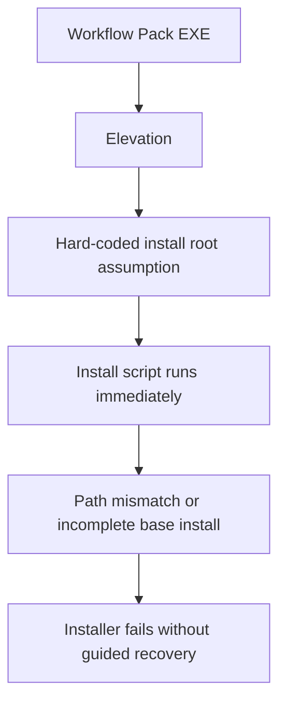
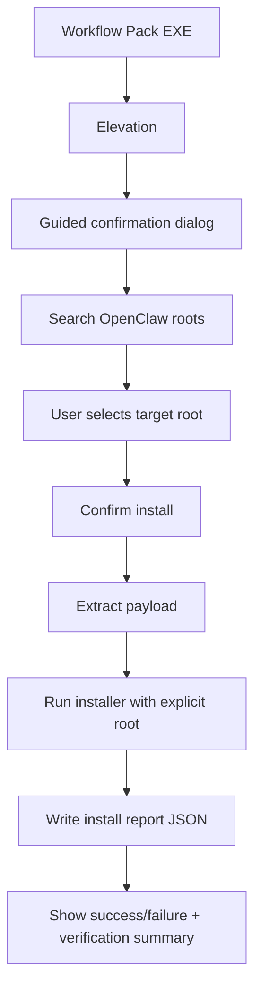

# Foundation Common Guided Installer Fix

## Goal

Make the `foundation-common` workflow pack EXE install reliably on end-user machines by adding:

- install confirmation for the combined capability pack
- OpenClaw path discovery and user confirmation
- install execution only after explicit confirmation
- post-install result report
- post-install verification summary

## Root Cause

```text
Current EXE
   |
   +-- elevate
   +-- assume OpenClaw root can be auto-resolved
   +-- extract payload
   +-- run install script directly
           |
           +-- fails if base install path is not the default one
           +-- no user confirmation step
           +-- no visible path selection step
           +-- no structured completion report back to user
```



## Target Flow

```text
Workflow Pack EXE
   |
   +-- elevate
   +-- show package confirmation
   +-- search OpenClaw install roots
   +-- user selects confirmed target root
   +-- confirm install
   +-- extract payload
   +-- run PowerShell installer with explicit OpenClawRoot + ReportPath
   +-- show install result + verification summary
```



## Stages

### Stage 1

- add guided launcher dialog in `client/build-windows-workflow-pack-installer.ps1`
- support path scanning, manual browse, explicit confirm install

### Stage 2

- extend `client/install-windows-workflow-pack.ps1`
- accept `ReportPath`
- emit structured success/failure report with verification and readiness summary

### Stage 3

- validate script parsing
- build new `foundation-common` EXE
- verify produced EXE and supporting metadata artifacts
