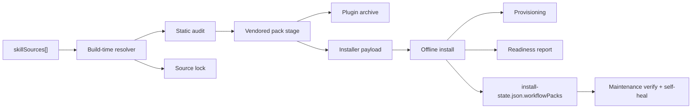

# Foundation Common Pack Implementation Plan

> For Claude: REQUIRED SUB-SKILL: Use superpowers:executing-plans to implement this plan task-by-task.

**Goal:** Build a reusable one-click Windows add-on installer for the shared foundation capability pack while blocking release until all exact skill sources are authoritative.

**Architecture:** Keep the main installer unchanged. Introduce a separate `foundation-common` workflow pack that vendors skill sources at build time, bundles a shared runtime profile, installs declarative provisioning locally, and records readiness/support metadata for repair flows.

**Tech Stack:** PowerShell, OpenClaw workflow pack plugin archives, embedded Python/Node/Git/GitHub CLI runtime, GitHub archive downloads, JSON manifests.

---

## Topology

```text
Main OpenClaw Installer
        |
        +-- Foundation Common Pack EXE
                |
                +-- pack-manifest.json
                +-- source lock
                +-- build manifest
                +-- vendored skills/
                +-- bundled runtime/
                +-- provisioning + prerequisite declarations
                +-- support archive for maintenance self-heal
```



## Delivery Rules

- `workflow-zone` remains backward compatible and is not repurposed.
- `foundation-common` is the new standard shared capability pack.
- Exact target skills for release:
  - `agent-reach`
  - `clawdefender`
  - `skill-vetter`
  - `security-auditor`
  - `find-skills`
  - `clawFeed`
  - `agent-browser`
  - `self-improving`
  - `proactive-agent`
  - `memory-setup`
- `proactive-agent` and `memory-setup` remain release blockers until authoritative sources are pinned.

## Stage Breakdown

### Stage 1: Pack Contract + Source Lock + Foundation Skeleton

**Files**
- Create: `client/workflow-packs/foundation-common/*`
- Create: `client/workflow-source-cache/foundation-common/*`
- Modify: `client/build-windows-workflow-pack.ps1`

**Outcome**
- New manifest contract supports:
  - `skillSources[]`
  - `runtimeProfile`
  - `provisioning[]`
  - `prerequisites[]`
- Build flow can vendor local or GitHub-based skill sources, audit them, and emit a source lock.
- Unresolved required skills block release unless explicitly overridden for development validation.

### Stage 2: Runtime + Installer + Readiness

**Files**
- Modify: `client/build-windows-workflow-pack-installer.ps1`
- Modify: `client/install-windows-workflow-pack.ps1`

**Outcome**
- Add `foundation-runtime-v1` with shared Node/Python/Git/GitHub CLI plus `skills`, `agent-browser`, `jq`, and shell support for `clawdefender`.
- Installer copies support metadata, applies declarative provisioning, runs prerequisite checks, and persists readiness details in `install-state.json`.

### Stage 3: Maintenance + Verification

**Files**
- Modify: `client/windows-openclaw-maintenance.ps1`
- Update: supporting manifests/docs if verification gaps are found

**Outcome**
- Maintenance re-verifies source lock, provisioning results, and readiness summaries in addition to plugin health.
- Self-heal continues to reinstall from local support archives without silently rewriting source pin metadata.

## Acceptance Checklist

- `build-windows-workflow-pack.ps1 -PackId foundation-common` fails release builds when unresolved required skills remain.
- `build-windows-workflow-pack.ps1 -PackId foundation-common -AllowUnresolvedSkillSources` can produce a development archive and source lock.
- `build-windows-workflow-pack-installer.ps1 -PackId foundation-common -AllowUnresolvedSkillSources` produces a development EXE with runtime and metadata.
- `install-windows-workflow-pack.ps1` records:
  - copied source lock/build manifest paths
  - provisioning results
  - prerequisite results
  - readiness summary
- Maintenance surfaces drift or missing provisioning explicitly instead of silently ignoring them.
