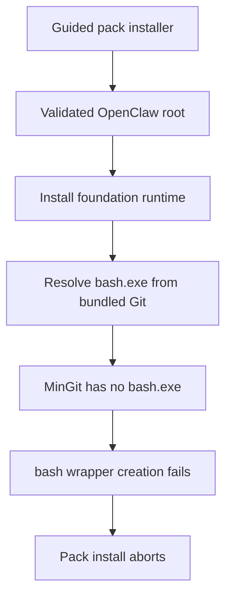
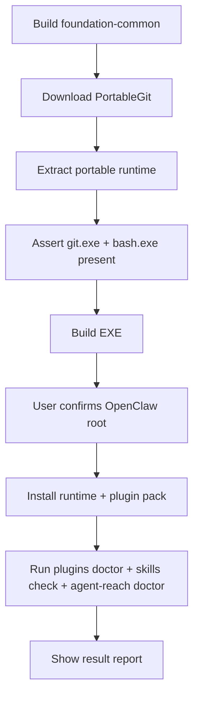

# Foundation Common Runtime And Agent Reach Fix

## Goal

Make the `foundation-common` installer reliably finish on Windows by:

- confirming and validating the OpenClaw root before install
- bundling a Git runtime that actually contains `bash.exe`
- aligning post-install verification with the Agent Reach official install guide

## Root Cause Summary

```text
Current failure
   |
   +-- launcher now finds and confirms OpenClaw root correctly
   |
   +-- install script copies foundation runtime
          |
          +-- runtime declares bash command
          +-- bundled Git payload is MinGit
          +-- MinGit contains git.exe but no bash.exe
          +-- wrapper creation for bash hard-fails
          +-- pack install aborts before plugin verification
```



## Five Hypotheses

### H1

- Hypothesis: `MinGit` does not contain `bash.exe`.
- Validation:
  - extracted `MinGit-2.53.0.2-64-bit.zip`
  - observed `git.exe` under `cmd\git.exe` and `mingw64\bin\git.exe`
  - observed `bash.exe` count = `0`
- Result: confirmed

### H2

- Hypothesis: current bash path resolution is wrong for the downloaded Git payload.
- Validation:
  - installer checks `bin\bash.exe`, `usr\bin\bash.exe`, `git-bash.exe`
  - extracted MinGit tree contains none of these files
- Result: rejected as primary cause

### H3

- Hypothesis: `bash` could be downgraded to a non-blocking warning.
- Validation:
  - `clawdefender` scripts use `#!/bin/bash`, arrays, `[[ ... ]]`, and other bash-specific syntax
  - Agent Reach docs and source also use bash for Xiaoyuzhou transcription
- Result: rejected for the robust path because it would ship broken core capability

### H4

- Hypothesis: switching to `PortableGit` is a viable fix.
- Validation:
  - downloaded `PortableGit-2.53.0.2-64-bit.7z.exe`
  - extracted with self-extractor arguments `-y -o<dir>`
  - observed `bash.exe` in both `bin\bash.exe` and `usr\bin\bash.exe`
- Result: confirmed

### H5

- Hypothesis: the installer is missing an Agent Reach official post-install health check.
- Validation:
  - official guide requires install followed by `agent-reach doctor`
  - current installer only runs `plugins info`, `plugins doctor`, `skills check`
  - no `agent-reach doctor` invocation exists in current install flow
- Result: confirmed

## Target Fix

```text
Build time
   |
   +-- replace MinGit payload with PortableGit payload
   +-- fail build if git.exe or bash.exe is missing
   |
Install time
   |
   +-- keep guided root confirmation flow
   +-- install runtime and wrappers
   +-- run plugin verification
   +-- run agent-reach doctor
   +-- write structured report with verification output
```



## Implementation Stages

### Stage 1

- update `client/build-windows-workflow-pack-installer.ps1`
- switch Git payload from `MinGit` to `PortableGit`
- add extraction helper for Git-for-Windows self-extracting archive
- validate both `git.exe` and `bash.exe` during build

### Stage 2

- update `client/install-windows-workflow-pack.ps1`
- include `agent-reach doctor` in verification
- improve missing-bash failure messaging if runtime drift still happens

### Stage 3

- update `client/workflow-packs/foundation-common/pack-manifest.json`
- make bash readiness non-optional for this pack because bundled security/runtime features depend on it

### Stage 4

- parse-check both scripts
- rebuild `release/OpenClaw-Workflow-Pack-Foundation-Common.exe`
- inspect output metadata and hash
- review only current-task diffs
- commit only current-task files

## Acceptance Criteria

- installer still requires explicit target-path confirmation before install
- installer succeeds on a clean base install without asking OpenClaw to download this pack online
- bundled runtime contains working `git` and `bash`
- `agent-reach doctor` runs during post-install verification
- final report clearly shows success/failure and verification results
