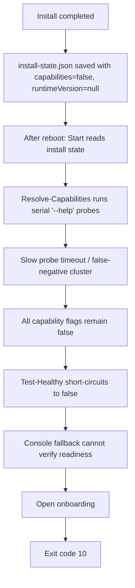

# One-Click Reboot Start Fix Implementation Plan

> **For Claude:** REQUIRED SUB-SKILL: Use superpowers:executing-plans to implement this plan task-by-task.

**Goal:** Fix the Windows one-click Start flow so a normal install still works after the first reboot instead of stalling on capability probes and falling back to onboarding.

**Architecture:** Seed a safe "modern CLI" capability preset into `install-state.json` at install time, then let the maintenance script trust that preset for known runtime versions instead of re-running many slow `--help` probes. Add runtime self-heal so old installs with empty or all-false capability caches are repaired on the next Start/Update/Repair run.

**Tech Stack:** PowerShell, Windows one-click installer, `install-state.json`, OpenClaw CLI wrappers

---

## Problem Snapshot

```text
Observed user flow

Install succeeds
  -> user completes onboarding
  -> current session works

Machine reboot
  -> user clicks "一键启动"
  -> maintenance probes 10+ commands with "--help"
  -> each probe burns ~20s
  -> capabilities become all false
  -> health checks are skipped by capability gates
  -> console fallback can never prove readiness
  -> onboarding opens again
  -> exit code 10
```



## Five Hypotheses

### Hypothesis 1: startup fails because the install is corrupt after reboot

Status: Rejected.

Evidence:
- User log shows `openclaw --version` succeeds immediately.
- The wrapper path and maintenance script path are both valid.
- This is not a missing-file or broken-entrypoint failure.

### Hypothesis 2: capability probing is false-negative and extremely slow on reboot

Status: Validated.

Evidence:
- `Test-OpenClawCommandSupport` appends `--help` and uses a fixed 20 second timeout.
- User log advances in ~20 second steps for each probe.
- All probed capabilities end up `False`, including commands documented for the bundled runtime.

### Hypothesis 3: installer state forces the first rebooted Start into the fragile probe path

Status: Validated.

Evidence:
- `client/install-windows-core.ps1` currently writes `capabilities` as all `false`.
- `capabilitiesRuntimeVersion` is written as `null`.
- That guarantees the first post-install Start cannot reuse a trusted cache.

### Hypothesis 4: once capabilities are all false, fallback startup cannot recover

Status: Validated.

Evidence:
- `Test-Healthy` returns `false` when all status/health capabilities are false.
- `Wait-For-Healthy` only calls `Test-Healthy`.
- `Start-PersistentGatewayConsole` can launch a console, but it still fails because readiness is capability-gated.

### Hypothesis 5: exit code 10 means "needs attention / onboarding reopened", not "reinstall required"

Status: Validated.

Evidence:
- `windows-openclaw-maintenance.ps1` maps `NeedsAttention = 10`.
- The default message for `10` is "Configuration still needs manual action. Onboarding was opened."
- This matches the user log exactly.

## Design Decision

Recommended fix:

```text
Do not let a fresh reboot depend on serial subcommand help probes.

Instead:
1. infer a modern capability preset from the installed runtime version
2. persist that preset at install time
3. self-heal missing / all-false caches in maintenance
4. only fall back to expensive probing for unknown runtimes
```

Reasoning:
- The bundled installer already knows which OpenClaw generation it ships.
- Local docs in this repo show the modern runtime supports the daemon/gateway/model commands the wrapper needs.
- False positives are acceptable because real command execution is still checked by exit code.
- False negatives are currently fatal because they disable the entire repair/start graph.

## Target Files

```text
Modify
- E:\app\openclaw-setup-cn\client\install-windows-core.ps1
- E:\app\openclaw-setup-cn\client\windows-openclaw-maintenance.ps1

Create
- E:\app\openclaw-setup-cn\docs\plans\2026-03-19-oneclick-reboot-start-fix-plan.md
```

## Implementation Tasks

### Task 1: Add version-based capability inference helpers

**Files:**
- Modify: `E:\app\openclaw-setup-cn\client\install-windows-core.ps1`
- Modify: `E:\app\openclaw-setup-cn\client\windows-openclaw-maintenance.ps1`

**Steps:**
1. Add a normalized release-version parser in the installer script.
2. Add a shared capability preset builder for modern bundled runtimes.
3. Add helpers to detect whether a cached capability state is empty / all false.

### Task 2: Seed capability cache during install

**Files:**
- Modify: `E:\app\openclaw-setup-cn\client\install-windows-core.ps1`

**Steps:**
1. Update `Save-InstallState`.
2. If `InstalledVersion` is known and matches the modern preset floor, write:
   - `capabilities`
   - `capabilitiesRuntimeVersion`
3. Keep unknown runtimes on the old fallback path.

### Task 3: Self-heal old installs at runtime

**Files:**
- Modify: `E:\app\openclaw-setup-cn\client\windows-openclaw-maintenance.ps1`

**Steps:**
1. Update `Resolve-Capabilities`.
2. If the runtime version is known-modern and cache is missing / incomplete / all false:
   - replace it with the inferred preset
   - persist it immediately
   - skip the slow `--help` probe fan-out
3. Keep expensive probing only for unknown runtimes.

### Task 4: Verify and review

**Files:**
- Modify: `E:\app\openclaw-setup-cn\client\install-windows-core.ps1`
- Modify: `E:\app\openclaw-setup-cn\client\windows-openclaw-maintenance.ps1`

**Steps:**
1. Run PowerShell parser-based syntax checks for both scripts.
2. Review the diff to ensure:
   - new installs persist capabilities
   - old installs self-heal on first Start
   - no unrelated behavior changes slipped in
3. Remove temporary validation artifacts if any are created.
4. Commit only the files for this task.

## Verification Commands

```powershell
$files = @(
  'E:\app\openclaw-setup-cn\client\install-windows-core.ps1',
  'E:\app\openclaw-setup-cn\client\windows-openclaw-maintenance.ps1'
)

foreach ($file in $files) {
  $null = $tokens = $null
  $null = $errors = $null
  [System.Management.Automation.Language.Parser]::ParseFile($file, [ref]$tokens, [ref]$errors) | Out-Null
  if ($errors.Count -gt 0) {
    throw "Parse failed for $file"
  }
}
```

```text
Expected outcomes
- No PowerShell parse errors
- install-windows-core writes a non-empty capability cache for bundled modern versions
- maintenance reuses or repairs the cache instead of probing every command on reboot
- the post-reboot Start path no longer degrades into onboarding for this case
```
