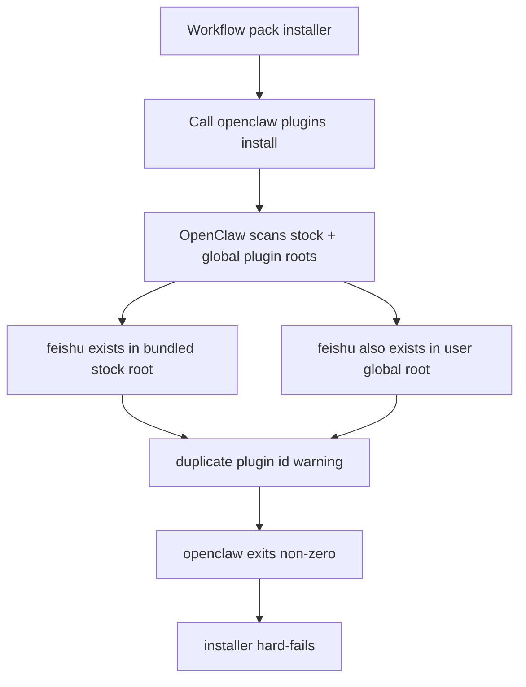

# Plugin Dedup And Idempotent Installer Fix

## Goal

Make workflow-pack installation robust on machines where OpenClaw already has overlapping plugin state.

The installer must:

- treat "capability already exists" as success, not failure
- normalize redundant plugin duplicates before calling `openclaw.cmd`
- remain safe by backing up duplicates instead of deleting them blindly

## Observed Failure

```text
Install workflow pack
   |
   +-- run openclaw plugins install / enable / info / doctor
          |
          +-- OpenClaw config load sees duplicate plugin id "feishu"
          +-- bundled stock plugin exists
          +-- global user plugin also exists
          +-- OpenClaw emits config warning and returns non-zero
          +-- installer interprets non-zero as hard failure
```



## Five Hypotheses

### H1

- Hypothesis: `foundation-common` itself contains a `feishu` plugin id.
- Validation:
  - inspected pack `openclaw.plugin.json`, `index.ts`, `package.json`
  - pack id is `foundation-common`
- Result: rejected

### H2

- Hypothesis: workflow-pack installer writes or provisions `feishu` during install.
- Validation:
  - inspected `client/install-windows-workflow-pack.ps1`
  - inspected `client/workflow-packs/foundation-common/pack-manifest.json`
  - no feishu provisioning or feishu plugin install logic exists there
- Result: rejected

### H3

- Hypothesis: OpenClaw base bundle already ships `feishu`, while user state still has an older separately installed `feishu`.
- Validation:
  - `openclaw plugins list` reports:
    - `stock:feishu/index.ts` version `2026.3.13`
    - `global:feishu/index.ts` version `2026.3.7`
  - user config tracks `plugins.installs.feishu.installPath = C:\Users\RZX\.openclaw\extensions\feishu`
- Result: confirmed

### H4

- Hypothesis: OpenClaw commands are functionally succeeding but still return non-zero because config warnings are elevated.
- Validation:
  - `openclaw plugins info feishu` prints valid plugin info and shows stock plugin loaded
  - command still exits non-zero because of duplicate plugin config warning
- Result: confirmed

### H5

- Hypothesis: the real fix is environment normalization plus idempotent skip, not another special-case install retry.
- Validation:
  - user goal is "ensure plugins exist"
  - duplicate global plugin is redundant because bundled stock plugin already provides the capability
  - current installer lacks preflight reconciliation and lacks "already installed => skip"
- Result: confirmed

## Root Cause

```text
Root cause is not a missing dependency and not a wrong pack manifest.

It is state drift between:
  1. bundled stock plugins shipped by the current OpenClaw base install
  2. legacy global plugins previously installed into ~/.openclaw/extensions

Installer failure happens because the workflow-pack installer delegates to openclaw CLI,
and the CLI currently returns non-zero when duplicate-plugin config warnings exist.
```

## Target Fix

### Stage 1

- add preflight duplicate-plugin normalization in `client/install-windows-workflow-pack.ps1`
- detect bundled/global plugin pairs with the same plugin id
- move redundant global copies to backup outside the scanned plugin root
- remove matching `plugins.installs.<id>` metadata when it points to the moved global copy

### Stage 2

- make `Install-PluginPack` idempotent
- if the target plugin is already installed, skip `plugins install`
- if the target plugin is already enabled, skip `plugins enable`

### Stage 3

- verify against the real local OpenClaw state:
  - duplicate `feishu` no longer blocks CLI
  - workflow-pack install can proceed

### Stage 4

- harden optional metadata reads under `Set-StrictMode`
- avoid direct access to optional fields like `install-state.commandTarget` or optional manifest runtime fields
- require helper-based reads so older or partial state files do not crash the installer before reconciliation starts

## Acceptance Criteria

- duplicate bundled/global plugins no longer break workflow-pack install
- no user capability is lost; stock plugin remains available
- redundant global plugin copy is backed up, not silently deleted
- rerunning the same workflow-pack installer becomes safe and idempotent
- missing optional metadata fields do not crash the installer under strict mode
