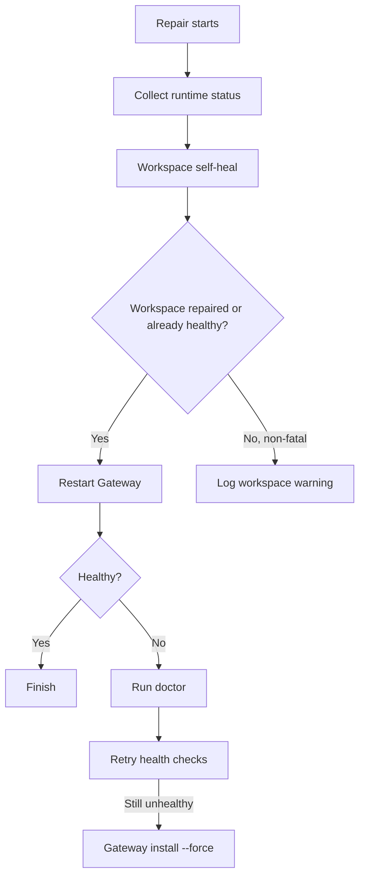

# Repair Workspace Self-Heal Implementation Plan

> **For Claude:** REQUIRED SUB-SKILL: Use superpowers:executing-plans to implement this plan task-by-task.

**Goal:** Extend the Windows `Repair` flow so it can automatically detect and heal common workspace failures before retrying Gateway startup.

**Architecture:** Add a conservative workspace self-heal stage to `client/windows-openclaw-maintenance.ps1`. The new stage resolves the effective workspace path, repairs missing/default config when safe, creates the workspace directory, validates config best-effort, and reseeds missing bootstrap files via `openclaw setup --workspace <path>` without overwriting user content. In the same pass, bound the capability preset logic to known runtime versions so future CLI drift falls back to probing instead of assuming support that may not exist.

**Tech Stack:** PowerShell, Windows maintenance wrapper, OpenClaw CLI (`config`, `setup`, `doctor`), bundled docs

---

## Problem Snapshot

```text
Observed repair gap

Gateway fails
  -> Repair checks wrapper/version
  -> Repair retries restart
  -> Repair runs doctor
  -> Repair rewrites gateway service
  -> Repair never repairs workspace path/config/bootstrap first
  -> workspace-originated failures can persist across the whole chain
```



## User Intent

```text
Repair package
  |
  +-- when workspace path/config/bootstrap is broken
  +-- try auto-fix first
  +-- do not wipe user memory/workspace content
  +-- keep reboot/start/repair path more stable
```

## Five Hypotheses

| # | Hypothesis | Result | Evidence |
|---|------------|--------|----------|
| 1 | Some repair failures are caused by missing or invalid `agents.defaults.workspace`. | Validated | Official docs expose `openclaw config get agents.defaults.workspace`, and current maintenance already classifies workspace/path creation failures in `Classify-GatewayStartupFailure`. |
| 2 | Missing workspace directory is safe to auto-create. | Validated | Workspace docs define a default path and describe setup creating the workspace automatically. |
| 3 | Missing bootstrap files can be repaired without overwriting user files. | Validated | Docs explicitly say `openclaw setup` recreates missing defaults without overwriting existing files. |
| 4 | Current Windows `Repair` mode has no dedicated workspace self-heal stage. | Validated | `Invoke-RepairMode` only does restart, doctor, and gateway install fallback today. |
| 5 | The current capability preset can misclassify future runtimes and distort health checks. | Validated | `Get-CapabilityPresetForRuntimeVersion` currently treats all `>= 2026.3.13` builds as full-support, while `Test-Healthy` short-circuits based on those flags. |

## Design Choice

Recommended approach: conservative workspace self-heal

```text
Repair should auto-fix the safe things first:

1. determine the effective workspace path
2. repair missing/default workspace config when safe
3. ensure the workspace directory exists
4. reseed missing bootstrap files only
5. validate config best-effort
6. continue with existing restart/doctor/service-rewrite chain
```

Why this approach:

- fixes the common failure class without risking user data loss
- uses official CLI/documented behavior instead of home-grown file resets
- composes cleanly with existing `doctor` and gateway restart fallbacks
- keeps future runtime drift safe by bounding the capability preset

Aggressive option considered but rejected for now:

- full workspace reset/rebuild during `Repair`
- rejected because it can destroy user instructions, memory, hooks, and local skills

## Scope

### In scope

- add workspace path resolution helpers
- auto-create missing workspace directory
- backfill missing `agents.defaults.workspace` when safe
- detect missing core bootstrap files
- run `openclaw setup --workspace <path>` as a non-destructive reseed
- best-effort `openclaw config validate`
- bound capability presets to explicit known versions

### Out of scope

- destructive workspace reset
- deleting extra workspace directories
- modifying user memory/bootstrap content beyond creating missing defaults
- changing onboarding defaults in this task

## Target Files

```text
Modify
- E:\app\openclaw-setup-cn\client\windows-openclaw-maintenance.ps1

Create
- E:\app\openclaw-setup-cn\docs\plans\2026-03-19-repair-workspace-self-heal.md
```

## Implementation Tasks

### Task 1: Add workspace resolution and diagnosis helpers

**Files:**
- Modify: `E:\app\openclaw-setup-cn\client\windows-openclaw-maintenance.ps1`

**Steps:**
1. Add a default workspace path builder that respects user home and `OPENCLAW_PROFILE`.
2. Add path normalization helpers for `~`, env vars, and relative values.
3. Add helpers to read `agents.defaults.workspace` and `agents.defaults.skipBootstrap`.
4. Add a bootstrap file inventory helper for required files only.

### Task 2: Add conservative workspace self-heal

**Files:**
- Modify: `E:\app\openclaw-setup-cn\client\windows-openclaw-maintenance.ps1`

**Steps:**
1. Add a workspace health snapshot/result object.
2. Ensure the workspace directory exists.
3. If config key is missing/blank, set `agents.defaults.workspace` to the resolved default path.
4. If bootstrap files are missing and bootstrap is not disabled, run `openclaw setup --workspace <path>`.
5. Create `memory/` when missing because it is a safe workspace subdirectory.
6. Run `openclaw config validate` best-effort and capture the outcome in logs.

### Task 3: Integrate self-heal into repair flow

**Files:**
- Modify: `E:\app\openclaw-setup-cn\client\windows-openclaw-maintenance.ps1`

**Steps:**
1. Insert a new `repair.workspace` UI phase before the first restart attempt.
2. Surface concise status messages when auto-repair takes action.
3. Keep the existing restart -> doctor -> gateway-install sequence intact.
4. If workspace repair fails non-fatally, continue the chain but preserve the log summary.

### Task 4: Bound capability presets to known versions

**Files:**
- Modify: `E:\app\openclaw-setup-cn\client\windows-openclaw-maintenance.ps1`

**Steps:**
1. Replace the open-ended `>= 2026.3.13` capability preset with an explicit version map.
2. Keep probing as the fallback for unknown or future runtimes.
3. Preserve current fast path for the known bundled runtime(s).

### Task 5: Verify and review

**Files:**
- Modify: `E:\app\openclaw-setup-cn\client\windows-openclaw-maintenance.ps1`

**Steps:**
1. Run a PowerShell parser check.
2. Review the diff for unintended behavior changes.
3. Check git status to ensure only task files are staged for commit.
4. Commit the task with a focused message.

## Verification Commands

```powershell
$file = 'E:\app\openclaw-setup-cn\client\windows-openclaw-maintenance.ps1'
$tokens = $null
$errors = $null
[System.Management.Automation.Language.Parser]::ParseFile($file, [ref]$tokens, [ref]$errors) | Out-Null
if ($errors.Count -gt 0) { throw ($errors | Out-String) }
```

```powershell
git diff -- client/windows-openclaw-maintenance.ps1 docs/plans/2026-03-19-repair-workspace-self-heal.md
git status --short
```

## Review Checklist

```text
[ ] Repair has a dedicated workspace self-heal phase
[ ] Missing workspace directory is auto-created
[ ] Missing workspace config is backfilled safely
[ ] Missing bootstrap files are reseeded without overwriting existing files
[ ] Config validation is attempted but does not become a hard blocker
[ ] Capability preset is no longer unbounded across future versions
[ ] PowerShell syntax passes
[ ] git diff only touches task files
```
