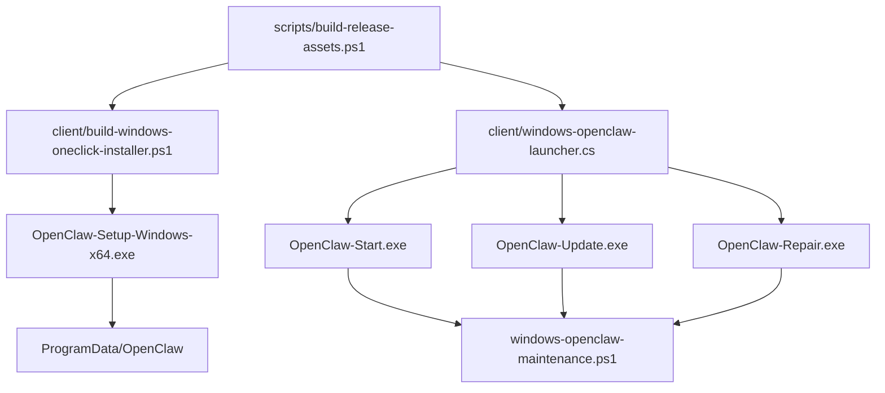
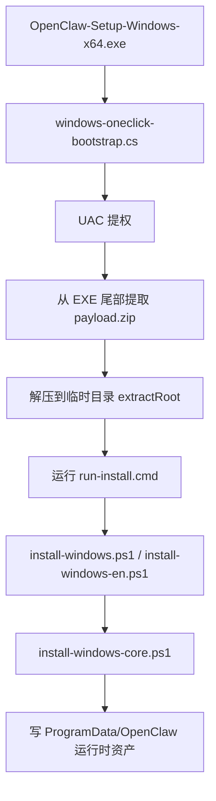
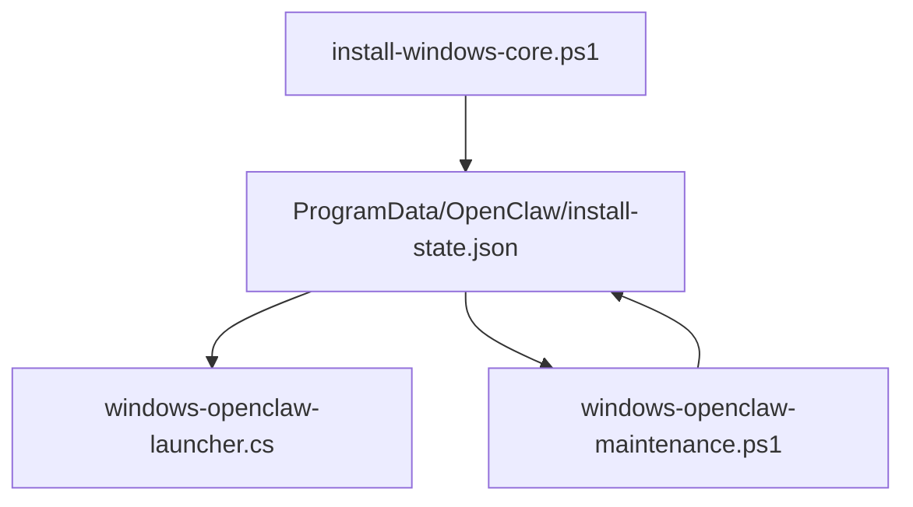

# OpenClaw Windows 一键安装上下文分析

> **For Claude:** 这是当前仓库里 Windows 一键安装功能的实现上下文地图，用于后续优化、重构和问题定位。

**Goal:** 在不修改功能的前提下，完整梳理 Windows 一键安装 / 一键启动 / 一键更新 / 一键修复 的实现边界、主文件职责、控制流、状态流和数据传递方式。

**Architecture:** 该功能不是单个 EXE，而是一个四层系统：Release 构建层 -> Setup 自解压安装层 -> ProgramData 运行时资产层 -> Launcher + Maintenance 维护层。真正的行为中枢是 `install-windows-core.ps1`、`windows-openclaw-maintenance.ps1` 和 `install-state.json`。

**Tech Stack:** PowerShell, C# WinForms, CodeDom 动态编译, ZIP 自解压 payload, ProgramData 状态持久化

---

## 1. 结论先行

```text
当前 “Windows 一键安装” 的完整实现不是单文件，而是 4 段闭环：

1. 构建期
   scripts/build-release-assets.ps1
   -> client/build-windows-oneclick-installer.ps1
   -> 生成 Setup.exe / Start.exe / Update.exe / Repair.exe

2. 首次安装期
   OpenClaw-Setup-Windows-*.exe
   -> windows-oneclick-bootstrap.cs
   -> run-install.cmd
   -> install-windows.ps1 / install-windows-en.ps1
   -> install-windows-core.ps1

3. 安装落地期
   ProgramData\OpenClaw\
   -> bundles / source / tools / support / bin / logs
   -> install-state.json

4. 后续维护期
   OpenClaw-Start.exe / Update.exe / Repair.exe
   -> windows-openclaw-launcher.cs
   -> windows-openclaw-maintenance.ps1
   -> openclaw.cmd
```

```text
一句话判断主中枢：

- 安装逻辑中枢：client/install-windows-core.ps1
- 维护逻辑中枢：client/windows-openclaw-maintenance.ps1
- GUI 壳层：client/windows-oneclick-bootstrap.cs + client/windows-openclaw-launcher.cs
- 构建中枢：client/build-windows-oneclick-installer.ps1
- 运行时状态中枢：ProgramData\OpenClaw\install-state.json
```

---

## 2. 系统拓扑

```text
Repo
+----------------------------------------------------------------------------------+
| root wrappers                                                                    |
| - build-windows-oneclick-installer.ps1 -> 仅转发到 client/                       |
| - install-windows.ps1                  -> 仅转发到 client/                       |
| - install-windows-core.ps1             -> 仅转发到 client/                       |
| - uninstall-windows.ps1                -> 仅转发到 client/                       |
+----------------------------------------------------------------------------------+
                                         |
                                         v
+----------------------------------------------------------------------------------+
| client/                                                                          |
| - build-windows-oneclick-installer.ps1   Setup 构建主脚本                         |
| - install-windows.ps1 / en.ps1           Setup 解包后入口                         |
| - install-windows-core.ps1               真正安装逻辑                             |
| - windows-oneclick-bootstrap.cs          Setup GUI + payload 解包                 |
| - windows-openclaw-launcher.cs           Start/Update/Repair GUI                  |
| - windows-openclaw-maintenance.ps1       Start/Update/Repair 真正执行逻辑         |
| - windows-openclaw-license.cs            授权 helper 预留能力                     |
| - assets/icons/*                         EXE 图标                                 |
| - manifests/*.json                       静态 manifest 备份/辅助资源              |
+----------------------------------------------------------------------------------+
                                         |
                                         v
+----------------------------------------------------------------------------------+
| Installed machine                                                                |
| ProgramData\OpenClaw\                                                            |
| - install-state.json                                                             |
| - license-state.json                                                             |
| - bundles\...                                                                    |
| - source\...                                                                     |
| - tools\...                                                                      |
| - support\OpenClaw-Maintenance.ps1                                              |
| - support\install-windows-core.ps1                                              |
| - bin\openclaw.cmd / ccman.cmd / OpenClaw-Maintenance.exe                       |
| - bin\OpenClaw Start/Update/Repair.exe                                          |
| - logs\...                                                                       |
+----------------------------------------------------------------------------------+
```



---

## 3. 主文件职责表

| 文件 | 是否主链 | 责任 |
| --- | --- | --- |
| `build-windows-oneclick-installer.ps1` | 否 | 根目录兼容转发入口 |
| `install-windows.ps1` | 否 | 根目录兼容转发入口 |
| `install-windows-core.ps1` | 否 | 根目录兼容转发入口 |
| `uninstall-windows.ps1` | 否 | 根目录兼容转发入口 |
| `scripts/build-release-assets.ps1` | 是 | Release 总入口，调用 Setup 构建和 Start/Update/Repair 构建 |
| `client/build-windows-oneclick-installer.ps1` | 是 | 构建 bundle、编译 launcher/helper、组装 payload、生成 Setup 自解压 EXE |
| `client/install-windows.ps1` | 是 | 中文安装入口，补默认参数并转发到 core |
| `client/install-windows-en.ps1` | 是 | 英文安装入口，补默认参数并转发到 core |
| `client/install-windows-core.ps1` | 是 | 真正安装 OpenClaw、wrapper、support、三件套、install-state |
| `client/windows-oneclick-bootstrap.cs` | 是 | Setup GUI、自提权、自解压、运行 `run-install.cmd` |
| `client/windows-openclaw-launcher.cs` | 是 | Start/Update/Repair GUI，负责调用 maintenance，并消费 `OPENCLAW_UI` 事件 |
| `client/windows-openclaw-maintenance.ps1` | 是 | Start/Update/Repair 实际执行逻辑，统一做 Gateway/health/dashboard/provider 检查 |
| `client/windows-openclaw-license.cs` | 半主链 | 授权 helper；代码完整保留，但当前 open 包默认关闭门禁 |
| `client/assets/icons/*` | 是 | Setup 与三件套图标资源 |
| `client/manifests/*.json` | 邻接 | 静态 manifest 资源，不是当前安装主闭环的唯一真源 |
| `client/package/` | 邻接 | vendored upstream snapshot；当前一键安装主路径不直接从这里安装 |

---

## 4. 构建期实现

### 4.1 Release 总装配

`scripts/build-release-assets.ps1` 做三件事：

```text
1. 调 client/build-windows-oneclick-installer.ps1 生成 Setup.exe
2. 直接编译 client/windows-openclaw-launcher.cs 生成：
   - OpenClaw-Start.exe
   - OpenClaw-Update.exe
   - OpenClaw-Repair.exe
3. 额外构建 workflow pack 安装器
```

### 4.2 Setup 构建主流程

`client/build-windows-oneclick-installer.ps1` 的主流程：

```text
Build-OneClickInstaller
|
+- Build-BundleFromScratch / Resolve-ExistingBundle
|  +- 下载 portable Node
|  +- npm install -g openclaw@latest/beta
|  +- npm install -g ccman
|  +- 调用 tools/apply-openclaw-overlay.mjs
|  +- 打 zip
|  +- 产出 sidecar manifest(.manifest.json)
|
+- New-QuickLauncherExecutable
|  +- 编译 windows-openclaw-launcher.cs -> OpenClaw-Launcher.exe
|
+- New-LicenseHelperExecutable
|  +- 编译 windows-openclaw-license.cs -> OpenClaw-License.exe
|
+- 复制 stage 资产
|  +- install-windows.ps1 / en.ps1
|  +- install-windows-core.ps1
|  +- windows-openclaw-maintenance.ps1
|  +- windows-openclaw-license.cs
|  +- launcher exe / license exe
|  +- bundle zip / manifest
|  +- 图标
|
+- New-RunInstallCmd
|  +- 生成解包后实际执行命令
|
+- New-EmbeddedOneClickExecutable
   +- stageDir 压成 payload.zip
   +- 编译 windows-oneclick-bootstrap.cs 为 stub.exe
   +- 把 payload.zip 直接 append 到 stub 尾部
   +- 尾部写入 magic = OCSFX01 + payloadLength
```

### 4.3 当前 Setup 包里携带的有效资产

```text
payload/
|- install-windows.ps1 或 install-windows-en.ps1
|- install-windows-core.ps1
|- windows-openclaw-maintenance.ps1
|- windows-openclaw-license.cs
|- OpenClaw-Launcher.exe
|- OpenClaw-License.exe
|- openclaw-windows-<channel>-<arch>.zip
|- openclaw-windows-<channel>-<arch>.zip.manifest.json
|- run-install.cmd
|- icons...
```

### 4.4 非主路径遗留实现

构建脚本里仍保留 IExpress 相关函数：

```text
- Get-IExpressPath
- New-IExpressSedFile
```

但当前实际产物已经切换到：

```text
C# stub + append payload
```

所以 IExpress 现在是遗留/备选代码，不是当前真主链。

---

## 5. 首次安装期实现

### 5.1 Setup EXE 到安装核心的调用链



### 5.2 `windows-oneclick-bootstrap.cs` 做什么

```text
Main
|- 若非管理员 -> 重新以 runas 启动自己
|- 启动 WinForms 安装窗口

BootstrapForm.StartWorkflowAsync
|- Capture install-state/license-state 快照
|- EnsurePayloadPrepared
|  |- 从当前 EXE 尾部读取 payloadLength
|  |- 提取 payload.zip
|  |- 解压出 run-install.cmd 等文件
|- 当前 open 包模式下跳过授权校验
|- 切换 UI 到 installing
|- RunInstallerAsync
   |- cmd.exe /c run-install.cmd
   |- 注入环境变量
   |- 等待外部安装窗口完成
```

### 5.3 Setup 传给安装脚本的环境变量

```text
OPENCLAW_LICENSE_API_BASE_URL
OPENCLAW_INSTALLER_AUTH_CODE
OPENCLAW_INSTALLATION_ID
```

当前 open 包下：

```text
RequireLicenseGate = false
```

所以授权流程默认被关闭，但相关代码仍存在。

### 5.4 `run-install.cmd` 的职责

```text
1. 设置 OPENCLAW_NO_PROGRESS_BAR=1
2. 设置 OPENCLAW_EXTRACTOR=builtin
3. 调 powershell.exe -File install-windows.ps1
4. 传入：
   -BundlePath <payload 内 bundle zip>
   -Scope machine
   -NoLicenseGate
   -NoOnboard / -NoDoctor (按构建参数决定)
5. 安装结束后延迟删除临时解压目录
```

### 5.5 `install-windows.ps1` / `install-windows-en.ps1`

这两个脚本只做轻量转发：

```text
|- 检查管理员权限
|- 优先使用本地同目录 install-windows-core.ps1
|- 否则从 OPENCLAW_INSTALLER_BASE_URL 下载 install-windows-core.ps1
|- 默认补 NoLicenseGate=true
|- 固定 Locale=zh-CN / en-US
|- 补 InvokerRoot
|- 把参数原样转发给 install-windows-core.ps1
```

---

## 6. 安装核心 `install-windows-core.ps1`

### 6.1 真正安装顺序

```text
Invoke-InstallFlow
|- Set-ConsoleUtf8
|- Initialize-InstallerContext
|- Import-SystemProxySettings
|- Probe-Network
|- routes = bundle / npm / git
|- 逐路尝试安装
|  |- bundle
|  |- npm
|  |- git
|- 成功后统一收尾：
   |- Verify-Installation
   |- Install-LicenseCliEntrypointHook
   |- Install-Wrapper
   |- Install-CompanionWrappers
   |- Install-QuickLaunchExecutable
   |- Try-ActivateLicenseAfterInstall
   |- Remove-LegacyCurrentUserInstallArtifacts
   |- Enable-ClassicConsolePasteForCurrentUser
   |- Run-Doctor
   |- Show-SuccessSummary
   |- Open-ConfigurationPage
```

### 6.2 安装上下文如何初始化

`Initialize-InstallerContext` 会统一归一化这些输入：

```text
显式参数
-> 环境变量
-> 默认值
```

关键落地点固定为：

```text
DataRoot    = ProgramData\OpenClaw
BundleRoot  = ProgramData\OpenClaw\bundles
SupportRoot = ProgramData\OpenClaw\support
ToolRoot    = ProgramData\OpenClaw\tools
SourceRoot  = ProgramData\OpenClaw\source
WrapperDir  = ProgramData\OpenClaw\bin
StatePath   = ProgramData\OpenClaw\install-state.json
```

并且它强制：

```text
Scope = machine
stable channel => latest
NoLicenseGate = true
```

### 6.3 三条安装路线

#### bundle 路线

```text
Install-BundleRoute
|- Resolve-BundleMetadata
|- 如果是远端 bundle:
|  |- 下载 bundle
|  |- 校验 sha256
|- 解压到 ProgramData\OpenClaw\bundles\<channel-version-arch>
|- 从 manifest / 文件结构识别 openclaw 启动入口
|- 设置：
   CommandType
   CommandTarget
   PortableNodeDir
   CompanionCommands(ccman)
```

#### npm 路线

```text
Install-NpmRoute
|- Ensure-Node
|- Ensure-Git
|- 选择官方/国内 registry
|- npm install -g openclaw@<tag>
|- npm install -g ccman
|- 设置：
   CommandType = cmd
   CommandTarget = <npm global openclaw.cmd>
```

#### git 路线

```text
Install-GitRoute
|- Ensure-Node
|- Ensure-Git
|- Ensure-Pnpm
|- git clone / 拉源码 zip
|- pnpm install
|- pnpm ui:build
|- pnpm build
|- 设置：
   CommandType = node
   CommandTarget = dist\entry.js
```

### 6.4 wrapper 是怎么生成的

`Install-Wrapper` 会写出：

```text
ProgramData\OpenClaw\bin\openclaw.cmd
```

内部根据安装路线决定调用方式：

```text
if CommandType == node
  "%OPENCLAW_NODE%" "<CommandTarget>" %*
else
  call "<CommandTarget>" %*
```

并统一注入：

```text
- portable node PATH bootstrap
- OPENCLAW_NODE
- 预留的 license bootstrap
```

`Install-CompanionWrappers` 同理生成 `ccman.cmd`。

### 6.5 support 目录与三件套是怎么落地的

`Install-MaintenanceSupportAssets` 会把下面这些文件复制到：

```text
ProgramData\OpenClaw\support\
|- OpenClaw-Maintenance.ps1
|- install-windows-core.ps1
|- windows-openclaw-license.cs
|- manifest.json
|- windows-<channel>-<arch>.json
|- icons...
```

`Install-QuickLaunchExecutable` 再负责：

```text
1. 先得到 canonical 维护 EXE:
   ProgramData\OpenClaw\bin\OpenClaw-Maintenance.exe

2. 基于相同源码或 payload 编译不同 icon 变体:
   - Start
   - Update
   - Repair

3. 复制到：
   - ProgramData\OpenClaw\bin
   - 公共桌面
```

### 6.6 安装期持久化的核心状态

`Save-InstallState` 写入：

```text
schemaVersion
locale / channel / installMode / installMethod / mirror / architecture
installedVersion / lastKnownGoodVersion / lastHealthState
dataRoot / bundleRoot / sourceRoot / toolRoot
wrapperDir / wrapperPath
supportDir / coreInstallerPath / maintenanceScriptPath
licenseExecutablePath / licenseStatePath / licenseStatus / licenseApiBaseUrl
runtimeControlMode / startMode
capabilities / capabilitiesRuntimeVersion
gatewayTokenState / providerAuthState
lastStartReason / lastDashboardMode
launcherPath / maintenanceExecutablePath
desktopStartPath / desktopUpdatePath / desktopRepairPath
commandType / commandTarget / portableNodeDir
companionCommands[]
updatedAt
```

补充注意：

```text
当前实现里 install-state.json 的 installMethod 字段被固定写成 "bundle"，
即使实际安装成功路线是 npm 或 git，它也不会严格反映真实安装路径。
后续如果有逻辑依赖 installMethod，必须先复核这里。
```

---

## 7. 后续维护期实现

### 7.1 Start / Update / Repair 的外层 GUI 壳

`client/windows-openclaw-launcher.cs` 本质是三件套共用的 WinForms 外壳：

```text
Main
|- ResolveMode
|  |- --mode 参数
|  |- 或根据 EXE 文件名推断 Start / Update / Repair
|- ResolveInstallRoot
|  |- 通过 ProgramData / exeDir / statePath 多点猜测
|- ResolveStatePath
|- ResolveSupportScriptPath
|- ResolveLocale
|- 若非管理员则 runas 提权
|- 打开 MaintenanceWindow
```

`MaintenanceWindow.StartMaintenance` 实际拉起：

```text
powershell.exe
  -File OpenClaw-Maintenance.ps1
  -Mode <Start|Update|Repair>
  -LogPath <logs\maintenance-*.log>
  -InvokerPath <当前 EXE 路径>
  -InstallRoot <推断出的安装根>
```

并设置环境变量：

```text
PATH = merged PATH
OPENCLAW_INSTALL_ROOT = <installRoot>
```

### 7.2 launcher 与 maintenance 的通信协议

不是命名管道，也不是 IPC 框架，而是 stdout 文本协议：

```text
maintenance:
  Write-Host "OPENCLAW_UI {json}"

launcher:
  读 stdout/stderr
  -> 检测前缀 OPENCLAW_UI
  -> TryParseUiEvent
  -> 更新 phase/status/result UI
```

协议类型：

```text
phase
- key
- title
- progress
- message

status
- level
- message

result
- code
- message
- summary
- reason
- nextAction
- recoveryCommand
```

### 7.3 launcher 的超时策略

```text
Start
- idle timeout = 180s
- hard cap     = 900s

Repair
- 600s

Update
- 3600s
```

Start 成功时窗口会自动关闭；Update / Repair 不自动关。

---

## 8. 维护核心 `windows-openclaw-maintenance.ps1`

### 8.1 它的基础职责

```text
1. 解析并修复 install-state.json
2. 找到或重建 openclaw.cmd
3. 探测 CLI capabilities
4. 维护 Gateway 持久化状态
5. 验证 RPC health
6. 验证 Dashboard 可打开性
7. 分类 Provider Auth 状态
8. 把结果持久化回 install-state.json
9. 向 launcher 发 UI 事件
```

### 8.2 install-state 的读取与修正

`Resolve-InstallState` 会：

```text
|- 读 ProgramData\OpenClaw\install-state.json
|- 不存在字段就补默认值
|- 如果 dataRoot 更可信，则切换上下文根
|- 同步：
   wrapperPath
   supportDir
   coreInstallerPath
   maintenanceScriptPath
   licenseExecutablePath
   capabilities
   gatewayTokenState
   providerAuthState
|- 再用实际磁盘资产反向修正 state
```

`Persist-InstallState` 是维护期统一写回入口。

### 8.3 wrapper 如何被恢复

如果 `openclaw.cmd` 丢了，`Resolve-WrapperPath` 会：

```text
1. 按 state.wrapperPath / wrapperDir / invokerDir / npm global 顺序找
2. 如果找不到，调用 Restore-WrappersFromState
3. 利用 install-state 中的：
   - commandType
   - commandTarget
   - portableNodeDir
   - companionCommands
   重新生成 openclaw.cmd / ccman.cmd
```

### 8.4 capabilities 如何推断

`Resolve-Capabilities` 有三层逻辑：

```text
1. 若 runtime version 命中预设 -> 直接用 preset
2. 否则若 state 缓存可用 -> 复用缓存
3. 否则冷启动 probe:
   - openclaw daemon status --json
   - openclaw health --json
   - openclaw gateway status --json --require-rpc
   - openclaw doctor --repair / --non-interactive
   - openclaw dashboard --no-open
   - openclaw models auth ...
```

然后把 capability cache 再写回 `install-state.json`。

### 8.5 Gateway token 检查

`Ensure-GatewayTokenReady` 的判断顺序：

```text
1. gateway.auth.mode == none
2. OPENCLAW_GATEWAY_TOKEN 环境变量
3. openclaw config get gateway.auth.token
4. 若支持 doctor --generate-gateway-token，则自动生成
5. 否则标记 RequiresAttention
```

### 8.6 Dashboard 验证与自动修复

`Verify-DashboardReady` 先跑：

```text
openclaw dashboard --no-open
```

然后把结果分成：

```text
verified-url
soft-fail
hard-fail
```

`Finalize-OperationalReadiness` 在 `OpenDashboard && local-stable` 且 `hard-fail` 时，会尝试一次本地安全修复：

```text
Invoke-LocalSafeDashboardAutoRepair
|- gateway_token_required -> 重新检查 / 生成 token
|- origin_not_allowed     -> 补 loopback allowedOrigins
|- reload Gateway
|- 再次 Verify-DashboardReady
```

### 8.7 Gateway 持久化恢复

`Ensure-PersistentGatewayReady` 的策略：

```text
1. 先看当前 snapshot:
   - healthy?
   - service.loaded?

2. 如果 service 已加载但不健康
   -> start/restart
   -> refresh loaded service

3. 如果 service 未加载
   -> Ensure-OfficialGatewayPersistence
   -> gateway install --force

4. 再不行
   -> start/restart

5. 若允许 console fallback
   -> 启动一个持久 cmd 窗口跑:
      openclaw gateway run
```

### 8.8 Start / Update / Repair 的差异

#### Start

```text
Invoke-StartMode
|- Resolve-WrapperPath
|- Get-InstalledVersion
|- Resolve-Capabilities
|- Ensure-GatewayTokenReady
|- Get-GatewayReadinessSnapshot
|- 必要时 Ensure-PersistentGatewayReady
|- Finalize-OperationalReadiness -OpenDashboard
```

#### Update

```text
Invoke-UpdateMode
|- Resolve current version
|- Resolve-TargetRelease
|  |- 直接查 npm 官方 dist-tags
|- 若已最新:
|  |- 直接做统一 post-validation
|- 否则:
|  |- Invoke-InstallerUpdate
|     |- 重新跑 install-windows-core.ps1
|     |- 强制 InstallMode=npm
|     |- Channel=latest
|- 再走 Finalize-OperationalReadiness
```

#### Repair

```text
Invoke-RepairMode
|- 检查 wrapper/version
|- Resolve-Capabilities
|- 收集状态诊断
|- 先尝试重启 Gateway
|- 不行就 Run-Doctor
|- 还不行就 gateway install --force
|- 最后统一走 Finalize-OperationalReadiness
```

### 8.9 维护结果如何回写

所有结果都经过 `Complete-Maintenance`：

```text
|- Persist-InstallState
|- 写 result 事件到 stdout:
   OPENCLAW_UI {"type":"result", ...}
|- exit code 返回给 launcher
```

---

## 9. 数据流总览

### 9.1 核心状态流



### 9.2 命令流

```text
Setup.exe
-> run-install.cmd
-> install-windows.ps1 / install-windows-en.ps1
-> install-windows-core.ps1

Start/Update/Repair.exe
-> windows-openclaw-launcher.cs
-> powershell.exe -File OpenClaw-Maintenance.ps1
-> openclaw.cmd
-> 真正 OpenClaw runtime
```

### 9.3 关键环境变量

```text
OPENCLAW_INSTALL_ROOT
  launcher -> maintenance，用于帮助定位安装根

OPENCLAW_INSTALLER_AUTH_CODE
OPENCLAW_LICENSE_API_BASE_URL
OPENCLAW_INSTALLATION_ID
  bootstrap -> 安装脚本 / license helper

OPENCLAW_NO_PROGRESS_BAR=1
OPENCLAW_EXTRACTOR=builtin
  run-install.cmd -> install core

OPENCLAW_NODE
  wrapper 启动 node 入口

OPENCLAW_INSTALLER_BASE_URL
  install-windows*.ps1 / maintenance 下载 install-windows-core.ps1 的后备地址
```

---

## 10. 主链与非主链边界

### 明确属于当前主链

```text
- scripts/build-release-assets.ps1
- client/build-windows-oneclick-installer.ps1
- client/install-windows.ps1
- client/install-windows-en.ps1
- client/install-windows-core.ps1
- client/windows-oneclick-bootstrap.cs
- client/windows-openclaw-launcher.cs
- client/windows-openclaw-maintenance.ps1
- ProgramData\OpenClaw\install-state.json
```

### 重要但当前默认关闭 / 半主链

```text
- client/windows-openclaw-license.cs
- license-state.json
```

原因：

```text
build 脚本会编译 helper
install-core 会复制 helper/source
maintenance / launcher 也保留授权入口
但是：
- build 阶段忽略 RequireLicenseGate
- install-core 的 Test-LicenseGateEnabled=false
- maintenance 的 Test-LicenseGateEnabled=false
- bootstrap 的 RequireLicenseGate=false
```

### 邻接功能，不属于 Setup/Start/Update/Repair 主闭环

```text
- client/build-windows-workflow-pack-installer.ps1
- client/build-windows-workflow-pack.ps1
- client/install-windows-workflow-pack.ps1
- client/build-windows-reach-pack.ps1
- client/install-windows-reach-pack.ps1
- client/package/
```

补充说明：

```text
workflow pack 虽然不是首次安装主路径的一部分，
但 Update / Repair 维护期会额外调用 workflow pack 自检/自修复逻辑。
```

---

## 11. 后续优化时的阅读顺序建议

### 如果要改 Setup 安装体验

```text
1. client/windows-oneclick-bootstrap.cs
2. client/build-windows-oneclick-installer.ps1
3. client/install-windows.ps1 / install-windows-en.ps1
4. client/install-windows-core.ps1
```

### 如果要改 Start / Update / Repair 行为

```text
1. client/windows-openclaw-launcher.cs
2. client/windows-openclaw-maintenance.ps1
3. client/install-windows-core.ps1
4. install-state.json 字段读写点
```

### 如果要改 release / 打包产物

```text
1. scripts/build-release-assets.ps1
2. client/build-windows-oneclick-installer.ps1
3. .github/workflows/windows-release.yml
```

---

## 12. 当前上下文认知结论

```text
这套系统里，最容易误判的点有 4 个：

1. Setup.exe 和 Start/Update/Repair.exe 不是一套程序
2. launcher 只是 GUI 壳，真正逻辑在 maintenance.ps1
3. install-state.json 不是附属文件，而是维护期的状态中枢
4. license/helper 代码虽然完整存在，但当前 open 包默认处于关闭门禁模式
```

```text
因此，后续任何改动都应该先判断你要动的是哪一层：

- build layer
- setup/bootstrap layer
- install-core layer
- runtime maintenance layer
- state contract layer
```
