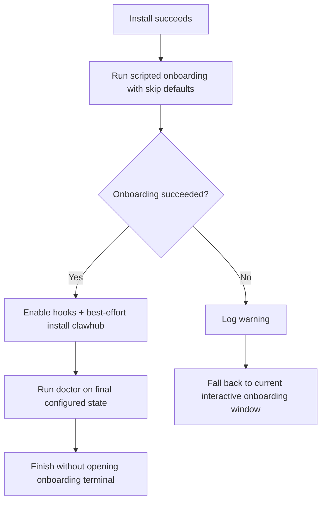

# 2026-03-19 Windows Auto Bootstrap Defaults

## Goal

Replace the current post-install interactive onboarding window with a deterministic
post-install bootstrap that preconfigures the user's requested defaults:

- auth/model config: skip for now
- channels: skip
- skills onboarding: skip
- install ClawHub CLI only
- enable all bundled internal hooks

## User intent

```text
install finished
  |
  +-- do not ask for API/auth now
  +-- do not configure channels now
  +-- do not run generic skills setup now
  +-- do install ClawHub CLI
  +-- do enable all built-in hooks
```

## Five hypotheses

| # | Hypothesis | Result | Evidence |
|---|------------|--------|----------|
| 1 | Official onboarding can be scripted with auth skipped. | True | `openclaw onboard --non-interactive --auth-choice skip` is documented. |
| 2 | We can avoid channel prompts entirely. | True | Official onboarding supports `--skip-channels`. |
| 3 | We can avoid skills onboarding entirely. | True | Official onboarding supports `--skip-skills`. |
| 4 | "Install ClawHub" is an onboarding option. | False | ClawHub is a separate CLI (`npm i -g clawhub`), not an onboarding step. |
| 5 | "Enable all hooks" can be made deterministic without UI. | True | Official docs say hook enable writes `hooks.internal.entries.<name>.enabled = true`; bundled hooks are known and fixed. |

## Current problem

Today the installer always opens:

```text
openclaw onboard --install-daemon
```

That forces a manual terminal flow even when we already know the desired defaults.

## Official surfaces we can use

### Non-interactive onboarding

Use one scripted onboarding pass:

```text
openclaw onboard
  --non-interactive
  --accept-risk
  --mode local
  --auth-choice skip
  --install-daemon
  --skip-channels
  --skip-skills
  --skip-health
  --skip-ui
```

Notes:

- gateway auth defaults to token mode during onboarding
- loopback + daemon install still get a usable local gateway
- auth/model remains intentionally unconfigured for later user setup

### Hook defaults

Use:

- `openclaw config set hooks.internal.enabled true --strict-json`
- `openclaw hooks enable session-memory`
- `openclaw hooks enable bootstrap-extra-files`
- `openclaw hooks enable command-logger`
- `openclaw hooks enable boot-md`

### ClawHub

ClawHub is separate from onboarding:

- install command: `npm i -g clawhub`
- it should be treated like an optional companion CLI
- later `clawhub install <slug>` writes into workspace `./skills`

## Design choice

Recommended approach: hybrid safe automation



Why this approach:

- meets the requested defaults on the happy path
- keeps install resilient if OpenClaw CLI behavior drifts
- avoids turning optional ClawHub install into a hard install blocker

## Scope

### In scope

- replace post-install interactive onboarding default
- add scripted post-install onboarding
- add bundled-hook enable step
- add best-effort ClawHub companion install + wrapper + dependency summary
- preserve manual fallback on automation failure

### Out of scope

- changing maintenance provider-auth repair behavior
- auto-installing any ClawHub skill package
- changing capability preset logic from the separate review finding

## Implementation sketch

1. Add a computed post-install onboarding command builder.
2. Add a scripted onboarding runner using `Invoke-InstalledOpenClaw`.
3. Add a post-bootstrap hook enable step.
4. Generalize companion npm install to support `clawhub` in addition to `ccman`.
5. Keep companion install best-effort for `clawhub`.
6. Move `Run-Doctor` to validate the final auto-configured state.
7. If scripted onboarding fails, fall back to the old `Open-ConfigurationPage()`.

## Risks and handling

### Risk 1: non-interactive onboarding changes upstream

Handling:

- keep the current interactive fallback
- log the exact failed command path

### Risk 2: ClawHub registry unavailable

Handling:

- warn only
- do not fail OpenClaw install

### Risk 3: hook enable command fails on partial installs

Handling:

- set `hooks.internal.enabled` first
- enable bundled hooks one by one and surface warnings
- do not fake success silently

## Review checklist

```text
[ ] installer no longer defaults to opening interactive onboarding
[ ] non-interactive onboarding uses requested skip defaults
[ ] bundled hooks are enabled
[ ] clawhub wrapper is installed when available
[ ] failure path still preserves interactive fallback
[ ] PowerShell syntax passes
[ ] git diff only touches task files
```
