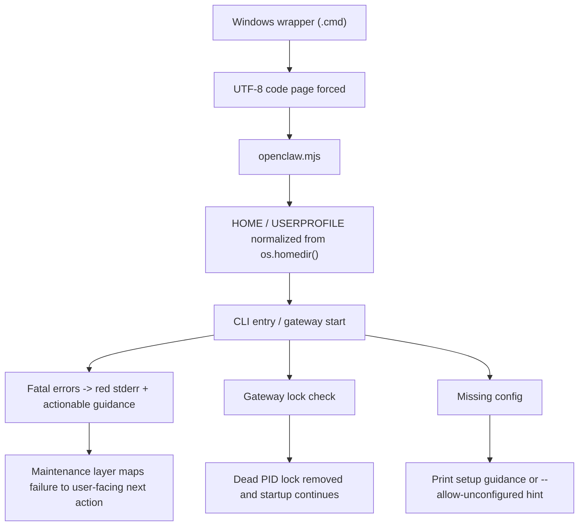

# Windows Startup Hardening Plan

## Summary
- Delivery stays on `openclaw@latest`, but the Windows bundle now applies a deterministic overlay after `npm install`.
- The overlay is guarded by required-file and anchor checks so drift fails the build instead of shipping silently.
- Wrapper and launcher layers are hardened first, then runtime startup error surfacing and maintenance classification are layered on top.

```text
Build pipeline
  npm install openclaw@latest
    -> overlay drift guard
    -> overlay patch apply
    -> bundle manifest records overlay revision

Runtime chain
  *.cmd wrapper
    -> chcp 65001 >nul
    -> openclaw.mjs env normalize
    -> CLI/gateway fatal printer
    -> stale lock self-heal / config guidance
    -> maintenance classifies surfaced failures
```



## Implementation
- Add a build-time overlay helper under `client/tools` that validates the installed package shape, patches bundle-root `.cmd` files, and records overlay metadata for the manifest.
- Force `chcp 65001 >nul` immediately after `@echo off` in installer-generated wrappers and maintenance-generated wrappers.
- Add runtime overlay patches for top-level home-dir normalization, red fatal stderr output, stricter stale-lock handling, and first-run guidance.
- Extend maintenance and launcher layers so startup failures map to concrete `reason`, `summary`, and `nextAction` values instead of collapsing into a generic recovery message.

## Verification
- Guard test: remove a required anchor from a temp bundle and ensure the overlay fails fast.
- Wrapper text test: assert `@echo off` is followed by `chcp 65001 >nul` in generated and bundled `.cmd` files.
- Runtime tests: cover HOME/USERPROFILE pollution, stale lock cleanup, missing config guidance, and gateway lock/port conflict fatal output.
- Maintenance test: feed captured stderr samples into the maintenance classifier and assert the new reason/summary mapping.
