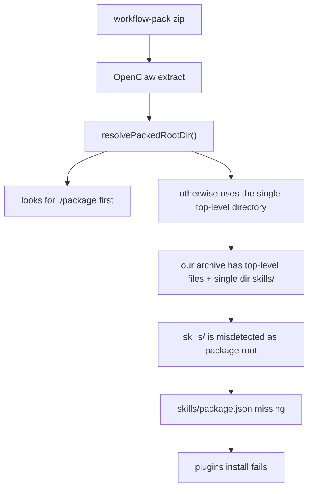

# Workflow Pack Archive Layout Fix

## Goal

Make `OpenClaw-Workflow-Pack-*.zip` installable by `openclaw plugins install` in both fresh and drifted environments.

The fix must address:

- wrong archive root layout produced by our workflow-pack builder
- compatibility with already-built broken archives copied into `support/workflow-packs/...`
- repeatable verification before rebuilding the EXE

## Observed Failure

```text
Installer
  -> openclaw plugins install <workflow-pack.zip>
     -> OpenClaw extracts archive
     -> OpenClaw resolves extracted package root
     -> package root is misdetected as ./skills
     -> ./skills/package.json is missing
     -> install fails with:
        "extracted package missing package.json"
```



## Five Hypotheses

### H1

- Hypothesis: the workflow-pack zip does not contain `package.json`.
- Validation:
  - inspected `release/OpenClaw-Workflow-Pack-Foundation-Common.zip`
  - inspected copied support archive under `C:\ProgramData\OpenClaw\support\workflow-packs\foundation-common`
- Result: rejected

### H2

- Hypothesis: the support archive copied during install is corrupt or truncated.
- Validation:
  - compared support archive contents with release archive
  - confirmed both contain identical top-level entries including `package.json`
- Result: rejected

### H3

- Hypothesis: OpenClaw expects a wrapped package root such as `package/...`, but our zip stores files directly at archive root.
- Validation:
  - inspected OpenClaw source `resolvePackedRootDir()` in bundled dist files
  - function first prefers `extract/package`
  - if absent, it picks the only top-level directory
- Result: confirmed

### H4

- Hypothesis: because our archive root contains files plus a single `skills/` directory, OpenClaw mistakes `skills/` for the package root.
- Validation:
  - matched archive structure against `resolvePackedRootDir()` behavior
  - failure message then exactly matches follow-up lookup for `skills/package.json`
- Result: confirmed

### H5

- Hypothesis: robust fix requires both build-time contract correction and install-time backward compatibility for already-built bad archives.
- Validation:
  - build-only fix would require all users to replace every previously copied support archive
  - install-only fix would keep shipping malformed archives
- Result: confirmed

## Options

### Option A

- Fix only builder output
- Pros:
  - clean contract
- Cons:
  - existing copied archives remain broken

### Option B

- Fix only installer by repacking archives on the fly
- Pros:
  - rescues old bad archives
- Cons:
  - keeps shipping malformed artifacts

### Option C

- Fix builder output and add installer-side legacy normalization
- Pros:
  - future archives are correct
  - already-copied broken archives are auto-repaired
  - lowest support burden
- Cons:
  - slightly more code

## Decision

Use Option C.

## Target Changes

```text
build-windows-workflow-pack.ps1
  -> emit plugin zip as:
     package/
       package.json
       openclaw.plugin.json
       index.ts
       skills/...

install-windows-workflow-pack.ps1
  -> before plugins install:
     inspect archive root
     if legacy flat layout detected
       repack to package/... layout
       install repaired archive instead
```

## Acceptance Criteria

- workflow-pack archive contains `package/...` root
- installer can detect and repair legacy flat archives already present in support root
- `openclaw plugins install` no longer fails with `extracted package missing package.json`
- rebuilt EXE embeds the corrected installer and corrected plugin archive
