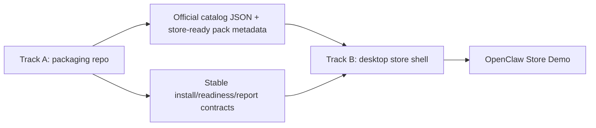

# OpenClaw Desktop Store V1 Implementation Plan

> **For Claude:** REQUIRED SUB-SKILL: Use superpowers:executing-plans to implement this plan task-by-task.

**Goal:** Build the first real `OpenClaw` desktop plugin store demo with a curated official catalog, explicit install/readiness states, and full reuse of the existing `capability-pack` installation pipeline instead of rewriting the plugin core.

**Architecture:** Execute in two coordinated tracks. `Track A` upgrades this repo into a stable store-artifact factory and install-verification backend for `capability-pack` items. `Track B` implements the in-app store shell in the future OpenClaw desktop app repo, consuming the catalog and install/readiness contracts from Track A. The first deliverable is an official curated store demo, not a public marketplace.

**Tech Stack:** PowerShell, C#, JSON manifests, OpenClaw CLI, local workflow-pack archives, desktop app UI layer (future OpenClaw repo), local catalog cache, install/readiness state machine

---

## I'm using the writing-plans skill to create the implementation plan.

## Assumptions

```text
1. Current workspace only contains the Windows packaging repo:
   E:\app\openclaw-setup-cn

2. The OpenClaw desktop application repo is separate and not mounted here.
   This plan uses:
   <openclaw-desktop-repo>
   as the target root placeholder for app-side work.

3. V1 scope remains:
   - OpenClaw only
   - desktop only
   - official curated catalog only
   - no open community submission system

4. We should not pause on missing desktop repo access.
   We can complete Track A now and use this plan to drive Track B once the app repo is available.
```

## Execution Shape

```text
Track A: This repo now
  -> make store-ready artifacts
  -> make install/readiness contracts stable
  -> make official catalog buildable
  -> make demo packs releasable

Track B: Desktop app repo later
  -> consume catalog
  -> render store pages
  -> execute install/update/repair/uninstall flows
  -> surface explicit readiness and reports
```



## Non-Negotiable Product Rules

```text
1. Installed != Ready
2. Store item is a capability outcome, not only an archive
3. capability-pack is a first-class item type
4. install success requires verification, not only file copy
5. repair is a first-class user action
6. V1 is official-curated, not open-submission
```

## Deliverable Definition

At the end of the full plan, V1 demo must provide:

```text
Desktop pages:
  - Store Home
  - Search / Category Results
  - Item Detail
  - Installed / Updates
  - Install Report / Repair Panel

Store actions:
  - install
  - update
  - repair
  - uninstall

Store item types:
  - native-plugin
  - capability-pack

Explicit states:
  - Not Installed
  - Installing
  - Verifying
  - Ready
  - Needs Setup
  - Needs Repair
  - Update Available
  - Failed
```

## Dependency Order

```text
Phase 0  Contract freeze
Phase 1  Store-ready manifest and catalog build in this repo
Phase 2  Harden install/report/readiness contracts in this repo
Phase 3  Desktop app store domain modules
Phase 4  Desktop app store UI
Phase 5  Demo seed catalog and end-to-end acceptance
Phase 6  Release and operational handoff
```

## Task 1: Freeze Cross-Repo Contracts

**Files:**
- Modify: [docs/plans/2026-03-20-openclaw-plugin-market-v1-architecture.md](/E:/app/openclaw-setup-cn/docs/plans/2026-03-20-openclaw-plugin-market-v1-architecture.md)
- Create: `/mnt/e/app/openclaw-setup-cn/docs/contracts/openclaw-store-item-contract.md`
- Create: `/mnt/e/app/openclaw-setup-cn/docs/contracts/openclaw-store-install-state-machine.md`
- Create: `/mnt/e/app/openclaw-setup-cn/docs/contracts/openclaw-store-catalog-contract.md`

**Step 1: Freeze the item model**

Lock these three item types as V1 contract:

```text
native-plugin
bundle-plugin
capability-pack
```

V1 implementation can defer `bundle-plugin`, but the contract must still reserve the type.

**Step 2: Freeze the state machine**

Write the canonical user-visible states:

```text
Not Installed
Queued
Resolving
Downloading
Installing
Provisioning
Verifying
Ready
Needs Setup
Needs Repair
Blocked
Failed
Update Available
Updating
Uninstalling
```

**Step 3: Freeze the catalog contract**

Create a contract doc that defines:

- identity
- presentation
- classification
- source
- trust
- compatibility
- contents
- install
- prerequisites
- verification
- support

**Step 4: Freeze readiness semantics**

Write the exact distinction:

```text
Ready
  -> verification passed and no blocking manual steps remain

Needs Setup
  -> install succeeded, but manual prerequisites still exist

Needs Repair
  -> expected payload, runtime, provisioning, or verification drift detected
```

**Step 5: Review**

Check that these contract docs do not depend on UI framework details and are reusable across repos.

**Step 6: Commit**

```bash
git add docs/contracts docs/plans/2026-03-20-openclaw-plugin-market-v1-architecture.md
git commit -m "docs: freeze OpenClaw store contracts"
```

**Acceptance:**

- contract docs exist
- architecture doc references the same state names
- no V1 scope drift into community marketplace features

## Task 2: Make This Repo a Store-Artifact Factory

**Files:**
- Modify: [client/workflow-packs/foundation-common/pack-manifest.json](/E:/app/openclaw-setup-cn/client/workflow-packs/foundation-common/pack-manifest.json)
- Modify: [client/build-windows-workflow-pack.ps1](/E:/app/openclaw-setup-cn/client/build-windows-workflow-pack.ps1)
- Modify: [client/build-windows-workflow-pack-installer.ps1](/E:/app/openclaw-setup-cn/client/build-windows-workflow-pack-installer.ps1)
- Create: `/mnt/e/app/openclaw-setup-cn/client/catalog/catalog.schema.json`
- Create: `/mnt/e/app/openclaw-setup-cn/client/catalog/items/foundation-common.json`
- Create: `/mnt/e/app/openclaw-setup-cn/client/build-openclaw-store-catalog.ps1`
- Modify: [scripts/build-release-assets.ps1](/E:/app/openclaw-setup-cn/scripts/build-release-assets.ps1)

**Step 1: Extend pack metadata to be store-ready**

Add store-facing fields to pack manifests, for example:

```json
{
  "catalog": {
    "publisher": "OpenClaw Official",
    "itemType": "capability-pack",
    "categories": ["foundation", "productivity"],
    "tags": ["skills", "runtime", "automation"],
    "summary": "Shared foundation capability pack for OpenClaw desktop.",
    "screenshots": [],
    "supportsOfflineInstall": true,
    "supportsRepair": true
  }
}
```

**Step 2: Create a formal catalog schema**

Create `client/catalog/catalog.schema.json` that validates:

- catalog version
- generatedAt
- items[]
- item fields aligned with Task 1 contracts

**Step 3: Create a catalog item builder**

`client/build-openclaw-store-catalog.ps1` should:

- scan `client/workflow-packs/*/pack-manifest.json`
- normalize each pack into one store item JSON object
- include output artifact names and hashes where available
- produce one official catalog JSON file

**Step 4: Generate item JSON beside pack outputs**

Each built pack should also emit:

```text
release/store-items/<pack-id>.json
release/openclaw-store-catalog.json
```

**Step 5: Integrate catalog generation into release builds**

Update [scripts/build-release-assets.ps1](/E:/app/openclaw-setup-cn/scripts/build-release-assets.ps1) so that release builds produce:

- base installer
- workflow pack installer(s)
- workflow pack archive(s)
- store item JSON
- official catalog JSON

**Step 6: Add catalog build verification**

Add build failure conditions for:

- missing store-facing metadata
- missing required output artifact references
- unresolved required skill sources for releasable items
- invalid catalog schema

**Step 7: Review**

Confirm the catalog output is deterministic and can be consumed by a desktop app without inferring hidden rules.

**Step 8: Commit**

```bash
git add client/catalog client/build-openclaw-store-catalog.ps1 client/workflow-packs scripts/build-release-assets.ps1
git commit -m "feat: build store-ready catalog artifacts"
```

**Acceptance:**

- `foundation-common` can be represented as a valid store item
- release build emits a catalog JSON
- catalog generation fails loudly on incomplete metadata

## Task 3: Harden Install, Report, and Readiness Contracts

**Files:**
- Modify: [client/install-windows-workflow-pack.ps1](/E:/app/openclaw-setup-cn/client/install-windows-workflow-pack.ps1)
- Modify: [client/windows-openclaw-maintenance.ps1](/E:/app/openclaw-setup-cn/client/windows-openclaw-maintenance.ps1)
- Modify: [client/install-windows-core.ps1](/E:/app/openclaw-setup-cn/client/install-windows-core.ps1)
- Create: `/mnt/e/app/openclaw-setup-cn/docs/contracts/openclaw-store-install-report.schema.json`

**Step 1: Freeze the install report shape**

Add a schema for install reports that desktop can consume directly.

Required report fields:

- itemId
- itemType
- action
- success
- summary
- verification[]
- provisioning[]
- prerequisites[]
- readiness
- generatedAt

**Step 2: Normalize workflow-pack install output**

Update the installer so the emitted report uses store item terms, not only workflow-pack terms.

Example mapping:

```text
packId     -> itemId
pluginId   -> pluginIds[0]
readiness  -> readiness
verification -> checks
```

**Step 3: Normalize maintenance verification output**

Ensure repair and verification paths emit the same readiness categories as first install.

**Step 4: Make report reopening possible**

Persist reports in a stable location such as:

```text
%ProgramData%\OpenClaw\reports\store\<item-id>\latest.json
%ProgramData%\OpenClaw\reports\store\<item-id>\<timestamp>.json
```

**Step 5: Add uninstall metadata**

Extend `install-state.json` so uninstall and desktop inventory views can reliably display:

- installed version
- installedAt
- verifiedAt
- runtime root
- support root
- archive path
- last readiness state

**Step 6: Review**

Check that `Ready`, `Needs Setup`, and `Needs Repair` can be derived from persisted data without rerunning UI-only heuristics.

**Step 7: Commit**

```bash
git add client/install-windows-workflow-pack.ps1 client/windows-openclaw-maintenance.ps1 client/install-windows-core.ps1 docs/contracts
git commit -m "feat: stabilize store install and readiness reports"
```

**Acceptance:**

- install and repair write the same report shape
- readiness categories are stable across install and repair
- latest report path is deterministic

## Task 4: Add an Official Demo Catalog in This Repo

**Files:**
- Create: `/mnt/e/app/openclaw-setup-cn/client/catalog/collections/official-demo.json`
- Create: `/mnt/e/app/openclaw-setup-cn/client/catalog/README.md`
- Modify: [README.md](/E:/app/openclaw-setup-cn/README.md)
- Modify: [RELEASING.md](/E:/app/openclaw-setup-cn/RELEASING.md)

**Step 1: Define the first demo item set**

Seed the official demo catalog with:

- `foundation-common`
- 2 to 4 smaller official packs if available
- optional native-plugin demo items once app-side support exists

**Step 2: Add collection metadata**

The store home needs collection data, for example:

```json
{
  "id": "official-demo",
  "title": "Official Starter Collection",
  "itemIds": ["foundation-common"]
}
```

**Step 3: Document release artifacts**

Update docs so release outputs are described as:

```text
installers + archives + store catalog + item metadata
```

**Step 4: Review**

Confirm docs no longer describe workflow packs as a side path if they are intended to become store items.

**Step 5: Commit**

```bash
git add client/catalog README.md RELEASING.md
git commit -m "docs: add official store demo catalog assets"
```

**Acceptance:**

- this repo can build a demo catalog without the desktop repo
- docs explain how catalog assets map to installer assets

## Task 5: Create the Desktop Store Domain Layer

**Files:**
- Create: `<openclaw-desktop-repo>/src/features/store/types.ts`
- Create: `<openclaw-desktop-repo>/src/features/store/catalog/loadCatalog.ts`
- Create: `<openclaw-desktop-repo>/src/features/store/catalog/cacheCatalog.ts`
- Create: `<openclaw-desktop-repo>/src/features/store/install/installOrchestrator.ts`
- Create: `<openclaw-desktop-repo>/src/features/store/install/installStateMachine.ts`
- Create: `<openclaw-desktop-repo>/src/features/store/install/reportStore.ts`
- Create: `<openclaw-desktop-repo>/src/features/store/inventory/installedItemsStore.ts`

**Step 1: Import Track A contracts directly**

Do not re-invent item types in the app repo.
Mirror the contract docs and generated catalog JSON exactly.

**Step 2: Implement catalog loading**

Support:

- local bundled catalog file
- refreshed catalog cache
- fallback to last-known-good cache

**Step 3: Implement install orchestration**

The orchestrator should support:

- install
- update
- repair
- uninstall

And it must delegate to the real install mechanism:

- workflow pack installer / archive flow for `capability-pack`
- native plugin install flow for `native-plugin`

**Step 4: Implement the canonical state machine**

Use the same states frozen in Task 1.
No UI-specific ad hoc states.

**Step 5: Implement report persistence**

The app must be able to:

- read latest install report
- stream live install progress
- reopen historical reports

**Step 6: Review**

Confirm app-side logic contains no packaging assumptions that belong in this repo.

**Step 7: Commit**

```bash
git add src/features/store
git commit -m "feat: add desktop store domain modules"
```

**Acceptance:**

- desktop app can load official catalog JSON
- desktop app can map persisted reports into canonical states
- install orchestration is separated from page components

## Task 6: Build the Desktop Store Pages

**Files:**
- Create: `<openclaw-desktop-repo>/src/features/store/pages/StoreHome.tsx`
- Create: `<openclaw-desktop-repo>/src/features/store/pages/StoreSearch.tsx`
- Create: `<openclaw-desktop-repo>/src/features/store/pages/StoreItemDetail.tsx`
- Create: `<openclaw-desktop-repo>/src/features/store/pages/StoreInstalled.tsx`
- Create: `<openclaw-desktop-repo>/src/features/store/pages/StoreInstallReport.tsx`
- Create: `<openclaw-desktop-repo>/src/features/store/components/ItemCard.tsx`
- Create: `<openclaw-desktop-repo>/src/features/store/components/ReadinessBadge.tsx`
- Create: `<openclaw-desktop-repo>/src/features/store/components/InstallActionBar.tsx`

**Step 1: Build Store Home**

Show:

- official collections
- recommended starter items
- recently updated items

**Step 2: Build Search / Results**

Support filters for:

- category
- installed status
- readiness status
- update available

**Step 3: Build Item Detail**

Must show:

- title
- summary
- publisher
- item type
- version
- included components
- runtime needs
- prerequisites
- risk notes
- install / update / repair / uninstall actions

**Step 4: Build Installed / Updates view**

Show:

- installed items
- readiness badge
- update badge
- repair CTA when needed

**Step 5: Build Install Report / Repair view**

Show:

- live stage progress
- final summary
- readiness result
- verification checks
- manual setup instructions when applicable

**Step 6: Review**

Check that the UI makes `Installed != Ready` impossible to miss.

**Step 7: Commit**

```bash
git add src/features/store/pages src/features/store/components
git commit -m "feat: add desktop store UI"
```

**Acceptance:**

- all five V1 pages exist
- a user can tell whether an item is installed, ready, or needs repair
- detail page carries setup burden instead of hiding it in docs

## Task 7: Implement End-to-End Install, Update, Repair, and Uninstall

**Files:**
- Modify: `<openclaw-desktop-repo>/src/features/store/install/installOrchestrator.ts`
- Create: `<openclaw-desktop-repo>/src/features/store/install/actions/installCapabilityPack.ts`
- Create: `<openclaw-desktop-repo>/src/features/store/install/actions/updateItem.ts`
- Create: `<openclaw-desktop-repo>/src/features/store/install/actions/repairItem.ts`
- Create: `<openclaw-desktop-repo>/src/features/store/install/actions/uninstallItem.ts`
- Modify: [client/install-windows-workflow-pack.ps1](/E:/app/openclaw-setup-cn/client/install-windows-workflow-pack.ps1)
- Modify: [client/windows-openclaw-maintenance.ps1](/E:/app/openclaw-setup-cn/client/windows-openclaw-maintenance.ps1)

**Step 1: Install path**

For `capability-pack`, use the real local archive / installer path, not a fake desktop-only state toggle.

**Step 2: Update path**

Support:

- new artifact version detected in catalog
- update action executes real installer/update flow
- readiness re-verification after update

**Step 3: Repair path**

Repair should:

- reuse persisted support archive or local artifact
- rerun verification
- clear `Needs Repair` only after success

**Step 4: Uninstall path**

Uninstall should:

- remove installed plugin/item records
- update inventory state
- preserve enough history to show last action result

**Step 5: Review**

Check that all four actions reuse the same report persistence and state machine.

**Step 6: Commit**

```bash
git add src/features/store/install client/install-windows-workflow-pack.ps1 client/windows-openclaw-maintenance.ps1
git commit -m "feat: wire store install lifecycle actions"
```

**Acceptance:**

- install, update, repair, and uninstall all trigger real backend actions
- app inventory view updates from persisted state, not guessed UI flags

## Task 8: Demo Seeding, QA, and Release Gate

**Files:**
- Create: `/mnt/e/app/openclaw-setup-cn/docs/reviews/2026-03-20-openclaw-store-demo-review.md`
- Create: `<openclaw-desktop-repo>/tests/e2e/store/install-foundation-common.spec.ts`
- Create: `<openclaw-desktop-repo>/tests/e2e/store/repair-flow.spec.ts`
- Modify: [scripts/build-release-assets.ps1](/E:/app/openclaw-setup-cn/scripts/build-release-assets.ps1)
- Modify: [RELEASING.md](/E:/app/openclaw-setup-cn/RELEASING.md)

**Step 1: Define the demo gate**

The demo is not releasable until these all pass:

- catalog loads
- item detail renders correct metadata
- `foundation-common` installs from the store flow
- report is persisted
- installed view shows correct readiness
- forced drift triggers `Needs Repair`
- repair clears drift

**Step 2: Add e2e coverage**

Minimum coverage:

- install `foundation-common`
- reopen report
- simulate runtime/path drift
- repair item
- verify readiness returns to `Ready`

**Step 3: Add operator checklist**

Create a release checklist that covers:

- artifact generation
- catalog validation
- install acceptance
- repair acceptance
- uninstall acceptance

**Step 4: Review**

Produce one final review doc with:

- what passed
- what failed
- what is intentionally deferred from V1

**Step 5: Commit**

```bash
git add docs/reviews tests/e2e scripts/build-release-assets.ps1 RELEASING.md
git commit -m "test: gate OpenClaw store demo release"
```

**Acceptance:**

- we can demo the store with a real install lifecycle
- V1 deferrals are explicit
- release gate is documented

## Critical Path

```text
Must happen first:
  Task 1 -> Task 2 -> Task 3

Can start only after contracts exist:
  Task 5 -> Task 6 -> Task 7

Final release gate:
  Task 8
```

## Recommended Phase Ownership

```text
Packaging / installer owner
  - Task 1
  - Task 2
  - Task 3
  - Task 4

Desktop app owner
  - Task 5
  - Task 6
  - Task 7

Joint review
  - Task 8
```

## What We Can Execute Immediately In This Repo

Right now, without waiting for the desktop repo, we can start:

1. Task 1: freeze cross-repo contracts
2. Task 2: make this repo emit store-ready catalog artifacts
3. Task 3: stabilize install/report/readiness contracts
4. Task 4: add official demo catalog assets

That means we already have a non-blocked Phase A.

## First Recommended Execution Slice

If we start implementation next, the best first slice is:

```text
Slice A1
  -> Task 1
  -> Task 2
```

Reason:

```text
Without a frozen contract and generated catalog,
the desktop store shell has nothing stable to consume.
```

## Final Success Criteria

We are done with V1 only when all of these are true:

```text
1. This repo can build official store-ready pack artifacts and a catalog JSON.
2. Desktop app can load that catalog and show the five required pages.
3. foundation-common can be installed from the store flow.
4. The user can see Ready vs Needs Setup vs Needs Repair clearly.
5. Repair is real and demonstrable.
6. The demo does not depend on a rewritten plugin core.
```
