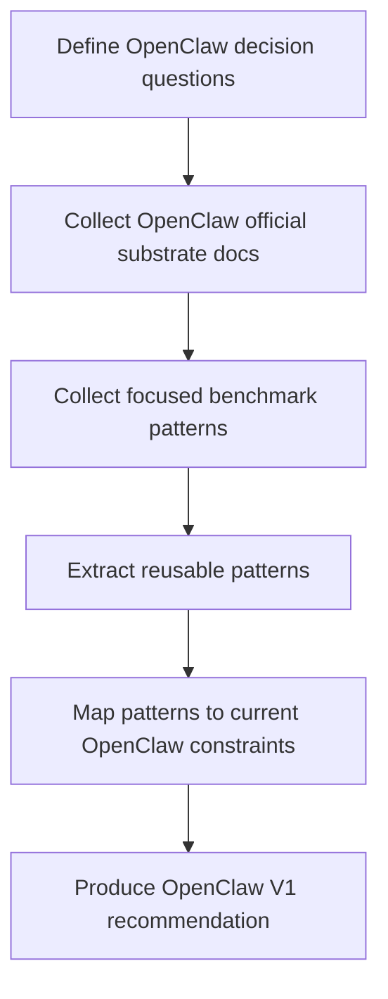

# OpenClaw Plugin Market Research Plan

Date: 2026-03-20
Status: Scope confirmed
Scope: OpenClaw only

## Goal

Research one concrete problem:

```text
How should OpenClaw build a pure desktop plugin market / app store
that lets users:
  - discover plugins
  - inspect details
  - install in one click
  - update in one click
  - repair in one click
  - uninstall in one click
  - understand install status clearly
```

## Out Of Scope

This round does not study:

- a generic multi-agent marketplace
- broad platform strategy for other agent ecosystems
- open community submission workflows
- payments, billing, or revenue sharing
- cross-device sync

## Decision Questions

This research must answer these five questions:

1. What should the OpenClaw desktop store UX look like?
2. What is the correct installable unit in OpenClaw: plugin, bundle, skill pack, or capability pack?
3. How should package, runtime, config, and permissions be modeled?
4. How should install state, errors, and repair flows be expressed?
5. What is the right V1 demo boundary?

## Research Boundary

Even though the product scope is OpenClaw-only, the research compares three layers:

```text
Layer 1: products closest to plugin / extension / skill stores
Layer 2: desktop install / update / repair product patterns
Layer 3: plugin host governance, trust, compatibility, and runtime models
```

The goal is not to produce a broad industry survey.
The goal is to extract what OpenClaw should copy, what it should not copy,
and what it must build first.

## Research Questions

### A. Product UX

- Where should the store entry live?
- What should plugin cards show?
- What belongs on the detail page?
- How should install status be presented?
- How should the product distinguish installed, enabled, ready, needs setup, and needs repair?

### B. Packaging Model

- What is the true OpenClaw install unit?
- What must be bundled offline?
- What can be fetched later?
- When is a plugin insufficient and a capability pack required?

### C. Install And Repair Model

- What is an install transaction?
- What counts as success?
- What must happen after install before the item is truly ready?
- How should reinstall, skip, update, and repair behave?

### D. Trust And Safety

- How should source, publisher, and risk be shown?
- Which checks must happen before install?
- How do we avoid "looks installed but is not actually usable"?

### E. V1 Demo

- Which pages are required?
- Which install capabilities are required?
- Which platform ambitions should be delayed?

## Benchmark Set

The benchmark set is intentionally narrow:

- VS Code
- Obsidian
- JetBrains
- Raycast

Reason:

```text
VS Code   -> marketplace UX, offline packages, private marketplace, extension packs
Obsidian  -> install vs enable vs trust separation
JetBrains -> policy, compatibility, custom repositories, governance
Raycast   -> desktop-native store UX, metadata-rich detail pages, host-managed runtime
```

## Method



## Output Structure

```text
Part 1. Current OpenClaw substrate
Part 2. Benchmark findings
Part 3. Pattern extraction
Part 4. OpenClaw packaging and install model recommendation
Part 5. OpenClaw desktop store V1 recommendation
```

## Deliverables

This research stage should produce:

1. A benchmark summary for the OpenClaw desktop store problem
2. A round-1 research report
3. A sharper V1 architecture / product spec

## Next Step

```text
1. Reconfirm OpenClaw substrate from docs and local code
2. Compare only the most relevant desktop plugin store patterns
3. Synthesize a V1 item model and install state model
4. Produce a concrete OpenClaw desktop store architecture
```
