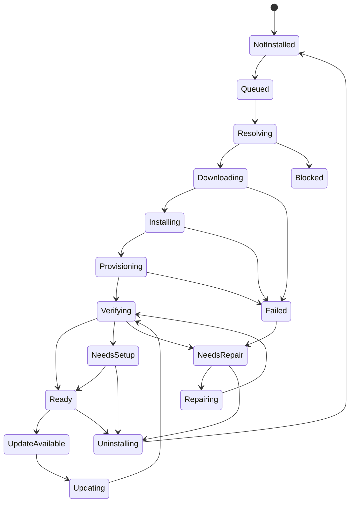
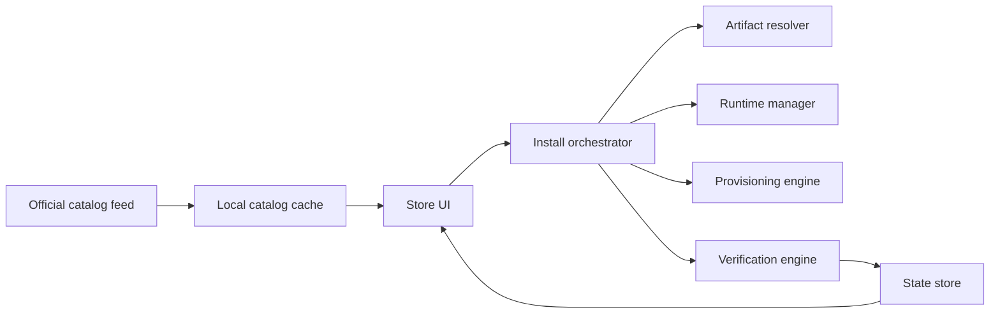

# OpenClaw Desktop Store V1 Architecture

Date: 2026-03-20
Status: Research synthesis
Scope: OpenClaw only

## Why This Document Exists

The first-round research already established the main direction:

```text
OpenClaw does not primarily lack a plugin mechanism.
OpenClaw primarily lacks a desktop store product layer.
```

This document turns that conclusion into a concrete V1 architecture that is:

- narrow enough for a real demo
- aligned with current OpenClaw primitives
- aligned with this repo's existing Windows packaging work
- intentionally not a generic multi-agent marketplace design

## Decision In One Screen

```text
Do not rewrite the OpenClaw plugin core first.

Build an official curated desktop store layer on top of:
  - openclaw plugins install/enable/disable/update/doctor
  - plugin manifests
  - skills loading and precedence
  - ClawHub for skill discovery patterns
  - bundle compatibility import
  - onboarding / prerequisite setup flows
  - capability-pack style packaged installers
```

## Repo Reality Check

This repo is not the OpenClaw desktop app source of truth.

It is currently a Windows distribution / installation / maintenance layer:

```text
This repo
  -> Windows installer wrapper
  -> workflow pack builder
  -> workflow pack installer
  -> repair / self-heal / readiness verification

Not this repo
  -> OpenClaw desktop app core UI
  -> OpenClaw plugin runtime core
  -> OpenClaw community marketplace backend
```

Current paired-repo ownership:

```text
E:\app\openclaw-setup-cn
  -> artifact factory
  -> installer / repair / verification backend

E:\app\aip
  -> desktop shell
  -> control-plane-backed product surfaces
  -> future in-app OpenClaw store UI
```

That matters because the future desktop store should reuse artifacts produced here,
but the final in-app store UI likely belongs in the OpenClaw desktop product layer,
not inside this packaging repo.

## Existing Building Blocks We Already Have

### 1. OpenClaw substrate

Research confirms OpenClaw already has these core primitives:

- plugin install, enable, disable, update, uninstall, doctor, inspect
- local archive install support for plugins
- plugin manifest validation before runtime execution
- plugin-shipped skills
- bundled vs managed vs workspace skills precedence
- ClawHub as a public skill registry
- onboarding that already configures models, workspace, channels, daemon, and skills

### 2. Existing packaged capability-pack pattern in this repo

This repo already has a meaningful packaged capability model:

```text
foundation-common
  -> plugin payload
  -> skill list
  -> source lock
  -> runtime profile
  -> prerequisite checks
  -> readiness report
  -> maintenance verification
```

Current file anchors:

- [client/workflow-packs/foundation-common/pack-manifest.json](/E:/app/openclaw-setup-cn/client/workflow-packs/foundation-common/pack-manifest.json)
- [client/build-windows-workflow-pack.ps1](/E:/app/openclaw-setup-cn/client/build-windows-workflow-pack.ps1)
- [client/install-windows-workflow-pack.ps1](/E:/app/openclaw-setup-cn/client/install-windows-workflow-pack.ps1)
- [client/windows-openclaw-maintenance.ps1](/E:/app/openclaw-setup-cn/client/windows-openclaw-maintenance.ps1)

This is the strongest local proof that a future store item cannot be modeled as
"just a skill" or "just a plugin zip".

## Product Boundary

V1 is not:

- a public submission platform
- a multi-agent plugin marketplace
- a ratings and reviews ecosystem
- a payment system
- a generic third-party package manager

V1 is:

```text
an official curated OpenClaw desktop store
for discovery, install, update, repair, and uninstall
of approved OpenClaw-native capability items
```

## Product Thesis

The user problem is not only "I need to install something".

The real problem is:

```text
I need the capability to become truly usable,
with the right files, runtime, config, readiness checks,
and a visible repair path if anything drifts.
```

That means the store unit must represent a usable capability outcome, not only an artifact.

## Benchmark Patterns That Matter

This is the distilled benchmark import for OpenClaw V1.

```text
VS Code
  -> in-product marketplace
  -> offline/local package install
  -> extension packs and recommendations
  -> private marketplace and enterprise control

Obsidian
  -> third-party plugin risk is explicit
  -> install, enable, and safe usage are not treated as the same thing
  -> restricted mode mindset matters for high-privilege extensions

JetBrains
  -> install from disk and custom repositories are first-class
  -> allow / block / auto-install policy exists
  -> compatibility and review discipline are productized

Raycast
  -> desktop-native store UX is the product center
  -> detail page carries onboarding burden
  -> host-managed runtime keeps installs stable
```

The direct OpenClaw translation is:

```text
1. in-app store first
2. install from official catalog and local package
3. treat trust, readiness, and repair as product features
4. prefer host-managed runtime profiles over plugin-self-managed runtime
```

## V1 Information Architecture

V1 should ship exactly these desktop surfaces:

```text
1. Store Home
2. Search / Category Results
3. Item Detail
4. Installed / Updates
5. Install Report / Repair Panel
```

### Page roles

```text
Store Home
  -> curated collections
  -> official packs
  -> recommended starter capabilities

Search / Category Results
  -> browse by category, tags, status
  -> filter by ready / needs setup / installed / update available

Item Detail
  -> metadata
  -> screenshots
  -> install requirements
  -> included components
  -> risk notes
  -> install / update / repair / uninstall CTA

Installed / Updates
  -> current machine state
  -> health badges
  -> update queue
  -> broken items

Install Report / Repair Panel
  -> step-by-step install log
  -> verification results
  -> readiness state
  -> actionable fix guidance
```

## Item Taxonomy

The store should expose one user-facing concept: `Store Item`.

Internally it should support exactly three item types.

```text
Type A: native-plugin
  -> standard OpenClaw plugin
  -> installed through plugin install flow

Type B: bundle-plugin
  -> compatible bundle import
  -> selective mapping into OpenClaw-supported surfaces

Type C: capability-pack
  -> plugin + skills + runtime + provisioning + verification
  -> best match for your current foundation-common model
```

The user should not need to understand all three deeply. The detail page can explain the compatibility model when relevant.

## Store Item Contract

V1 needs a unified catalog contract.

```text
store_item
  id
  slug
  title
  summary
  publisher
  type
  version
  categories[]
  tags[]
  screenshots[]
  source
  trust
  compatibility
  contents
  install
  runtime
  prerequisites
  verification
  changelog
  support
```

### Recommended contract fields

```text
identity
  id
  slug
  title
  publisher
  version

presentation
  summary
  longDescription
  categories[]
  tags[]
  screenshots[]
  docsUrl

classification
  type: native-plugin | bundle-plugin | capability-pack
  official: true | false
  curated: true | false

source
  installSourceType: npm | local-archive | workflow-pack | bundle
  canonicalSource
  pinnedRef
  sha256

compatibility
  openclawVersionRange
  platform: windows | macos | linux
  architecture: x64 | arm64 | any

contents
  pluginIds[]
  skillIds[]
  runtimeProfiles[]
  provisioningRules[]

trust
  reviewStatus
  auditStatus
  capabilities[]
  riskNotes[]

install
  installStrategy
  requiresRestart
  supportsRepair
  supportsOfflineInstall

prerequisites
  automaticChecks[]
  manualSteps[]

verification
  commands[]
  readinessRules[]
  healthChecks[]

support
  uninstallStrategy
  repairStrategy
  knownIssues[]
```

## Mapping To Current Pack Manifest

The future `capability-pack` contract should directly inherit from the current
workflow-pack manifest model instead of inventing a new concept.

```text
current pack-manifest.json
  packId
  displayName
  version
  pluginId
  skills[]
  runtimeProfile
  runtime
  skillSources[]
  provisioning[]
  prerequisites[]

future store item contract
  id
  title
  version
  pluginIds[]
  skillIds[]
  runtimeProfiles[]
  source.lock
  provisioningRules[]
  prerequisiteChecks[]
  verificationRules[]
```

This is the direct bridge from today's installer work to tomorrow's store.

## Install State Machine

The most important V1 product rule is this:

```text
Installed != Ready
```

The UI and state model must say this explicitly.



### User-visible states

```text
Not Installed
Queued
Resolving
Downloading
Installing
Provisioning
Verifying
Ready
Needs Setup
Needs Repair
Blocked
Failed
Update Available
Updating
Uninstalling
```

### State semantics

```text
Ready
  -> verification passed and no blocking manual steps remain

Needs Setup
  -> installed successfully, but one or more manual prerequisites remain

Needs Repair
  -> expected payload, runtime, provisioning, or verification drift detected

Blocked
  -> install cannot proceed because compatibility, source trust, or policy failed
```

Canonical contract references:

- [openclaw-store-item-contract.md](/E:/app/openclaw-setup-cn/docs/contracts/openclaw-store-item-contract.md)
- [openclaw-store-install-state-machine.md](/E:/app/openclaw-setup-cn/docs/contracts/openclaw-store-install-state-machine.md)
- [openclaw-store-catalog-contract.md](/E:/app/openclaw-setup-cn/docs/contracts/openclaw-store-catalog-contract.md)

## Install Transaction Model

Every install should be treated as a transaction with explicit stages:

```text
1. Resolve item metadata
2. Resolve artifacts and source lock
3. Validate policy / trust / compatibility
4. Acquire or reuse runtime
5. Install artifact payload
6. Apply provisioning
7. Run verification
8. Persist install state
9. Render readiness report
```

The install report must survive after the modal is closed. Users need to reopen
the result and see what happened later.

## Desktop Architecture

The cleanest V1 architecture is:

```text
OpenClaw Desktop Store
|
+-- Store UI
|    - home
|    - search
|    - item detail
|    - installed
|    - repair panel
|
+-- Catalog Layer
|    - official curated catalog feed
|    - local catalog cache
|    - search index
|
+-- Install Orchestrator
|    - install
|    - update
|    - repair
|    - uninstall
|
+-- Artifact Resolver
|    - local archive / pack / npm / bundle resolution
|    - digest verification
|    - source lock handling
|
+-- Runtime Manager
|    - runtime profiles
|    - acquire / repair / verify
|
+-- Provisioning Engine
|    - file writes
|    - directory creation
|    - template seeding
|
+-- Verification Engine
|    - plugins doctor
|    - skills check
|    - item-specific health checks
|
+-- State Store
     - installed items
     - readiness
     - repair history
     - update availability
```



## Catalog Architecture

Because V1 is official-curated only, the catalog architecture can stay simple.

Recommended V1 catalog source:

```text
signed or pinned official catalog JSON
served from a controlled endpoint or release artifact
downloaded by desktop
cached locally
```

This avoids needing a full marketplace backend for the demo.

### V1 catalog responsibilities

- item metadata
- screenshots and docs links
- version and compatibility metadata
- install strategy metadata
- trust and audit labels
- optional collections such as "starter packs" or "research packs"

### V1 catalog does not need

- reviews
- comments
- public submissions
- ranking algorithms
- complex recommendation systems

## Where Current Capability Packs Fit

Your current `foundation-common` work is not a side path.
It should become one of the first first-class store item types.

```text
Today:
  workflow-pack EXE / zip
  -> install plugin payload
  -> install runtime payload
  -> write install-state
  -> verify readiness

Tomorrow:
  store capability-pack item
  -> same artifact family
  -> same source lock
  -> same runtime profile
  -> same readiness verification
  -> same repair semantics
```

This is why a store should not throw away the capability-pack pipeline.
It should productize it.

## Recommended V1 Demo Scope

The best V1 demo is not a full marketplace.

It is this:

```text
OpenClaw Desktop Store Demo
  -> official catalog only
  -> 5 to 12 curated items
  -> install
  -> update
  -> repair
  -> uninstall
  -> visible readiness states
  -> visible install reports
```

Recommended first demo item mix:

- 1 capability-pack: `foundation-common`
- 2 to 4 smaller official packs
- 2 native plugins
- 1 bundle-based item if compatibility import is important to demonstrate

## What Must Not Be Faked

V1 must not report success when any of these are still false:

- plugin is not discoverable by OpenClaw
- required skills are not present
- required runtime profile is broken
- provisioning did not complete
- verification did not pass

If manual work is still required, the item must land in `Needs setup`, not `Ready`.

## Why No Full Rewrite Yet

A full plugin-core rewrite would be the wrong first move for three reasons:

```text
1. The current OpenClaw substrate already covers much of the low-level mechanism.
2. The current user pain is install success rate and readiness clarity, not plugin API novelty.
3. Your repo already proved the value of packaged capability items with verification and repair.
```

The missing layer is orchestration plus product expression, not raw plugin execution.

## Recommended Phase Sequence

```text
Phase 0
  -> finalize item contract
  -> define catalog JSON format
  -> define store state machine

Phase 1
  -> build official curated desktop store demo
  -> support native-plugin + capability-pack
  -> install/update/repair/uninstall

Phase 2
  -> add bundle-plugin support where useful
  -> improve search, categories, collections
  -> add update notifications and richer diagnostics

Phase 3
  -> evaluate private partner catalog or community submissions
  -> only after trust, review, and support workflows are stable
```

## Immediate Implementation Implication

If you decide to build this next, the first implementation work should not be:

- "rewrite plugin runtime"
- "build community backend"
- "design social marketplace features"

It should be:

```text
1. define the store item contract
2. define the catalog feed shape
3. define the install state machine
4. define the desktop pages
5. wire current capability-pack artifacts into that contract
```

## Sources

### OpenClaw

- [OpenClaw Plugins](https://docs.openclaw.ai/tools/plugin)
- [OpenClaw CLI plugins](https://docs.openclaw.ai/cli/plugins)
- [OpenClaw Plugin Manifest](https://docs.openclaw.ai/plugins/manifest)
- [OpenClaw Plugin Bundles](https://docs.openclaw.ai/plugins/bundles)
- [OpenClaw Skills](https://docs.openclaw.ai/tools/skills)
- [OpenClaw ClawHub](https://docs.openclaw.ai/tools/clawhub)
- [OpenClaw Community plugins](https://docs.openclaw.ai/plugins/community)
- [OpenClaw Onboarding Wizard](https://docs.openclaw.ai/start/wizard)

### Benchmarks

- [VS Code Extension Marketplace](https://code.visualstudio.com/docs/configure/extensions/extension-marketplace)
- [VS Code Extension Runtime Security](https://code.visualstudio.com/docs/configure/extensions/extension-runtime-security)
- [VS Code Enterprise Extensions](https://code.visualstudio.com/docs/enterprise/extensions)
- [VS Code Private Marketplace announcement](https://code.visualstudio.com/blogs/2025/11/18/PrivateMarketplace/)
- [Obsidian Community Plugins](https://help.obsidian.md/community-plugins)
- [Obsidian Plugin Security](https://help.obsidian.md/plugin-security)
- [JetBrains Managing Plugins](https://www.jetbrains.com/help/webstorm/managing-plugins.html)
- [JetBrains Install Plugins From the Command Line](https://www.jetbrains.com/help/idea/install-plugins-from-the-command-line.html)
- [JetBrains Marketplace Approval Guidelines](https://plugins.jetbrains.com/docs/marketplace/jetbrains-marketplace-approval-guidelines.html)
- [JetBrains Plugin Control Rules](https://www.jetbrains.com/help/ide-services/manage-available-plugins.html)
- [Raycast Install an Extension](https://developers.raycast.com/basics/install-an-extension)
- [Raycast Security](https://developers.raycast.com/information/security)
- [Raycast Prepare an Extension for Store](https://developers.raycast.com/basics/prepare-an-extension-for-store)
