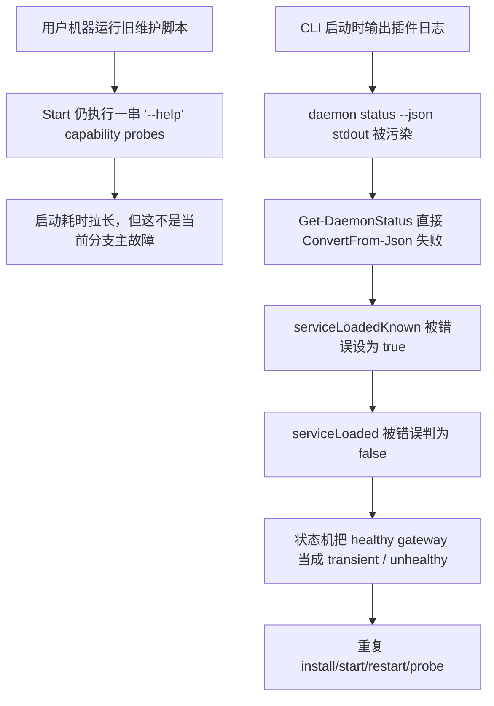

# Windows Startup JSON Hardening Plan

## 目标

修复 Windows 一键启动在插件输出污染 CLI JSON 时的误判链路，并把这次真实日志里暴露出的“已安装脚本版本落后于当前分支”现象明确区分出来。

```text
目标拆解

1. daemon status --json 前后出现插件日志时，仍能提取出真实 JSON
2. 无法确认 service.loaded 时，状态机要把它视为 unknown，而不是 false
3. 其他会消费 CLI JSON 的入口一起加固，避免同类问题转移
4. 保持当前分支已有的 capability preset / install-state 优化不回退
5. 最终产物要能解释这份用户日志，也要能避免下一次同类误判
```

## 5 个最可能根因与验证结论

### 假设 1：用户机器运行的维护脚本不是当前仓库这一版

状态：已验证。

证据：
- 当前分支的 `Resolve-Capabilities` 对 `2026.3.13` 会直接命中 capability preset，不该再跑大串 `--help` 探测。
- 用户日志却明确出现了：
  - `openclaw daemon status --json --help`
  - `openclaw status --deep --help`
  - `openclaw gateway install --force --help`
- 这说明用户机器上的 `C:\ProgramData\OpenClaw\support\OpenClaw-Maintenance.ps1` 更接近旧发布线，而不是当前工作树。

### 假设 2：当前仓库仍然会把 capability cache 持久化成全 false，导致冷启动探测

状态：对当前分支已排除；对旧发布线成立。

证据：
- 当前分支的安装器 `Save-InstallState` 已按 runtime version 写入 capability preset。
- 当前分支的维护脚本也会在 `Resolve-Capabilities` 中对 `2026.3.13` 直接推断能力。
- 但 `origin/main` 的 `v0.1.5` 线仍是“全 false + 运行时再探测”的旧逻辑，所以用户日志里的行为与旧发布线一致。

### 假设 3：`daemon status --json` 的 JSON 解析会被插件日志污染

状态：已验证。

证据：
- 当前脚本的 `Get-DaemonStatus` 直接把整段 stdout `ConvertFrom-Json`。
- 用户日志中 `daemon status --json` 输出前有多行：
  - `[plugins] plugins.allow is empty ...`
  - `[plugins] feishu_doc: Registered ...`
- 随后脚本报：
  - `Failed to parse daemon status JSON: 无效的 JSON 基元: plugins。`

### 假设 4：readiness 状态机会把“service.loaded 未知”误当成 false

状态：已验证。

证据：
- 当前 `Get-GatewayReadinessSnapshot` 只要 capability 支持 `daemon status --json`，就直接把 `serviceLoadedKnown = $true`。
- 一旦 `Get-DaemonStatus` 因日志污染返回 `$null`，`Test-GatewayServiceLoaded` 就会返回 `$false`。
- 这会把“解析失败 / 未知”错误降格成“明确未加载”，从而触发：
  - `gateway install --force`
  - `gateway start/restart`
  - 重复 persistent readiness probe

### 假设 5：不止 daemon status，其他 CLI JSON 消费点也存在同类脆弱性

状态：已验证。

证据：
- 当前维护脚本中以下位置仍直接对原始 stdout 做 `ConvertFrom-Json`：
  - `Get-DaemonStatus`
  - `Convert-ConfigOutputToStringList`
  - `Get-ConfigBooleanValue`
  - `Resolve-ProviderAuthState`
- 安装器的 post-install provider auth 快检也有同样问题：
  - `Resolve-PostInstallProviderAuthState`

## 根因关系图



## 修复决策

```text
推荐方案（稳健）

1. 新增“混合输出 JSON 提取器”
   - 先直解析
   - 再提取被日志包裹的 JSON object / array
   - 最后回退到逐行解析 JSON scalar

2. Get-DaemonStatus 使用该提取器
   - 只在真正拿到 service.loaded 时才声明 serviceLoadedKnown=true

3. 复用到其他 JSON 消费点
   - models status --json
   - config get 返回的 JSON array / bool
   - installer 的 post-install models status --json

4. 不改动当前 capability preset 逻辑
   - 它已经是正确方向
   - 仅确保 JSON 污染不再把 readiness 状态机带偏
```

```text
激进方案（不采用）

直接在启动时关闭或屏蔽所有插件日志。

放弃原因：
- 会影响用户可见诊断
- 会和 CLI 自身日志策略耦合
- 只是压制症状，不是修复 JSON 消费端的边界处理
```

## 代码边界

```text
修改
- /mnt/e/app/openclaw-setup-cn/client/windows-openclaw-maintenance.ps1
- /mnt/e/app/openclaw-setup-cn/client/install-windows-core.ps1

可选不改
- launcher / 打包链路
  原因：当前打包链路会复制维护脚本，问题核心不在复制动作本身
```

## 验收口径

```text
必须通过

1. 带 [plugins] 前缀日志的 daemon status 输出仍能解析出 JSON
2. service.loaded 提取失败时，snapshot 要落到 unknown 分支
3. healthy=true 且 service.loaded unknown 时，不再强制判成 transient
4. models status --json / config JSON 解析对同类噪声具备容错
5. 维护脚本 PowerShell 语法检查通过
```

```text
附加结论

这份用户日志不能单纯归因于“当前仓库代码仍完全未修”。
更准确的结论是：
- 用户机器很可能仍在跑旧发布线脚本
- 但当前分支确实还留着一个新的真实 bug：JSON 污染会误导 readiness 状态机
```
