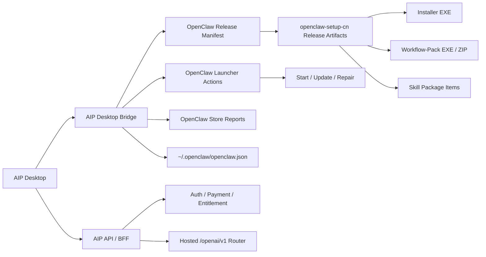
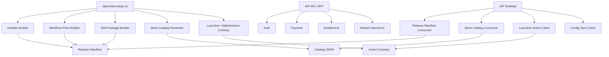
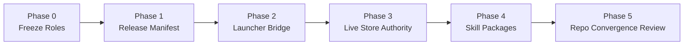

# AIP x OpenClaw Integration Research

Date: 2026-03-21
Status: Research synthesis
Scope: `E:\app\aip` + `E:\app\openclaw-setup-cn`
Mode: Read-only technical analysis, no business-code changes

## Why This Document Exists

The product goal is larger than "open another installer download link".

The target product experience is:

```text
user logs into AIP
  -> AIP detects OpenClaw is missing
  -> AIP downloads the correct installer release
  -> AIP launches install
  -> AIP can later trigger Start / Update / Repair
  -> AIP can also install packaged skills / capability items
  -> user experiences one-stop management instead of separate tools
```

This document answers five questions:

```text
1. Is this integration feasible?
2. What is already implemented today?
3. What is still missing for a real one-stop product flow?
4. Should the two repos be merged now?
5. If not, what migration path creates the least risk and the most leverage?
```

## Boundary And Assumptions

```text
Assumption A
  -> Windows-first scope
  -> because current installer, workflow-pack lifecycle, and launcher flows are Windows-led

Assumption B
  -> Goal is product integration first, repo convergence second

Assumption C
  -> This round is source inspection only
  -> build execution was not completed because pnpm and cargo are unavailable in this environment
```

## Executive Verdict

```text
Feasibility
  -> High

What is surprising
  -> AIP is not starting from zero
  -> it already contains real OpenClaw install detection, installer download,
     config sync, and workflow-pack store execution code

Main recommendation
  -> Do not do a full repo merge first
  -> First formalize the contracts between the repos and turn AIP into the
     control-plane shell for the already-existing installer backend

Recommended target split
  -> openclaw-setup-cn = artifact factory + install authority + repair authority
  -> aip               = login + payment + control plane + desktop shell + store UX

Biggest blockers
  -> hardcoded installer release contract
  -> snapshot store catalog instead of live catalog
  -> hidden local path fallback to openclaw-setup-cn release folder
  -> no first-class Start / Update / Repair bridge in AIP
  -> releaseBlocked trust signal is surfaced but not enforced
  -> AIP backend has real auth/payment/gateway infra complexity
```

## Decision In One Screen

```text
Do not merge repos immediately.

Do this first:

  AIP
    -> become the signed-in control shell
    -> own login, payment, entitlements, config sync, store UX
    -> consume official OpenClaw release/catalog contracts

  OpenClaw Setup CN
    -> remain the artifact/release/install/repair authority
    -> publish installer + workflow-pack + skill-package manifests
    -> publish machine-readable release and catalog metadata

Then add:
  -> latest release manifest
  -> launcher action bridge for Start / Update / Repair
  -> live store catalog refresh
  -> packaged skill-item distribution

Only after those contracts stabilize:
  -> evaluate monorepo or deeper source convergence
```

## Current Reality Map

### Repo ownership as it exists today

```text
E:\app\openclaw-setup-cn
  -> Windows one-click installer
  -> workflow-pack builder
  -> workflow-pack installer
  -> maintenance / repair / readiness verification
  -> store catalog and item contract authoring

E:\app\aip
  -> desktop app shell
  -> auth / payment / account system
  -> hosted /openai/v1 router
  -> OpenClaw config sync
  -> OpenClaw store UI
  -> local Tauri bridge for workflow-pack lifecycle
```

### System view today

```text
+---------------------+       +---------------------------+
| AIP Desktop         |       | AIP API / BFF            |
|                     |       |                           |
| - login             |<----->| - auth / entitlement     |
| - payment           |       | - payment / top-up        |
| - OpenClaw page     |       | - config payload          |
| - store UI          |       | - hosted /openai/v1       |
+----------+----------+       +-------------+-------------+
           |                                  |
           | local desktop bridge             | network control plane
           v                                  v
+---------------------+       +---------------------------+
| Tauri commands      |       | OpenClaw config/runtime   |
|                     |       |                           |
| - detect install    |------>| ~/.openclaw/openclaw.json |
| - download installer|       | OpenClaw CLI / providers  |
| - apply config      |       +---------------------------+
| - execute pack act. |
+----------+----------+
           |
           | installer / pack execution
           v
+---------------------------+
| openclaw-setup-cn outputs |
|                           |
| - OpenClaw installer exe  |
| - workflow-pack exes      |
| - workflow-pack zips      |
| - reports / state machine |
| - store catalog contract  |
+---------------------------+
```

### Recommended system view



## What Is Already Implemented

### AIP already has real OpenClaw bridge code

This is the most important conclusion of the review:

```text
the integration is already partially real
it is not only a future concept
```

Observed capabilities in `aip`:

```text
desktop install detection
  -> detect_openclaw_install

desktop activation context loading
  -> load_activation_context

desktop config write-back
  -> apply_openclaw_config

desktop installer download + verification + launch
  -> download_openclaw_installer

desktop store report loading
  -> load_store_item_reports

desktop store action execution
  -> execute_store_item_action

desktop OpenClaw product surface
  -> OpenClawScreen

desktop store product surface
  -> StoreScreen
```

Key anchors:

```text
E:\app\aip\apps\desktop\src-tauri\src\config.rs
E:\app\aip\apps\desktop\src-tauri\src\store.rs
E:\app\aip\apps\desktop\src\lib\desktop.ts
E:\app\aip\apps\desktop\src\features\store\StoreScreen.tsx
E:\app\aip\apps\desktop\src\App.tsx
```

### OpenClaw Setup CN already exposes the right installer-side primitives

Observed capabilities in `openclaw-setup-cn`:

```text
workflow-pack installer supports:
  -> --action
  -> --report-path

install-state persists:
  -> workflowPacks[*]

maintenance layer already reasons about:
  -> readiness
  -> drift
  -> repair
  -> verification

launcher already supports:
  -> Start
  -> Update
  -> Repair
  -> mode selection by exe name or --mode
```

Key anchors:

```text
E:\app\openclaw-setup-cn\client\build-windows-workflow-pack-installer.ps1
E:\app\openclaw-setup-cn\client\install-windows-workflow-pack.ps1
E:\app\openclaw-setup-cn\client\windows-openclaw-maintenance.ps1
E:\app\openclaw-setup-cn\client\windows-openclaw-launcher.cs
E:\app\openclaw-setup-cn\docs\contracts\openclaw-store-catalog-contract.md
E:\app\openclaw-setup-cn\docs\contracts\openclaw-store-item-contract.md
E:\app\openclaw-setup-cn\docs\contracts\openclaw-store-install-state-machine.md
```

### AIP backend already solves the signed-in control plane problem

Observed backend capabilities:

```text
Supabase-backed auth
desktop BFF
payment order flow
Alipay checkout + notify
gateway identity / token provisioning
config sync payload generation
hosted /openai/v1 router
```

This means the "user logs in first, then manage OpenClaw lifecycle" product direction
already has a natural host repo:

```text
AIP is already the control-plane candidate
```

## What Is Only Partially Implemented

### Store exists, but it is still not fully release-authoritative

The current AIP store flow is real but not yet production-safe:

```text
it can render catalog items
it can load local install reports
it can trigger workflow-pack install/update/repair/uninstall

but it does not yet consume a single authoritative live release source
```

### Release artifact evidence

Current local artifact hashes in `openclaw-setup-cn`:

```text
OpenClaw-Setup-Windows-x64.exe
  -> e084f42da729488aaeb99232eedb8b0d88a46b2cf83a161ba1f074cb1fb3185c

OpenClaw-Workflow-Pack-Foundation-Common.exe
  -> 6adc0845726b72c4c0c0ba729ef0cb3c42319d0c716ff6d43ee9a31fe5d691df

OpenClaw-Workflow-Pack-Foundation-Common.zip
  -> f32c6f3e385e182c49b0f83182b822e01ce1d9f832d1ec90d2a23f12f9a78abb
```

But AIP currently hardcodes:

```text
installer URL
  -> https://github.com/RZX00/openclaw-windows-installer/releases/download/v0.1.5/OpenClaw-Setup-Windows-x64.exe

installer sha256
  -> f1dce686ee1593c568cbbd5e3e853426eba82bb060eefa707b7856817ac79e37
```

This proves the current bridge is:

```text
manual-sync based
not release-manifest based
prone to silent drift
```

Important caution:

```text
the inspected local release artifacts do not automatically prove that the
published GitHub v0.1.5 asset is wrong

but they do prove that AIP depends on manually synchronized release metadata
instead of consuming one authoritative published manifest
```

### Catalog refresh exists in utility code, but the product does not actually use it

`loadStoreCatalog.ts` supports a `refreshUrl`, cache, and refresh source.

However `StoreScreen.tsx` currently calls:

```text
loadStoreCatalog()
```

with no refresh URL.

Result:

```text
the store UI is effectively bundled-catalog first
not live-catalog first
```

### Hidden local repo knowledge still leaks into AIP

The Tauri store bridge in `aip` falls back to:

```text
E:\app\openclaw-setup-cn\release
```

as an asset root.

That is acceptable for local development,
but not acceptable as the long-term product contract.

It creates an implicit rule:

```text
desktop behavior depends on another repo's local folder structure
```

which must be removed before calling the integration complete.

## What Is Missing For The One-Stop Vision

### Missing capability 1: first-class Start / Update / Repair product flows

This is the biggest functional gap against the user vision.

Today AIP exposes:

```text
Install
Sync config
Store actions for workflow-pack items
```

But it does not yet expose OpenClaw runtime-level:

```text
Start
Update
Repair
```

as first-class product actions in the signed-in desktop shell.

Observed current OpenClaw page action shape:

```text
when OpenClaw is missing
  -> Install

when OpenClaw is detected
  -> Sync Now

always
  -> Rescan
```

This is important because the user vision is not just:

```text
install OpenClaw once
```

It is:

```text
use AIP as the single management surface for the OpenClaw lifecycle
```

### Missing capability 2: trust gate enforcement

The store contract already includes:

```text
trust.releaseBlocked
```

AIP surfaces that badge in the UI,
but the current state/action logic does not appear to prevent execution based on it.

The bundled demo catalog currently includes at least one official item with:

```text
releaseBlocked: true
```

which means this is not only a hypothetical contract field.

That means:

```text
trust state is displayed
but not fully productized as a policy gate
```

### Missing capability 3: packaged skill distribution as a first-class store item family

OpenClaw Setup CN already has capability-pack / workflow-pack build logic,
and the broader OpenClaw ecosystem already has skills and packaged assets.

What is still missing is a clean productized mapping:

```text
packaged skill bundle
  -> official item type
  -> build artifact
  -> manifest
  -> install / uninstall / verify semantics
  -> catalog contract
  -> AIP store presentation
```

In other words:

```text
the technical ingredients exist
the final item taxonomy and distribution contract are not finished
```

### Missing capability 4: single release authority for installers and store assets

One-stop management requires one machine-readable source of truth for:

```text
latest OpenClaw installer
latest launcher action capabilities
latest workflow-pack catalog
latest skill package catalog
hashes
URLs
channels
compatibility
release notes
blocked states
```

This source does not yet exist as a unified release manifest.

## Gap Classification

```text
Already real
  -> install detection
  -> config sync
  -> installer download/launch
  -> workflow-pack action execution
  -> store report reading
  -> auth/payment/control plane

Partially real
  -> store UI
  -> store catalog consumption
  -> release authority
  -> trust gating

Not yet first-class
  -> Start / Update / Repair inside AIP
  -> packaged skill market integration
  -> unified release manifest
  -> fully hidden-repo-free desktop contract
```

## Why Full Repo Merge Is Not The Best First Move

### Reason 1: the product split is already meaningful

The two repos are not duplicates.

They already map to different concerns:

```text
openclaw-setup-cn
  -> release engineering
  -> packaging
  -> install
  -> repair
  -> verification

aip
  -> signed-in product shell
  -> commercial control plane
  -> hosted API routing
  -> account and payment flows
```

That split is useful, not accidental.

### Reason 2: AIP backend drags in real operational dependencies

Observed infra complexity includes:

```text
Supabase URL / keys / JWT secret / service role
Postgres persistence
optional Redis cache
Alipay app credentials
optional New API gateway admin credentials
public base URL coordination
```

If the repos are merged before contracts are stabilized,
then packaging concerns and hosted-service concerns become entangled too early.

### Reason 3: the current problems are contract problems, not monorepo problems

The main defects discovered are:

```text
hardcoded installer URL/hash
bundled catalog snapshot usage
hidden local asset-root fallback
missing launcher bridge
missing releaseBlocked enforcement
```

A monorepo does not automatically solve any of these.

They are solved by:

```text
clear contracts
single release manifest
formal action bridge
clean item taxonomy
policy enforcement
```

## Architecture Options

## Option A

### Contract-first dual-repo integration

```text
openclaw-setup-cn
  -> publishes release manifest, store catalog, skill-package artifacts,
     workflow-pack artifacts, launcher contract, install report contract

aip
  -> consumes those contracts, owns UX and control plane
```

Pros:

```text
lowest migration risk
keeps release engineering independent from hosted backend ops
matches current repo ownership reality
lets AIP ship one-stop management quickly
lets OpenClaw setup repo remain the installer authority
```

Cons:

```text
requires discipline around published contracts
requires release artifact hosting and versioning hygiene
```

Verdict:

```text
Recommended
```

## Option B

### AIP-led source convergence with OpenClaw setup as a build subtree/module

```text
aip becomes the obvious top-level product repo
openclaw-setup-cn is pulled closer as a managed packaging module
```

Pros:

```text
tighter product ownership
easier coordinated release process later
```

Cons:

```text
still requires the same contracts anyway
harder to separate hosted-service changes from installer changes
raises repo operational complexity before the boundary is stable
```

Verdict:

```text
reasonable later
not the best first step
```

## Option C

### Full monorepo merge now

```text
all desktop, backend, packaging, artifact generation, and store logic
move into one source tree immediately
```

Pros:

```text
one repo
one PR surface
one release narrative
```

Cons:

```text
highest migration risk
hardest conflict profile
forces infra and packaging coupling too early
still does not solve the missing product contracts by itself
```

Verdict:

```text
Not recommended as Phase 1
```

## Recommended Target Architecture

```text
Product shell
  -> AIP desktop

Commercial control plane
  -> AIP API / BFF

OpenClaw installation authority
  -> openclaw-setup-cn release manifest + signed artifacts

OpenClaw lifecycle execution authority
  -> launcher contract + maintenance scripts + workflow-pack installers

Store authority
  -> openclaw-setup-cn generated catalog + item contracts

Skill package authority
  -> openclaw-setup-cn build pipeline extended to emit official skill-package items
```

### Ownership model



## Concrete Integration Contract To Build

### Contract 1: release manifest

Create one official release manifest emitted by `openclaw-setup-cn`.

It should answer:

```text
what is the latest OpenClaw installer for this channel/platform/arch
what is its hash
what are the workflow-pack artifacts
what are the skill-package artifacts
what launcher capabilities are supported
what items are blocked
```

Suggested shape:

```text
releaseManifest
  version
  generatedAt
  channel
  installers[]
  launcher
  workflowPacks[]
  skillPackages[]
  catalog
  notes
```

### Contract 2: launcher action bridge

AIP needs a stable way to trigger:

```text
start
update
repair
```

This should not depend on guessing file names manually inside AIP.

Preferred direction:

```text
AIP calls a single launcher entry with an explicit action contract
```

For example:

```text
OpenClaw-Launcher.exe --mode start
OpenClaw-Launcher.exe --mode update
OpenClaw-Launcher.exe --mode repair
```

or an equivalent action adapter published in the release manifest.

### Contract 3: live catalog source

The AIP store should load:

```text
bundled catalog as offline fallback
live catalog as primary online source
cache as resilience layer
```

This is already close in code shape.
The missing step is product wiring and authoritative URL ownership.

### Contract 4: skill package item taxonomy

The store should distinguish at least:

```text
OpenClaw core installer
workflow-pack / capability-pack item
skill-package item
```

A recommended item model is:

```text
core-product
  -> installs or upgrades OpenClaw itself

capability-pack
  -> installs packaged capability outcome with runtime/profile/readiness semantics

skill-package
  -> installs curated skills or skill bundles, optionally with prerequisites
```

This avoids pretending every skill bundle must be a workflow-pack,
while still allowing the workflow-pack path for heavier packaged outcomes.

## Migration Plan

### Phase 0

Freeze the integration boundary.

```text
decide official repo roles
freeze contracts already authored in openclaw-setup-cn
stop adding more hidden local-path assumptions in AIP
```

### Phase 1

Replace hardcoded release knowledge with a manifest.

```text
publish installer URL + sha via manifest
publish launcher capability metadata
publish workflow-pack artifact metadata
point AIP desktop download flow at the manifest
remove hardcoded release URL/hash from AIP code
remove local repo release fallback from desktop bridge
```

### Phase 2

Add first-class lifecycle management in AIP.

```text
surface Start / Update / Repair in the OpenClaw page
wire those actions to the launcher contract
show progress, report, and failure reasons
```

### Phase 3

Make the store release-authoritative.

```text
switch StoreScreen to live catalog first
keep bundled catalog as offline fallback only
enforce releaseBlocked as a real policy gate
bind all install/update/repair actions to published artifact refs
```

### Phase 4

Add packaged skill distribution.

```text
extend build pipeline to emit skill-package artifacts
define install/uninstall/verify semantics
extend catalog generator for skill-package items
surface skill-package install actions in AIP store
```

### Phase 5

Only then evaluate repo convergence.



## Migration Strategy: Aggressive vs Stable

### Aggressive plan

```text
AIP becomes the only visible product shell quickly
OpenClaw page inside AIP gets Install / Start / Update / Repair
Store becomes the default package entry point
skill packages are introduced early
repo convergence review happens after contracts stabilize
```

When to choose it:

```text
when product unification speed matters more than internal repo neatness
```

### Stable plan

```text
first publish release manifest
then replace hardcoded URLs and hidden fallback paths
then add launcher bridge
then promote the live store
then add skill-package items
```

When to choose it:

```text
when installer reliability and release correctness must win over interface speed
```

### Recommendation

```text
Choose the stable plan for implementation order,
but keep the aggressive end-state as the product target.
```

## Merge And Migration Risks

### Risk 1

Hardcoded release drift.

```text
Impact
  -> AIP downloads an installer that no longer matches the actual official release

Mitigation
  -> manifest-driven installer resolution + sha verification
```

### Risk 2

Desktop depends on hidden repo-local folders.

```text
Impact
  -> store behavior works on the developer machine but not in product distribution

Mitigation
  -> artifact refs must resolve from published manifest/catalog only
```

### Risk 3

Trust policy is cosmetic instead of enforced.

```text
Impact
  -> blocked or not-yet-approved items may still be installable

Mitigation
  -> derive blocked state from contract and disable execution paths
```

### Risk 4

Lifecycle ownership is split across too many ad hoc commands.

```text
Impact
  -> Start / Update / Repair become inconsistent, fragile, or duplicated

Mitigation
  -> one launcher action contract owned by openclaw-setup-cn
```

### Risk 5

Premature repo merge imports hosted-service complexity into installer work.

```text
Impact
  -> slower delivery, more conflicts, harder review, harder release debugging

Mitigation
  -> merge contracts first, not source trees first
```

## Final Recommendation

```text
Yes, the integration is feasible.

Yes, AIP can become the one-stop signed-in management shell for OpenClaw.

But the correct first move is not a source merge.

The correct first move is:
  1. publish an official release manifest from openclaw-setup-cn
  2. consume it from AIP
  3. add first-class Start / Update / Repair bridge in AIP
  4. upgrade the store from snapshot/demo mode to live contract mode
  5. extend the artifact pipeline to skill-package distribution
  6. only then evaluate monorepo convergence
```

## Immediate Next-Step Recommendation

If this direction is approved, the next implementation planning doc should define:

```text
Track A
  -> release manifest contract
  -> launcher action contract
  -> artifact publishing rules

Track B
  -> AIP OpenClaw page upgrade
  -> AIP store live catalog integration
  -> releaseBlocked enforcement

Track C
  -> skill-package item taxonomy
  -> build/distribution pipeline
  -> install/uninstall/verify semantics
```

## Review Notes

```text
This document is based on source inspection across both repos.

No business code was modified for this research round.

Build or test execution was not completed because pnpm and cargo are unavailable
in the current environment.
```
