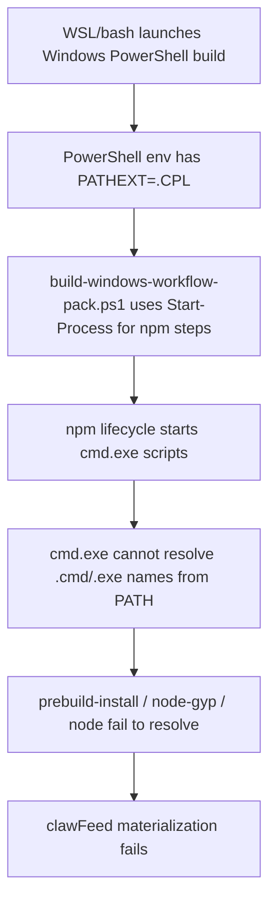
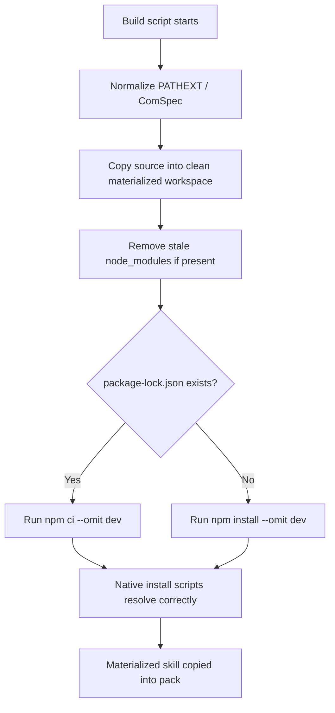

# Foundation Common Rebuild Root Cause Fix

## Goal

Make `foundation-common` rebuild reliably on Windows by fixing the real build-environment fault instead of patching `clawFeed` symptoms.

## Root Cause Summary

```text
Observed failure
   |
   +-- clawFeed materialization runs npm lifecycle
          |
          +-- better-sqlite3 install script executes
                 |
                 +-- prebuild-install not recognized
                 +-- node-gyp not recognized
                 +-- sometimes even node not recognized
                        |
                        +-- PATH looked suspicious at first
                        +-- dependency tree looked suspicious at first
                        +-- native prebuild availability looked suspicious at first
                        |
                        +-- actual root cause:
                               PowerShell build process inherits PATHEXT=".CPL"
                               Start-Process child processes inherit that bad PATHEXT
                               npm lifecycle shells can no longer resolve .EXE/.CMD/.BAT
                               all npm-based skill materialization becomes unstable
```



## Five Hypotheses

### H1

- Hypothesis: `better-sqlite3` has no usable Windows prebuild for the current Node version.
- Validation:
  - ran `npm ci --omit=dev --foreground-scripts --loglevel verbose` in a clean `clawFeed` repro directory via direct `cmd.exe`
  - observed `prebuild-install` find and unpack cached `better-sqlite3-v11.10.0-node-v115-win32-x64.tar.gz`
- Result: rejected

### H2

- Hypothesis: the machine is missing `prebuild-install` or `node-gyp`.
- Validation:
  - direct `cmd.exe` invocation completed successfully
  - `prebuild-install` ran and installed the prebuilt binary
- Result: rejected

### H3

- Hypothesis: `clawFeed` source or lockfile is fundamentally broken.
- Validation:
  - `package-lock.json` is present and valid
  - `npm ci` from direct `cmd.exe` succeeds in a clean repro directory
  - current failure reproduces only through the PowerShell `Start-Process` path
- Result: rejected as primary root cause

### H4

- Hypothesis: `Invoke-External` is starting Windows batch/npm commands through an unstable process-launch path.
- Validation:
  - reproduced failure with `Start-Process -FilePath npm.cmd ...`
  - reproduced failure with `Start-Process -FilePath node.exe npm-cli.js ...`
  - same npm command succeeds when launched through direct `cmd.exe` from the shell
- Result: confirmed

### H5

- Hypothesis: the inherited Windows environment is malformed, specifically command resolution metadata.
- Validation:
  - probed npm script environment under `Start-Process` and direct `cmd.exe`
  - observed identical `PATH`
  - observed identical `ComSpec`
  - observed `PATHEXT=".CPL"` under `Start-Process`
  - observed normal `PATHEXT=".COM;.EXE;.BAT;.CMD;.VBS;.JS;.WS;.MSC"` under direct `cmd.exe`
  - after forcing a sane `PATHEXT`, both direct `Start-Process npm.cmd` and wrapped `cmd.exe` npm runs succeed
- Result: confirmed root cause

## Target Fix

```text
Script startup
   |
   +-- normalize Windows command-resolution environment
          |
          +-- repair PATHEXT if .EXE/.CMD/.BAT are missing
          +-- backfill ComSpec if missing
   |
External process launch
   |
   +-- remove fragile .cmd special-case wrapping
   +-- launch commands directly with Start-Process
   |
Npm materialization
   |
   +-- clear stale node_modules before install
   +-- prefer npm ci when package-lock.json exists
   +-- fall back to npm install only when lockfile is absent
```



## Implementation Stages

### Stage 1

- update `client/build-windows-workflow-pack.ps1`
- add Windows environment normalization for `PATHEXT` and `ComSpec`
- simplify `Invoke-External` so it does not rely on the current fragile `.cmd` wrapper behavior

### Stage 2

- update npm build-step materialization in `client/build-windows-workflow-pack.ps1`
- clear stale `node_modules` before npm execution
- prefer `npm ci` when `package-lock.json` exists

### Stage 3

- parse-check the script
- rebuild `release/OpenClaw-Workflow-Pack-Foundation-Common.exe`
- verify latest metadata and artifacts changed

### Stage 4

- review diff only for current-task files
- clean temporary repro scripts and logs created during investigation
- commit current task changes only

## Acceptance Criteria

- `clawFeed` materialization succeeds in the current Windows build environment
- build no longer depends on OpenClaw or npm silently fixing `PATHEXT`
- npm-based skill materialization is deterministic from a clean workspace
- rebuilt `foundation-common` ZIP and EXE are produced successfully
- final review documents the real root cause and why the fix is systemic
