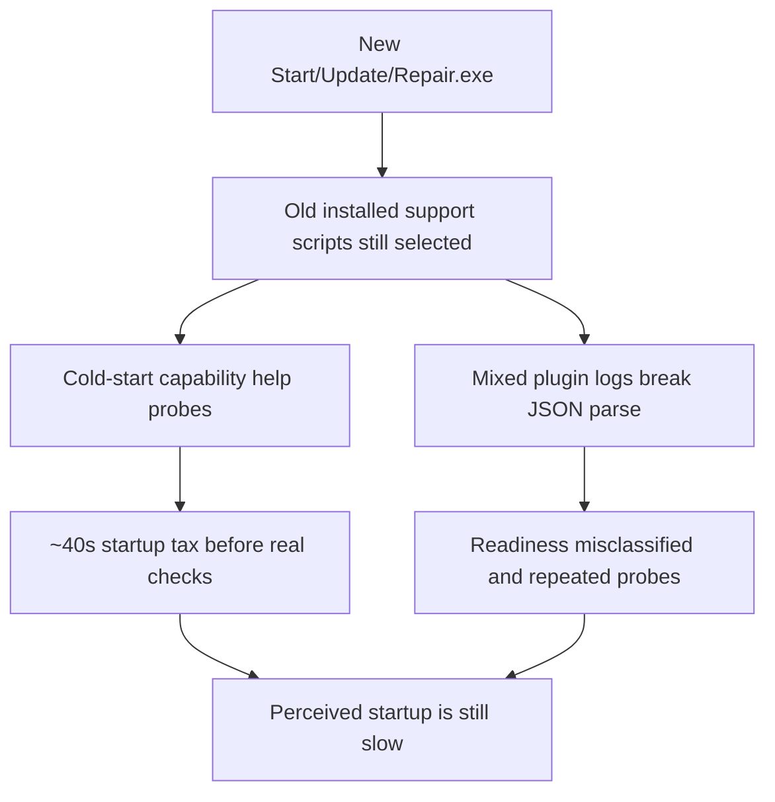
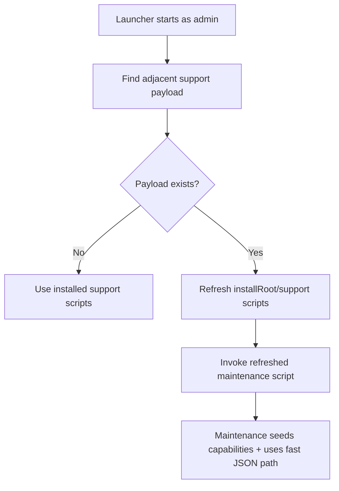

# Launcher Support Self-Update Plan

## Goal

Make updated `OpenClaw-Start.exe`, `OpenClaw-Update.exe`, and `OpenClaw-Repair.exe` automatically refresh the installed `support` scripts before they invoke maintenance, so old installs immediately receive the startup-speed fixes.

## Root Cause Graph

```text
User runs new Start.exe
   |
   +-- launcher resolves install root = C:\ProgramData\OpenClaw
   |
   +-- launcher still invokes installed support\OpenClaw-Maintenance.ps1
          |
          +-- installed support scripts are from 2026-03-14
          |      |
          |      +-- still run 13+ serial --help capability probes
          |      +-- still fail to parse mixed plugin+JSON output
          |
          +-- install-state.json is from 2026-03-19 and lacks
                 capabilities + capabilitiesRuntimeVersion
```



## Solution

```text
New launcher package
   |
   +-- ship latest support/OpenClaw-Maintenance.ps1
   +-- ship latest support/install-windows-core.ps1
   |
   +-- before launching maintenance:
          |
          +-- compare adjacent support payload vs installed support payload
          +-- copy newer/different files into C:\ProgramData\OpenClaw\support
          +-- then resolve and invoke maintenance normally
```



## Acceptance Criteria

- New standalone launcher package updates old `ProgramData\\OpenClaw\\support` scripts automatically.
- First run from the refreshed launcher no longer depends on a separate hotfix step.
- Release artifacts include the `support` payload next to the three launchers.
- The delivery ZIPs include the `support` directory so extracted launchers are self-sufficient.
