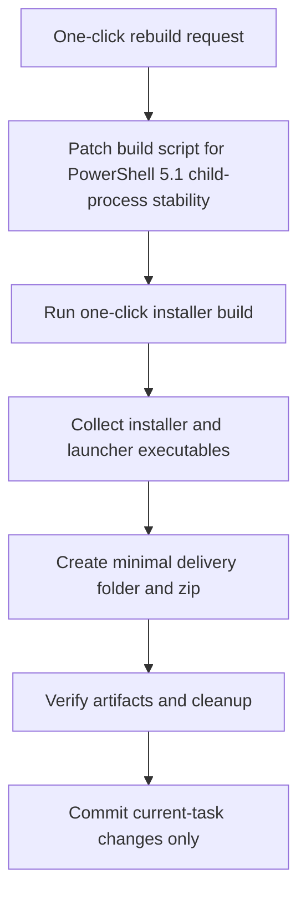

# OneClick Rebuild Delivery Plan

## Goal

Rebuild the Windows one-click installer with the startup JSON hardening already merged, then assemble a minimal runnable delivery package that includes the installer and the three maintenance launchers.

## Execution Graph

```text
User asks for direct package
   |
   +-- Validate current one-click build script on Windows PowerShell 5.1
   |      |
   |      +-- normalize Windows child-process env
   |      +-- keep bundle install path minimal
   |
   +-- Rebuild one-click installer
   |      |
   |      +-- build fresh bundle
   |      +-- embed maintenance/start/update/repair assets
   |
   +-- Assemble delivery package
   |      |
   |      +-- installer exe
   |      +-- OpenClaw-Start.exe
   |      +-- OpenClaw-Update.exe
   |      +-- OpenClaw-Repair.exe
   |      +-- optional hotfix zip for direct patching
   |
   +-- Verify artifacts
   |      |
   |      +-- files exist
   |      +-- package structure is clean
   |
   +-- Clean temp files and commit current task only
```



## Five Working Hypotheses

### H1

- Hypothesis: the current one-click build script is syntactically broken after the last compatibility edit.
- Validation: parse-check with Windows PowerShell 5.1 parser.
- Action if true: fix syntax first, then rerun.

### H2

- Hypothesis: one-click build still inherits a malformed Windows command-resolution environment like the workflow-pack builder did.
- Validation: compare one-click builder to the already-fixed workflow-pack builder; inspect missing PATHEXT/ComSpec normalization.
- Action if true: port the normalization into the one-click builder.

### H3

- Hypothesis: bundle build still fails because npm child scripts cannot resolve `node`, `git`, `.cmd`, or `.exe` from PATH.
- Validation: rerun the build with explicit Git path bootstrapping and inspect npm errors.
- Action if true: fix the process-launch path, not package logic.

### H4

- Hypothesis: the installer build succeeds, but the final delivery package is missing the maintenance launchers the user actually wants.
- Validation: inspect `release/` and new `dist/` outputs before packaging.
- Action if true: assemble a dedicated delivery directory with the four required executables.

### H5

- Hypothesis: leftover temporary build directories or wrapper scripts are contaminating later runs or the repo state.
- Validation: review temp outputs after build.
- Action if true: remove them before final review and commit.

## Acceptance Criteria

- Windows PowerShell 5.1 can parse the one-click builder.
- A fresh one-click installer EXE is produced in `dist/oneclick-20260321/`.
- A minimal delivery package exists with installer + `OpenClaw-Start.exe` + `OpenClaw-Update.exe` + `OpenClaw-Repair.exe`.
- Temporary build artifacts created only for debugging are removed.
- Only current-task source changes are committed.
