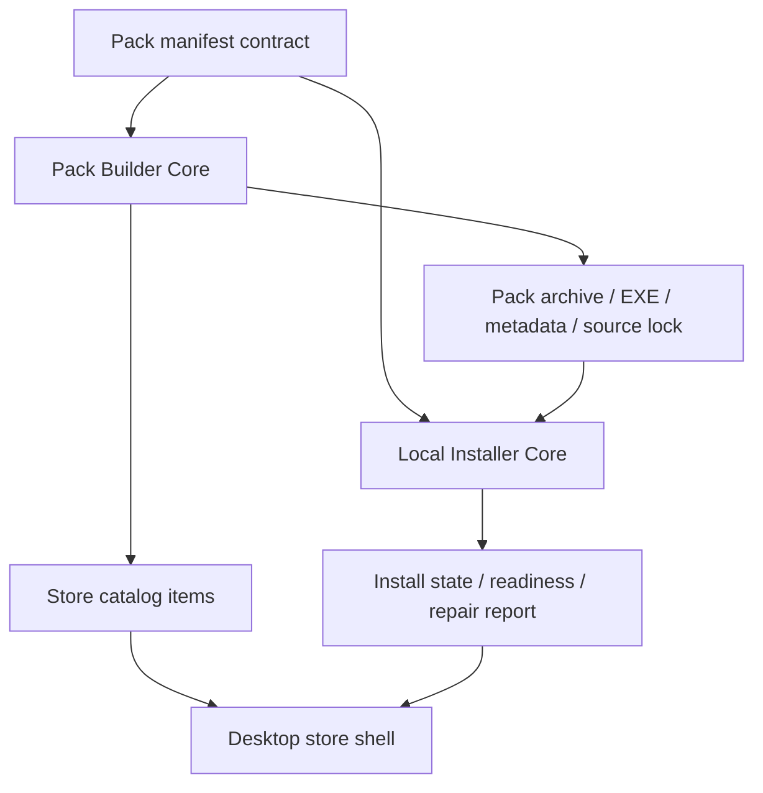

# Two-Layer Pack Platform Plan

## Goal

Converge the current OpenClaw capability-pack system into a reusable platform with a clear separation between:

- `Pack Builder Core`
- `Local Installer Core`

so later we can put a desktop store or plugin market on top without rebuilding installation logic again.

## Current Reality

```text
Today we already have most of the raw pieces:

  build-windows-workflow-pack.ps1
    -> source resolve
    -> audit
    -> materialize
    -> source lock + build metadata

  build-windows-workflow-pack-installer.ps1
    -> wrap pack archive
    -> bundle runtime/tools
    -> produce EXE

  install-windows-workflow-pack.ps1
    -> locate OpenClaw root
    -> install / enable / verify
    -> provisioning / prerequisites / readiness / report

  build-openclaw-store-catalog.ps1
    -> normalize pack manifests into store catalog items

But these pieces still duplicate contract parsing and helper logic.
They are not yet a clean long-term platform boundary.
```

## Target Shape

```text
                    OpenClaw Store / Market UI
                               |
        +----------------------+----------------------+
        |                                             |
   Layer 1: Pack Builder Core                  Layer 2: Local Installer Core
        |                                             |
   source resolve / audit / lock                 root detect / confirm / install
   materialize / runtime bundle                  register / provision / verify
   artifact emit / catalog emit                  readiness / repair / reports
```



## Non-Negotiable Rules

```text
1. Build-time complexity stays on our side.
2. Install-time complexity stays minimal on the user machine.
3. The manifest is the only pack contract.
4. Installed != Ready.
5. Repair is a first-class action.
6. Curated packs and imported packs must remain distinguishable.
```

## Current File Ownership

```text
Builder-side today
  client/build-windows-workflow-pack.ps1
  client/build-windows-workflow-pack-installer.ps1
  client/build-openclaw-store-catalog.ps1
  client/workflow-packs/*/pack-manifest.json

Installer-side today
  client/install-windows-workflow-pack.ps1
  client/windows-openclaw-maintenance.ps1

Store-side bridge today
  client/catalog/*
  release/store-items/*
  release/openclaw-store-catalog.json
```

## Target Internal Modules

```text
client/modules/
  OpenClaw.WorkflowPack.Common.psm1
    -> JSON / object / path / hash helpers
    -> catalog contract helpers

  OpenClaw.WorkflowPack.Builder.psm1
    -> source resolve / audit / materialize / emit

  OpenClaw.WorkflowPack.Installer.psm1
    -> install context / support assets / verification / readiness / state

  OpenClaw.WorkflowPack.Store.psm1
    -> catalog normalization / registry / readiness projections / repair hints
```

## Execution Stages

### Stage 1

Builder contract convergence.

```text
Goal
  -> stop duplicating manifest/catalog/helper logic

Files
  -> create shared builder-side common module
  -> migrate build-windows-workflow-pack.ps1
  -> migrate build-windows-workflow-pack-installer.ps1
  -> migrate build-openclaw-store-catalog.ps1

Acceptance
  -> all three scripts import the same common contract helper module
  -> no behavior drift in pack build or catalog build
```

### Stage 2

Installer core convergence.

```text
Goal
  -> isolate install context, support assets, verification, provisioning,
     prerequisites, readiness, and report/state persistence into a shared core

Files
  -> create shared installer module
  -> slim install-windows-workflow-pack.ps1 into an entrypoint
  -> align maintenance / repair scripts to the same readiness semantics

Acceptance
  -> install/update/repair/uninstall all go through one engine
  -> readiness and repair semantics are generated from one place
```

### Stage 3

Store/platform convergence.

```text
Goal
  -> make catalog, install registry, and readiness state stable enough for a UI store

Files
  -> catalog schema + item builders + registry projection
  -> explicit item type lanes: curated vs imported

Acceptance
  -> store UI can consume one stable item/install/readiness contract
```

## Stage Status

```text
Stage 1
  status: completed
  outcome:
    -> builder-side shared contract helpers extracted

Stage 2
  status: completed
  outcome:
    -> installer + maintenance now share one readiness engine

Stage 3
  status: in progress
  outcome target:
    -> catalog + install-state + latest report projected into one local install registry
```

## Immediate Phase To Execute Now

```text
This turn executes Stage 3.

Why:
  - desktop store should not join 3 different local data sources
  - local install state must become a first-class store contract
  - this unlocks a future native app-store shell without reworking install semantics again
```

## Stage 1 Review Checklist

```text
1. Shared module exports the exact helper behavior builder scripts need.
2. workflow-pack build still succeeds in dry-run mode for foundation-common.
3. workflow-pack installer build still parses successfully.
4. store catalog builder still parses and emits from the same manifest contract.
5. only Stage 1 files are committed.
```
