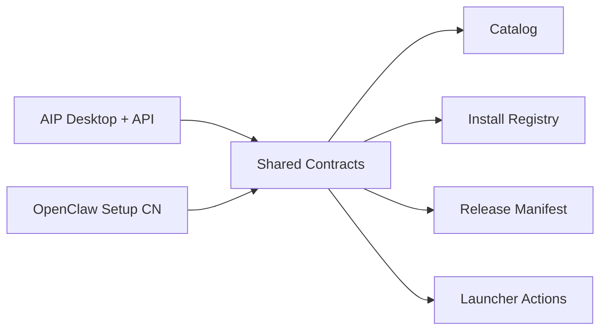

# AIP x OpenClaw Repo Convergence Plan

Date: 2026-03-23
Scope: `/mnt/e/app/aip` + `/mnt/e/app/openclaw-setup-cn`
Status: execution blueprint

## Problem

We now have two real systems:

```text
/mnt/e/app/aip
  -> account system
  -> payment / entitlement / BFF
  -> desktop shell
  -> store UI
  -> local Tauri bridge

/mnt/e/app/openclaw-setup-cn
  -> OpenClaw Windows installer authority
  -> workflow-pack builder
  -> workflow-pack installer
  -> maintenance / repair authority
  -> release assets + store catalog generation
```

They already integrate, but the integration is only partial and path-coupled.

## Key Judgement

Do not start with a hard git-history merge.

Start with a **platform-level convergence**:

```text
logical merge first
  -> shared contracts
  -> shared release manifest
  -> shared launcher action bridge
  -> shared dev orchestration

physical repo merge later
  -> only after build, release, and ownership boundaries stabilize
```

## Why A Hard Merge Is Wrong Right Now

```text
If we hard-merge now
├─ we mix two different release cadences
├─ we mix pnpm monorepo code with PowerShell artifact-factory code
├─ we increase blast radius for every installer or desktop change
├─ we make packaging and release debugging harder
└─ we still do not solve the real problem:
   the two systems need one stable contract surface
```

## Recommended Target

```text
Target state
├─ aip
│  ├─ signed-in desktop shell
│  ├─ payment / entitlement / account
│  ├─ store UI / install orchestration
│  └─ consumes official OpenClaw machine-readable contracts
├─ openclaw-setup-cn
│  ├─ installer factory
│  ├─ workflow-pack / capability-pack factory
│  ├─ maintenance / repair authority
│  └─ publishes official release contracts
└─ shared platform seam
   ├─ catalog contract
   ├─ install-registry contract
   ├─ release manifest contract
   └─ launcher action contract
```



## The Real Meaning Of 'Merge'

The correct first merge is:

```text
merge responsibility graph
  -> one product
  -> two execution authorities
  -> one contract surface
```

Not:

```text
merge .git directories immediately
  -> one giant codebase
  -> mixed tooling
  -> unstable release path
```

## Recommended Execution Stages

### Stage 1: Contract Convergence

```text
Goal
  -> let both repos "understand each other" through the same machine-readable truth

Do
├─ freeze canonical schema ownership
│  ├─ catalog schema
│  ├─ install-registry schema
│  ├─ trust/review metadata schema
│  └─ new release-manifest schema
├─ define exactly which repo owns which contract
└─ remove hidden path assumptions where possible
```

### Stage 2: Workspace Convergence

```text
Goal
  -> make local development feel like one project without destroying repo boundaries

Do
├─ create a top-level integration workspace
│  └─ e.g. /mnt/e/app/openclaw-platform
├─ mount both repos as sibling worktrees or managed folders
├─ add shared dev scripts
│  ├─ build-all
│  ├─ sync-contracts
│  ├─ validate-release-assets
│  └─ smoke-desktop-store
└─ add one root README for full-stack development
```

### Stage 3: Runtime Convergence

```text
Goal
  -> AIP becomes the visible product shell; OpenClaw setup repo becomes the install authority

Do
├─ AIP reads official release-manifest.json
├─ AIP invokes official installer / pack actions
├─ AIP reads install-registry.json as local truth
└─ OpenClaw release outputs stop being hidden local dev dependencies
```

### Stage 4: Physical Source Convergence

```text
Only do this later if still needed

Possible end states
├─ keep dual repos permanently, with stable contracts
├─ move openclaw-setup-cn into aip/tools/openclaw-installer
└─ move both into a new monorepo under a new platform root
```

## My Recommendation

```text
Do now
├─ yes: merge them logically
├─ yes: move toward one development workspace
└─ no: do not physically collapse the two repos yet

Reason
  this gets us the benefits you want immediately:
  shared context, shared contracts, one development flow,
  without breaking release authority or installer stability
```

## What 'Success' Looks Like

```text
After Stage 1 + Stage 2
├─ both repos consume the same contract files
├─ both repos can be built and validated from one root command set
├─ AIP no longer depends on hidden ad-hoc local release paths
├─ OpenClaw release outputs are explicitly published for AIP
└─ later full integration work can happen on stable ground
```
