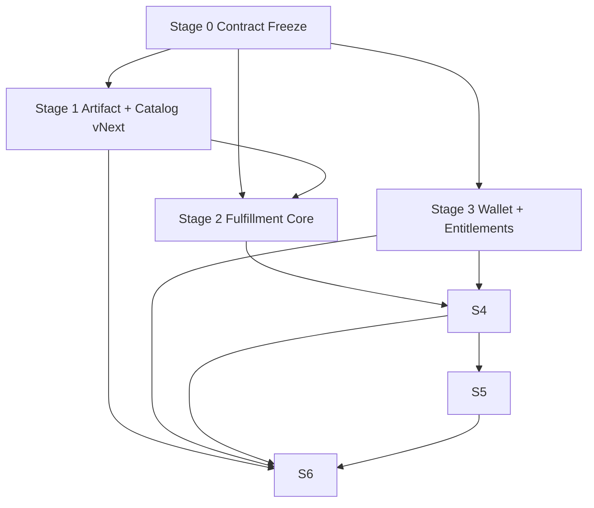

# OpenClaw Super Store Task Plan

Date: 2026-03-23
Status: Execution task plan
Scope: `E:\app\openclaw-setup-cn` + `E:\app\aip`
Source: `2026-03-23-openclaw-super-store-implementation-blueprint.md`
Goal: turn the implementation blueprint into an execution sequence with concrete stage boundaries, repo ownership, target files, acceptance criteria, and review / commit checkpoints

## 0. Planning Rule

This plan assumes:
- no more architectural re-arguing during execution unless a stage exposes a hard contradiction
- code execution follows the stage order below
- each stage ends with review, verification, and a dedicated commit
- unrelated dirty files are ignored

## 1. Program Shape

```ascii
Program
├─ Stage 0: Contract Freeze
├─ Stage 1: Artifact + Catalog vNext
├─ Stage 2: Rust/Tauri Fulfillment Core
├─ Stage 3: Wallet + Purchase + Entitlement Unification
├─ Stage 4: Connector Item System
├─ Stage 5: Community-Ready Trust Platform
└─ Stage 6: Product Shell Convergence + External Release Cut
```



## 2. Stage 0: Contract Freeze

### Goal

Freeze the platform contracts before implementation starts.
This stage exists to prevent schema drift across the two repos.

### Repos

```ascii
Primary
├─ openclaw-setup-cn
└─ aip
```

### Outputs

```ascii
Contract outputs
├─ market_item schema
├─ fulfillment_strategy schema
├─ trust_lane schema
├─ wallet_ledger schema
├─ entitlement schema
├─ fulfillment_job schema
└─ install_registry vNext schema
```

### Planned File Targets

```ascii
openclaw-setup-cn
├─ docs/contracts/openclaw-super-store-contract-governance.md
├─ docs/contracts/market-item.schema.json
├─ docs/contracts/fulfillment-strategy.schema.json
├─ docs/contracts/trust-lane-policy.schema.json
├─ docs/contracts/wallet-ledger.schema.json
├─ docs/contracts/entitlement.schema.json
├─ docs/contracts/fulfillment-job.schema.json
├─ docs/contracts/install-registry-vnext.schema.json
└─ docs/plans/2026-03-23-openclaw-super-store-task-plan.md

aip
├─ packages/shared/src/openclaw-store-contracts.ts
├─ packages/shared/src/index.ts
└─ apps/desktop/src/features/store/types.ts
```

### Work

```ascii
Task 0.1
├─ define canonical names
├─ freeze enum sets
└─ freeze required/optional field policy

Task 0.2
├─ create machine-readable schemas
├─ create TypeScript shared contract mirrors
└─ define schema versioning rule

Task 0.3
├─ define compatibility rule
├─ define additive vs breaking changes rule
└─ define source-of-truth ownership
```

### Acceptance

- Both repos point to the same contract vocabulary.
- No stage after this invents new top-level contract names casually.
- A schema versioning rule is written down.
- A breaking-change rule is written down.

### Review / Commit Gate

```ascii
Review checklist
├─ every top-level entity has one owner definition
├─ enums are not duplicated with conflicting names
├─ install registry vNext includes both pack and connector cases
└─ trust lane policy exists before community work starts
```

Commit boundary:
- one commit for contract freeze only

## 3. Stage 1: Artifact + Catalog vNext

### Goal

Upgrade `openclaw-setup-cn` from pack factory into `market_item` artifact publisher.

### Repo

```ascii
Primary
└─ openclaw-setup-cn
```

### Outputs

```ascii
Outputs
├─ signed artifact metadata
├─ official catalog vNext
├─ trust metadata snapshot
├─ market_item-compatible build input
└─ artifact index for desktop download/cache
```

### Planned File Targets

```ascii
openclaw-setup-cn
├─ client/workflow-packs/*
├─ client/build-windows-workflow-pack.ps1
├─ client/build-windows-workflow-pack-installer.ps1
├─ client/build-openclaw-store-catalog.ps1
├─ client/modules/OpenClaw.WorkflowPack.*.psm1
├─ release/openclaw-store-catalog.json
├─ release/store-items/*
├─ release/artifacts/*
└─ docs/contracts/catalog-publish-contract.md
```

### Work

```ascii
Task 1.1
├─ upgrade current pack manifest shape into market_item build input
├─ add item_kind / fulfillment_strategy / trust_lane fields
└─ add artifact publish metadata

Task 1.2
├─ emit signed artifact descriptor
├─ emit hash manifest
└─ emit cache addressing fields

Task 1.3
├─ rebuild catalog generator around market_item
├─ include trust metadata snapshot
└─ include pricing fields in official catalog

Task 1.4
├─ preserve current pack outputs for backward compatibility
└─ add vNext outputs beside them
```

### Acceptance

- A desktop client can discover items without inferring hidden metadata.
- Catalog contains enough data to render official, connector, and future community-ready items.
- Release artifacts are addressable by `artifact_id + sha256`.
- Legacy workflow-pack output is not broken during transition.

### Review / Commit Gate

```ascii
Review checklist
├─ catalog entries map 1:1 to market_item schema
├─ no runtime-only inference is required to know fulfillment strategy
├─ trust metadata is present in publish output
└─ artifact descriptor contains enough fields for cache + verification
```

Commit boundary:
- one commit for artifact/catalog vNext only

## 4. Stage 2: Rust/Tauri Fulfillment Core

### Goal

Move runtime installation authority into the desktop engine.
This is the first stage that changes the long-term runtime center of gravity.

### Repo

```ascii
Primary
└─ aip
```

### Outputs

```ascii
Outputs
├─ fulfillment engine shell in Rust
├─ artifact acquire + verify path
├─ local_install_pack strategy
├─ local_import strategy
├─ registry/report vNext writer
└─ progress event bridge to UI
```

### Planned File Targets

```ascii
aip
├─ apps/desktop/src-tauri/src/market/*.rs
├─ apps/desktop/src-tauri/src/store/*.rs
├─ apps/desktop/src-tauri/src/registry/*.rs
├─ apps/desktop/src-tauri/src/cache/*.rs
├─ apps/desktop/src/lib/storeDesktop.ts
├─ apps/desktop/src/features/store/install/*
├─ apps/desktop/src/features/store/types.ts
├─ apps/desktop/src/features/store/installRegistry.ts
└─ apps/desktop/src/features/store/reportStore.ts
```

### Work

```ascii
Task 2.1
├─ create fulfillment engine module boundary in Rust
├─ define command surface for install/repair/update/uninstall/verify
└─ define progress event schema

Task 2.2
├─ implement artifact cache layout
├─ implement signature/hash verification
└─ implement staging layout

Task 2.3
├─ implement local_install_pack pipeline
├─ implement local_import pipeline
└─ write report + registry vNext

Task 2.4
├─ bridge engine output back into desktop TS layer
└─ stop frontend from owning lifecycle orchestration logic directly
```

### Acceptance

- Desktop can install an official local pack through Rust/Tauri without delegating core logic to PowerShell entrypoints.
- Desktop can import a local artifact through the same engine contract.
- Registry/report vNext are written by the engine, not guessed by UI.
- Existing store UI can subscribe to progress and final state.

### Review / Commit Gate

```ascii
Review checklist
├─ frontend issues commands, but does not decide filesystem semantics
├─ engine can recover from failure and write usable failure report
├─ artifact cache is deterministic
└─ local_import and official install share the same registry semantics
```

Commit boundary:
- one commit for fulfillment core shell
- one commit for local_install_pack + local_import pipelines

## 5. Stage 3: Wallet + Purchase + Entitlement Unification

### Goal

Unify runtime usage and item purchase into one wallet economy while keeping accounting typed internally.

### Repo

```ascii
Primary
└─ aip
```

### Outputs

```ascii
Outputs
├─ wallet ledger vNext
├─ purchase flow for market items
├─ entitlement records
├─ owned / purchased projections
└─ desktop store purchase integration
```

### Planned File Targets

```ascii
aip
├─ apps/api/src/wallet/*
├─ apps/api/src/market/*
├─ apps/api/src/entitlements/*
├─ supabase/migrations/*market_wallet*
├─ apps/shared/src/contracts/wallet-ledger.ts
├─ apps/shared/src/contracts/entitlement.ts
├─ apps/desktop/src/features/store/*
└─ apps/desktop/src/features/overview/*
```

### Work

```ascii
Task 3.1
├─ add wallet ledger reason types
├─ preserve top-up and runtime usage flows
└─ add item_purchase debit flow

Task 3.2
├─ create entitlement persistence
├─ bind purchase result to entitlement creation
└─ define ownership projection API

Task 3.3
├─ add owned/purchased queries
├─ surface price/owned/purchased state in desktop store
└─ prevent fulfillment without required entitlement when applicable
```

### Acceptance

- One visible wallet supports both runtime usage and item purchase.
- Purchases create typed ledger entries and entitlements.
- Desktop store can render `buy`, `owned`, `install`, and `repair` states coherently.
- Runtime usage accounting is not broken by item purchase integration.

### Review / Commit Gate

```ascii
Review checklist
├─ ledger and entitlement are not conflated
├─ purchase rollback path exists for failed entitlement creation
├─ desktop state derives from API + local registry cleanly
└─ wallet balance semantics remain user-simple but internally typed
```

Commit boundary:
- one commit for backend wallet/entitlement groundwork
- one commit for desktop purchase/owned integration

## 6. Stage 4: Connector Item System

### Goal

Land connector items as first-class market items using the same store shell and ownership model.

### Repo

```ascii
Primary
├─ aip
└─ openclaw-setup-cn
```

### Outputs

```ascii
Outputs
├─ connector item schema in catalog
├─ connector secret policy engine
├─ connector bundle acquisition
├─ connector_config_bundle fulfillment strategy
└─ OpenClaw route readiness verification
```

### Planned File Targets

```ascii
openclaw-setup-cn
├─ release/store-items/*connector*
├─ docs/contracts/connector-secret-policy.schema.json
└─ build pipeline metadata emitters

aip
├─ apps/api/src/connectors/*
├─ apps/api/src/secrets/*
├─ apps/shared/src/contracts/connector-secret-policy.ts
├─ apps/desktop/src-tauri/src/connectors/*.rs
├─ apps/desktop/src/features/openclaw/*
└─ apps/desktop/src/features/store/*
```

### Work

```ascii
Task 4.1
├─ extend market_item schema for connector remote contract fields
├─ define connector secret classes and scopes
└─ define connector policy enforcement rules

Task 4.2
├─ implement backend bundle/bind/rotate/revoke APIs
├─ implement secret vault/storage boundary
└─ implement audit trail for connector secret-backed operations

Task 4.3
├─ implement connector_config_bundle fulfillment in Rust/Tauri
├─ patch/sync OpenClaw config through engine
└─ verify route readiness and write registry/report state
```

### Acceptance

- Connector items appear in the same store shell as capability packs.
- Connector provisioning goes through the fulfillment engine, not an ad hoc UI flow.
- Secret usage is policy-backed and auditable.
- OpenClaw route readiness is visible as a first-class post-install outcome.

### Review / Commit Gate

```ascii
Review checklist
├─ connector items do not bypass item purchase and entitlement model
├─ secret classes and scopes are enforced in backend policy
├─ no raw platform-managed secret leaks into frontend state
└─ connector readiness is represented in registry/report state
```

Commit boundary:
- one commit for connector backend policy + APIs
- one commit for desktop fulfillment + UI integration

## 7. Stage 5: Community-Ready Trust Platform

### Goal

Add the trust lane platform and review flow required for community-ready architecture, while keeping first external release gated.

### Repo

```ascii
Primary
├─ openclaw-setup-cn
└─ aip
```

### Outputs

```ascii
Outputs
├─ submission model
├─ review/publish workflow
├─ trust lane admin flow
├─ verified-community support
└─ feature-gated public community surfaces
```

### Planned File Targets

```ascii
openclaw-setup-cn
├─ docs/contracts/community-submission.schema.json
├─ build/review metadata tools
└─ release/trust/*

aip
├─ apps/api/src/community/*
├─ apps/api/src/admin/review/*
├─ apps/shared/src/contracts/community-submission.ts
├─ apps/desktop/src/features/admin/*
├─ apps/desktop/src/features/store/*
└─ feature-flag plumbing
```

### Work

```ascii
Task 5.1
├─ create submission schema
├─ create review state machine
└─ create publish gating rules

Task 5.2
├─ create admin review surfaces/APIs
├─ create trust lane promotion flow
└─ create verified-community path before broad community exposure

Task 5.3
├─ gate public community publishing UI behind flag
└─ keep catalog and policy ready even if entry stays hidden
```

### Acceptance

- Community architecture exists in data model and admin flow.
- Verified-community lane is implementable before broad open publishing.
- First external release can hide public submission UI without schema hacks.
- Trust lane metadata can influence policy and catalog rendering.

### Review / Commit Gate

```ascii
Review checklist
├─ trust lane promotion is explicit and auditable
├─ public gating is feature-flagged, not hard-forked in schema
├─ verified-community path exists before open community lane exposure
└─ catalog publishing can represent gated and non-gated lanes coherently
```

Commit boundary:
- one commit for backend/admin/community model
- one commit for gated desktop/admin surfaces

## 8. Stage 6: Product Shell Convergence + External Release Cut

### Goal

Converge all prior stages into the first external product cut.

### Repo

```ascii
Primary
├─ aip
└─ openclaw-setup-cn
```

### Outputs

```ascii
Outputs
├─ unified Overview / Store / OpenClaw shell
├─ official items + local import in release
├─ wallet + purchase + ownership in release
├─ selected connector items in release
├─ feature-gated community architecture in release
└─ Windows-first external build with macOS execution track ready
```

### Planned File Targets

```ascii
aip
├─ apps/desktop/src/App.tsx
├─ apps/desktop/src/features/overview/*
├─ apps/desktop/src/features/store/*
├─ apps/desktop/src/features/openclaw/*
├─ apps/desktop/src/styles/*
└─ apps/desktop/src-tauri/tauri.conf.json

openclaw-setup-cn
├─ release/*
├─ store catalog outputs
└─ delivery manifests
```

### Work

```ascii
Task 6.1
├─ align desktop shell states to new contracts
├─ surface owned/purchased/installed coherently
└─ keep card density low while preserving secondary diagnostics

Task 6.2
├─ connect release artifacts to desktop cache/download flow
├─ define first external release catalog set
└─ define bundled starter shelf contents

Task 6.3
├─ run end-to-end install / repair / purchase / connector tests
├─ run Windows release validation
└─ prepare macOS adapter execution backlog from real gaps, not guesses
```

### Acceptance

- User can browse, buy, install, repair, and use selected connector items in one shell.
- Store shell, wallet shell, and OpenClaw shell all agree on state.
- Community architecture exists but public submission UI remains gated.
- First release is coherent, not a pile of half-joined subsystems.

### Review / Commit Gate

```ascii
Review checklist
├─ external release uses vNext catalog and fulfillment engine, not legacy hidden seams
├─ wallet / entitlement / local registry states reconcile cleanly
├─ connector items and capability packs coexist in one shell without special-case UX fragmentation
└─ feature-gated community path does not leak unfinished public surfaces
```

Commit boundary:
- one commit for product shell convergence
- one commit for release cut + validation artifacts

## 9. Verification Matrix

```ascii
System verification
├─ schema compatibility tests
├─ catalog generation tests
├─ ledger + entitlement tests
├─ artifact verification tests
├─ install registry/report tests
├─ local pack install/repair tests
├─ local import tests
├─ connector route readiness tests
├─ desktop browse/purchase/install UI tests
└─ end-to-end release validation tests
```

## 10. Recommended First Work Package

If execution starts immediately, the correct first work package is not UI.
It is:

```ascii
Work Package 1
├─ Stage 0 Contract Freeze
└─ Stage 1 Artifact + Catalog vNext skeleton
```

Reason:
- everything else depends on stable contracts
- the desktop engine and wallet work should not begin on drifting schemas

## 11. Command Discipline During Execution

```ascii
Execution discipline
├─ do not start Stage 2 before Stage 0 contracts are frozen
├─ do not start connector implementation before wallet + entitlement model is settled
├─ do not expose public community submission before verified-community path exists
└─ do not let UI invent state that backend/registry contracts do not own
```
