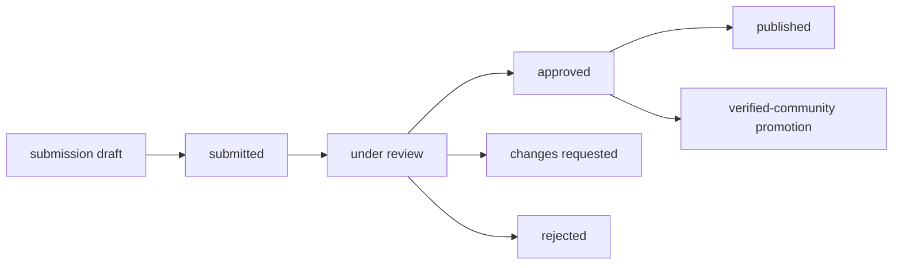

# Stage 5 Slice 1 Community Contract Note

Date: 2026-03-23
Scope: `openclaw-setup-cn` + `aip`
Stage: Stage 5 / slice 1
Goal: freeze the community submission and trust-lane exposure contract before admin workflow work begins

## Contract Shape

```ascii
Stage 5 slice 1
├─ community_submission becomes an explicit contract
├─ trust_lane_policy gains exposure + gating fields
├─ verified-community promotion path is explicit
└─ aip shared types mirror the schema vocabulary
```



## Decisions

- `community_submission` is now an allowed Stage 5 extension contract.
- Trust-lane exposure is modeled as data, not hard-coded UI branching.
- Verified-community remains an explicit promotion path, not an implicit community alias.
- Public submission exposure remains flag-driven even when the data model is fully present.
