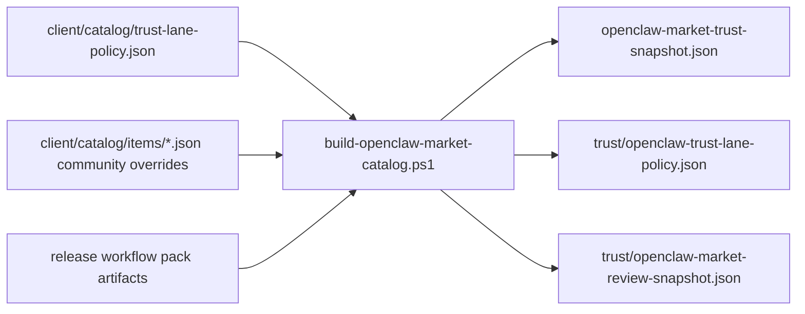

# Stage 5 Slice 2 Release Trust Metadata

Date: 2026-03-23
Scope: `openclaw-setup-cn`
Stage: Stage 5 / slice 2
Goal: emit release-side trust policy and review metadata without coupling to the dirty admin route work in `aip`

## Root Decision

```ascii
Why this slice exists
├─ existing trust snapshot only answers audit + pinning state
├─ Stage 5 also needs publish/review/exposure metadata
├─ market-item schema is already frozen and disallows ad hoc fields
└─ therefore Stage 5 metadata must ship as additive release/trust outputs
```

## Output Shape

```ascii
release/
├─ openclaw-market-trust-snapshot.json
└─ trust/
   ├─ openclaw-trust-lane-policy.json
   └─ openclaw-market-review-snapshot.json
```



## Rules

- Trust lane policy is published as its own frozen artifact so backend and desktop can both consume the same lane rules.
- Item review snapshot is a projection, not a second source of truth; per-item `community` overrides only supply item-specific review state.
- Existing `market_item` and `trust snapshot` contracts remain backward-compatible.
- Community exposure stays flag-driven through policy data, not through desktop hardcoding.
