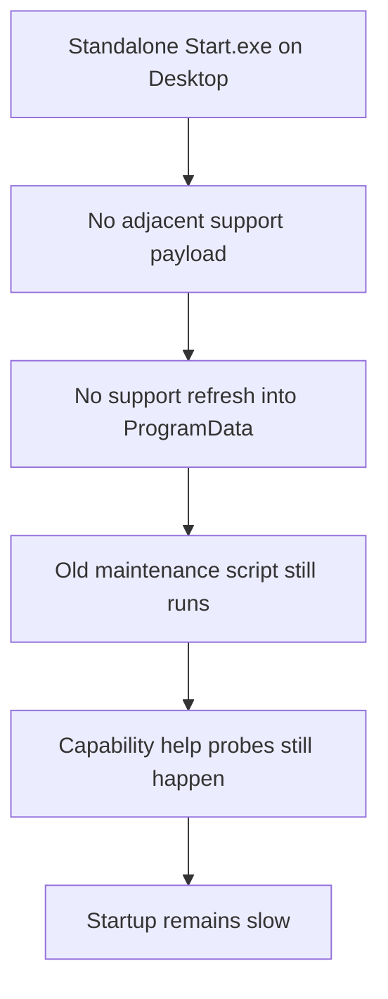
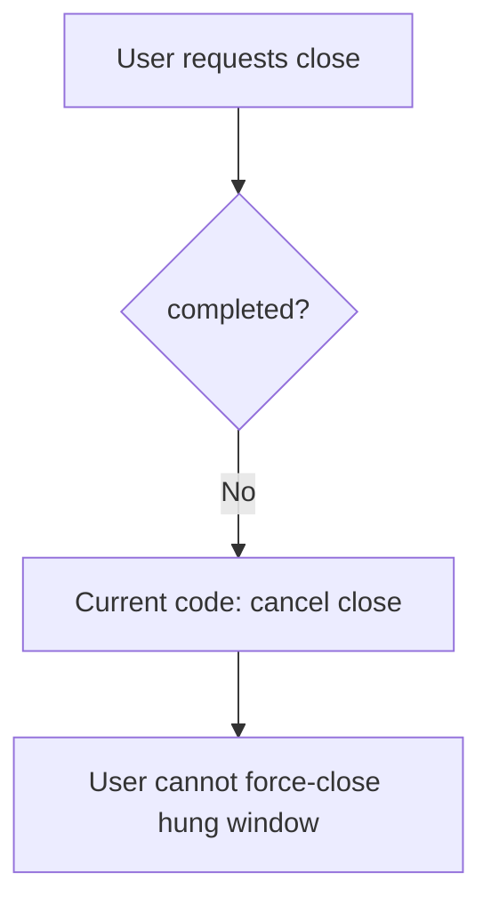
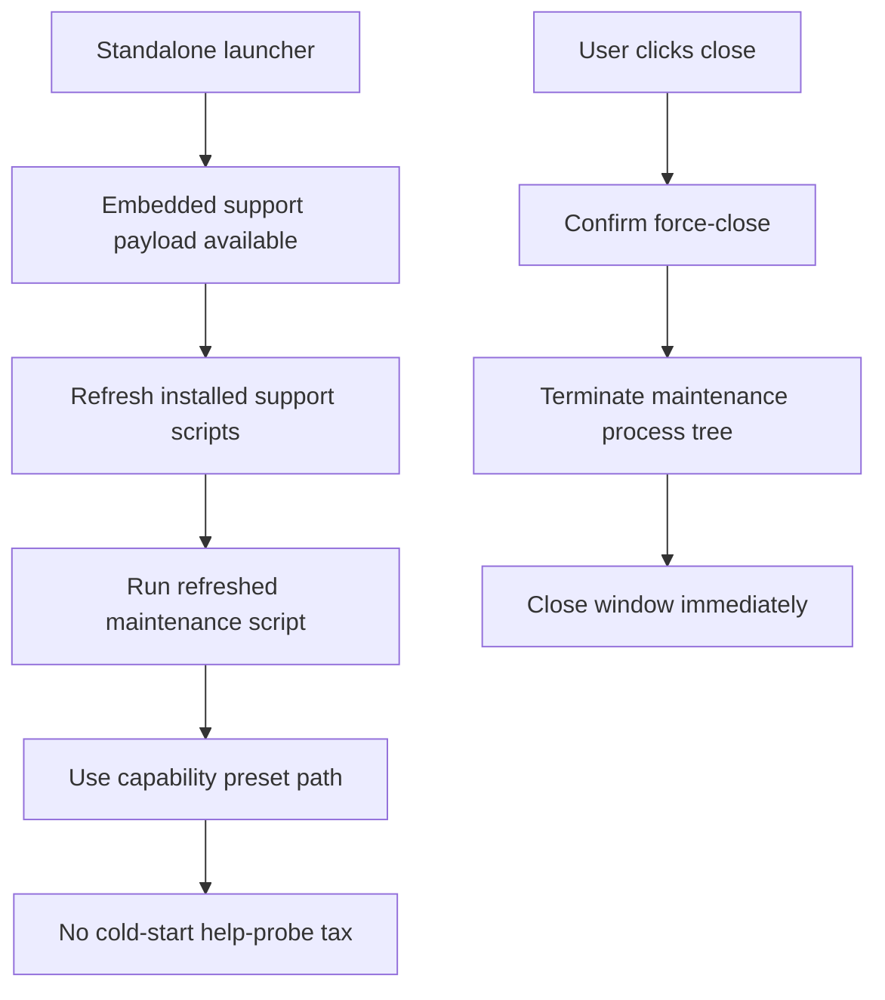

# 2026-03-24 Launcher Embedded Support And Force-Close Plan

## Goal

```text
Fix two confirmed user-facing problems:
1. standalone OpenClaw-Start.exe still falls back to old installed support scripts
2. maintenance window cannot be force-closed while maintenance is still running
```

## Root Cause Graph

```text
User downloads standalone OpenClaw-Start.exe
  |
  +-- launcher only looks for adjacent support/ payload
  |     |
  |     +-- no support/ beside Desktop\OpenClaw-Start.exe
  |     +-- installed C:\ProgramData\OpenClaw\support remains stale
  |
  +-- stale maintenance script runs cold-start capability --help probes
        |
        +-- startup remains slow and old behavior persists
```



## Close Behavior Root Cause

```text
MaintenanceWindow.FormClosing always cancels close requests until completed=true
  |
  +-- user clicks X / Alt+F4 / Close button while maintenance is active
        |
        +-- request is rejected unconditionally
        +-- window becomes non-force-closable
```



## Solution

```text
A. Launcher payload
   - embed current support scripts directly into each launcher exe at build time
   - use adjacent support/ as optional override, not the only source
   - refresh C:\ProgramData\OpenClaw\support from embedded payload even when exe is standalone

B. Window close behavior
   - allow explicit force-close while maintenance is running
   - ask for confirmation
   - terminate the maintenance process tree
   - close the window immediately
```



## Acceptance Criteria

- Standalone `OpenClaw-Start.exe`, `OpenClaw-Update.exe`, and `OpenClaw-Repair.exe` can refresh installed support scripts without requiring an adjacent `support/` folder.
- New logs should no longer begin with the long `openclaw ... --help` capability probe block when runtime is `2026.3.13`.
- User can always force-close the maintenance window while maintenance is still running.
- Force-close stops the child maintenance process instead of leaving an orphaned PowerShell window/process.
- Updated build artifacts are produced for the three launchers.
