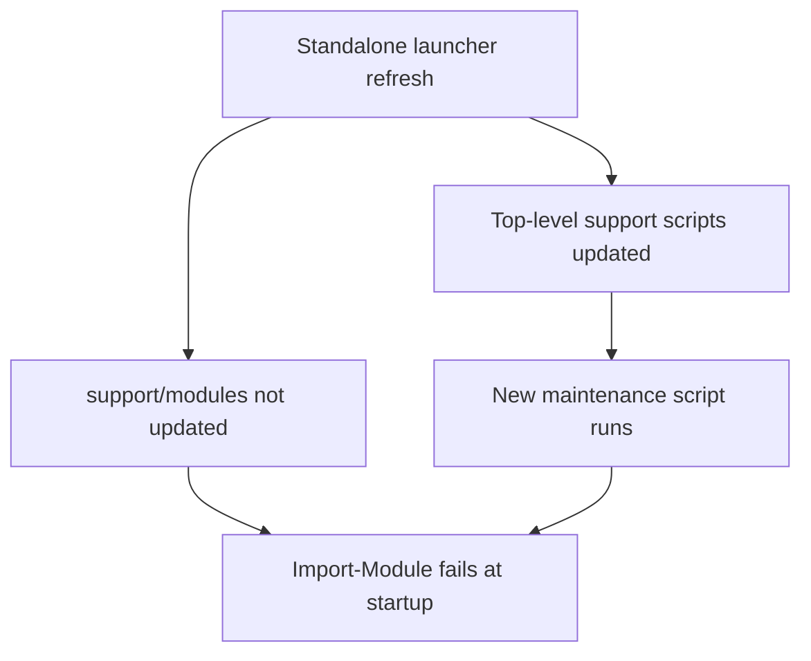
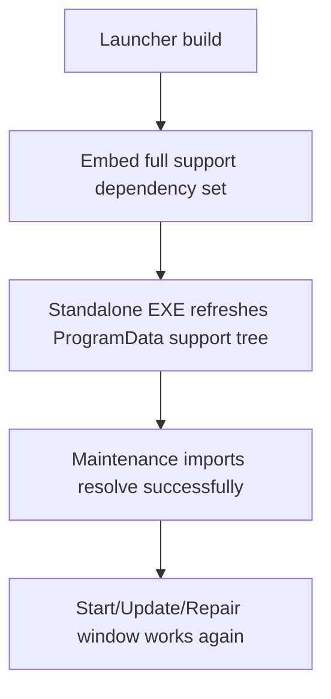

# 2026-03-24 Launcher Support Modules Hotfix Plan

## Goal

```text
Fix the v0.1.7 regression where standalone Start/Update/Repair launchers
refresh OpenClaw-Maintenance.ps1 but do not refresh the required support/modules
PowerShell modules.
```

## Root Cause Graph

```text
v0.1.7 launcher embeds only 2 support files
  |
  +-- OpenClaw-Maintenance.ps1 is refreshed into ProgramData\OpenClaw\support
  +-- support\modules\*.psm1 is NOT refreshed
        |
        +-- maintenance script imports support\modules\OpenClaw.WorkflowPack.*.psm1
              |
              +-- Import-Module fails before maintenance can proceed
```



## Correct Fix

```text
1. Treat launcher support payload as the full dependency set, not only top-level ps1 files.
2. Embed and publish:
   - OpenClaw-Maintenance.ps1
   - install-windows-core.ps1
   - modules/OpenClaw.WorkflowPack.Common.psm1
   - modules/OpenClaw.WorkflowPack.Installer.psm1
   - modules/OpenClaw.WorkflowPack.Store.psm1
3. Refresh nested support paths under ProgramData\OpenClaw\support, creating directories as needed.
4. Rebuild and republish the 3 launcher assets.
```



## Acceptance Criteria

- Standalone launcher EXEs refresh both top-level scripts and `support/modules/*.psm1`.
- `OpenClaw-Maintenance.ps1` no longer fails on `Import-Module` immediately after launcher refresh.
- Release zip includes the same `support/modules` payload for adjacent-folder delivery.
- New launcher assets are rebuilt and published as a new hotfix release.
