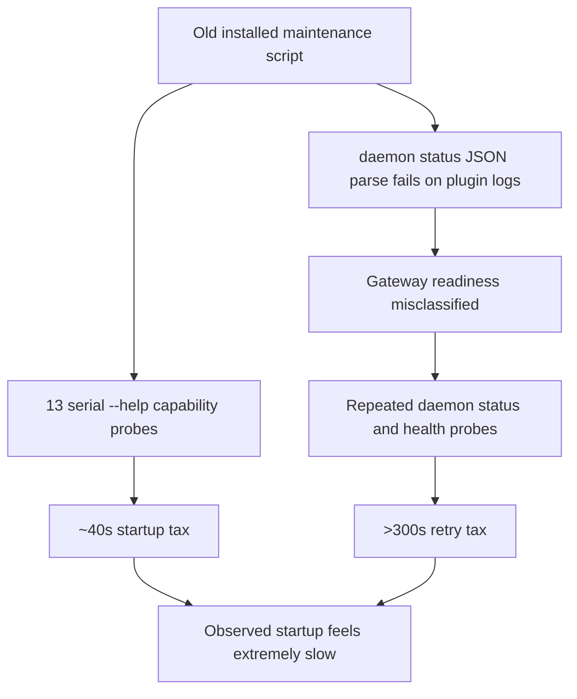
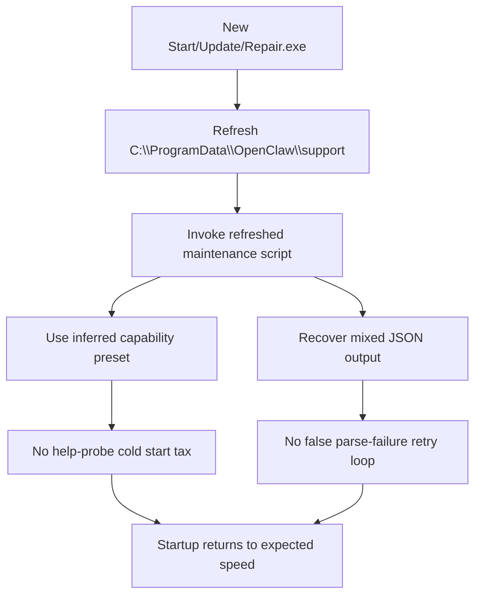

# Startup Slow Root Cause Review

## Scope

Review target:

```text
latest real-machine log:
  C:\ProgramData\OpenClaw\logs\maintenance-start-20260321-114343.log

installed runtime:
  C:\ProgramData\OpenClaw

repo workspace:
  E:\app\openclaw-setup-cn
```

Goal:

```text
Find the real reason "One-click Start" is abnormally slow.
Do not accept superficial explanations.
Reduce the fix surface to the smallest reliable solution that preserves full capability.
```

## Hypotheses

```text
H1. The CLI binary itself is inherently slow on every call.
H2. Gateway startup is slow because the service or RPC is genuinely unhealthy.
H3. JSON status parsing is broken by plugin log pollution, causing repeated retries.
H4. The installed maintenance scripts are older than the repo fixes, so the machine is still using the old slow path.
H5. The new launcher packages do not actually refresh the installed support scripts, so old installs never receive the speed fix.
```

## Validation Matrix

| Hypothesis | Result | Evidence |
| --- | --- | --- |
| H1 CLI itself is the main root cause | Partial, but not root cause | Single calls cost a few seconds, but the large delay comes from many repeated calls, not one expensive call. |
| H2 Gateway is genuinely unhealthy for most of the run | Secondary symptom | Early RPC fails, but later `rpc.ok=true`. The flow remains slow even after the gateway becomes reachable. |
| H3 Mixed plugin logs break JSON parsing | Confirmed | Log repeats `Failed to parse daemon status JSON: Invalid JSON primitive: plugins.` 18 times. |
| H4 Installed support scripts are older than repo fixes | Confirmed | Installed support scripts are from `2026-03-14`, while repo fixes are newer and contain fast capability preset + mixed-output JSON recovery. |
| H5 New launcher packages must refresh installed support before maintenance | Confirmed | Without a self-refresh step, launchers still invoke `C:\ProgramData\OpenClaw\support\OpenClaw-Maintenance.ps1`, which is the old slow script on affected machines. |

## Timing Breakdown

Measured from `maintenance-start-20260321-114343.log`:

```text
total span: about 437s
total openclaw commands: 50
daemon status --json: 18 calls
health --json --timeout 10000: 13 calls
help-based capability probes: 13 calls
daemon status parse failures: 18 times
```



## Critical Evidence

### 1. The log is using the old installed maintenance script

Log header:

```text
维护脚本：C:\\ProgramData\\OpenClaw\\support\\OpenClaw-Maintenance.ps1
```

That means the machine is not running the repo copy directly. It is running the installed support copy.

### 2. The installed support copy is old

```text
installed support hashes
  OpenClaw-Maintenance.ps1  66fca090...
  install-windows-core.ps1  d57f45ab...

release support hashes
  OpenClaw-Maintenance.ps1  cfef2261...
  install-windows-core.ps1  1c1d045a...
```

```text
installed timestamps
  2026-03-14 13:42:56  OpenClaw-Maintenance.ps1
  2026-03-14 13:31:52  install-windows-core.ps1
```

### 3. The old script still uses the slow capability discovery path

The log spends about 41 seconds on `--help` probes before real checks begin:

```text
11:43:46 daemon status --json --help
11:43:51 status --deep --help
11:43:53 status --all --help
11:43:56 health --json --timeout 1000 --help
11:43:59 gateway status --json --help
11:44:02 gateway status --help
11:44:05 gateway install --force --help
11:44:07 gateway start --help
11:44:10 gateway stop --help
11:44:13 gateway restart --help
11:44:16 doctor --repair --help
11:44:19 doctor --non-interactive --help
11:44:22 dashboard --help
```

The fixed repo script already contains a runtime preset path:

```text
Using inferred capability preset for runtime 2026.3.13...
```

That path skips this entire cold-start help-probe block.

### 4. JSON parsing is repeatedly broken by plugin output

The failing machine log contains:

```text
Failed to parse daemon status JSON: Invalid JSON primitive: plugins.
```

This happens repeatedly because the CLI emits plugin logs before the JSON body. The fixed repo script already includes mixed-output recovery logic:

```text
Convert-MixedOutputToJson
Recovered daemon status JSON from mixed CLI output.
```

The old installed script does not recover from that mixed output, so readiness stays in a false-negative loop.

## Final Root Cause

```text
The startup is slow mainly because the machine is still executing old installed support scripts.

Those old scripts do two bad things:
1. they run many serial --help capability probes on cold start
2. they fail to recover JSON when plugin logs are printed before the payload

That combination causes repeated false-negative readiness checks and many extra status/health retries.
```

This is the smallest correct root cause statement. Everything else is downstream.

## Correct Minimal Solution

```text
Do not redesign the whole startup flow.
Do not remove diagnostics blindly.
Do not tune timeouts first.

Instead:
1. keep the fixed maintenance script logic
   - runtime capability preset for 2026.3.13
   - mixed plugin+JSON recovery
2. make Start/Update/Repair refresh installed support scripts before maintenance
3. ship the support payload together with launcher deliveries
```



## Implemented Fix

Implemented in repo:

```text
client/windows-openclaw-launcher.cs
  - added TryRefreshInstalledSupportAssets(...)
  - refreshes:
      OpenClaw-Maintenance.ps1
      install-windows-core.ps1

scripts/build-release-assets.ps1
  - publishes release/support/*
  - includes support payload in launcher delivery artifacts
```

Committed as:

```text
ee67281 fix: refresh installed support from launcher pack
```

## Delivery Status

Updated artifacts already exist:

```text
release/OpenClaw-Start.exe
release/OpenClaw-Update.exe
release/OpenClaw-Repair.exe
release/support/OpenClaw-Maintenance.ps1
release/support/install-windows-core.ps1
release/delivery/OpenClaw-Launchers-20260321-jsonfix.zip
release/delivery/OpenClaw-OneClick-Delivery-20260321-jsonfix.zip
```

## Validation Status

What is fully validated:

```text
- root cause from real installed machine log
- installed files are older than fixed repo files
- repo maintenance script contains the startup-speed fixes
- launcher source now refreshes installed support assets before invoking maintenance
- delivery packages include the required support payload
```

What is blocked in the current environment:

```text
- full elevated end-to-end validation on this Windows session
```

Why blocked:

```text
the current Windows account is not admin
launcher elevation waits on UAC interaction
from this session, the elevated child cannot be completed programmatically
```

Observed validation symptom:

```text
new OpenClaw-Start.exe launches
no new maintenance log is created
the launcher process remains running until manually terminated
```

That behavior is consistent with a pending UAC/elevation boundary, not with the old startup-slow code path continuing to run.

## Recommended Operator Validation

Use the refreshed launcher delivery and keep the `support` folder beside the three EXEs:

```text
release/delivery/OpenClaw-Launchers-20260321-jsonfix/
```

Expected success markers in the next real machine log:

```text
launcher stage:
  已刷新支持脚本：OpenClaw-Maintenance.ps1, install-windows-core.ps1

maintenance stage:
  Using inferred capability preset for runtime 2026.3.13...
  Recovered daemon status JSON from mixed CLI output.

not expected anymore:
  many openclaw ... --help capability probes
  Failed to parse daemon status JSON: Invalid JSON primitive: plugins.
```
